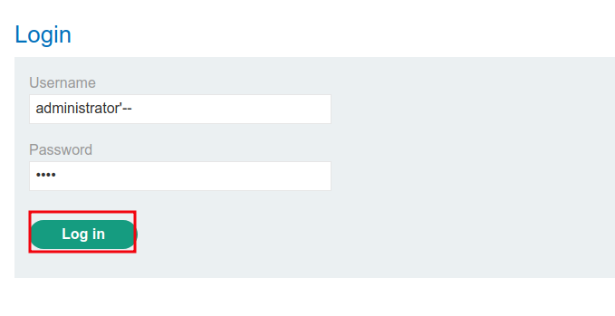
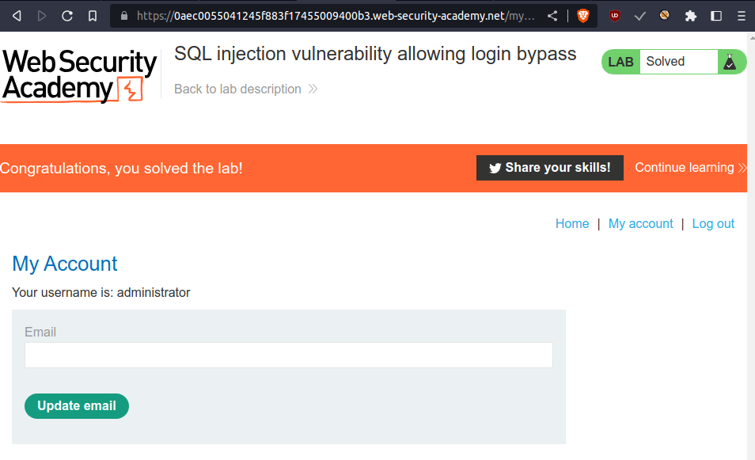
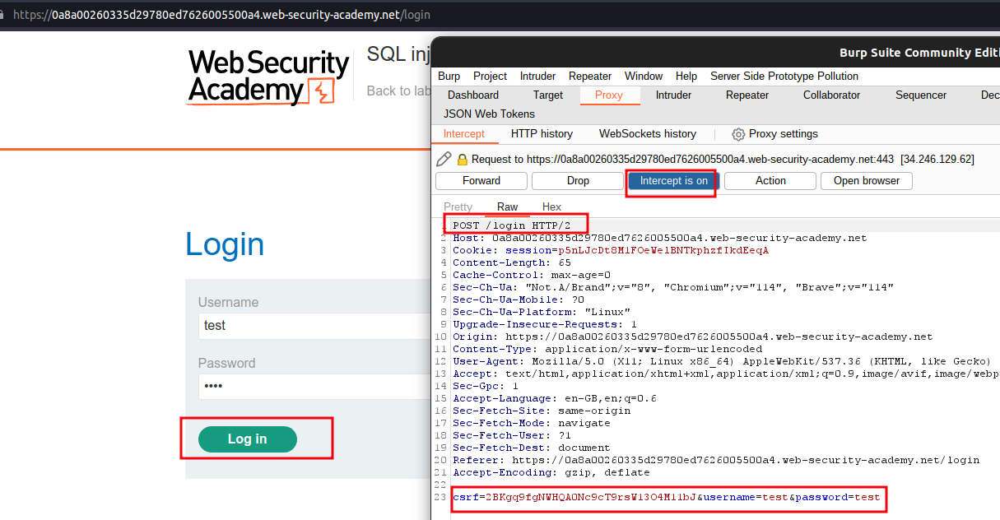
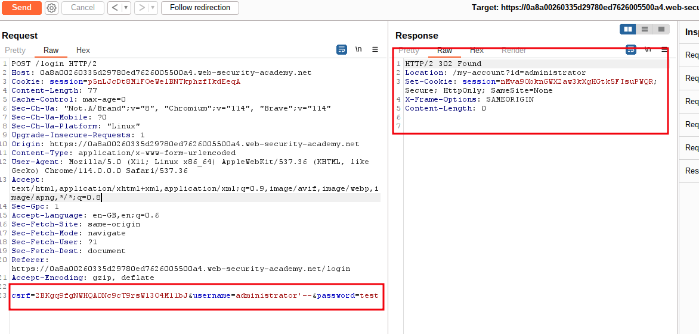

# SQL injection vulnerability allowing login bypass

## To solve the lab, perform a SQL injection attack that logs in to the application as the `administrator` user.

>**Note:**
> SELECT \* FROM users WHERE username = 'administrator' AND password = 'administrator'
> when we log in using username and password the query passed through the above example and if it match with database
> then you able to login successfully
> to bypass password credentials you will use -- it consider as comment in sql

```sql
SELECT * FROM users WHERE username = 'administrator'--' AND password = 'administrator' 
```

in the above example `'--` added to the username rest become `comment` whatever you passed into credentials it will always come inside single quotes _' '_

---

step 1





---

you can use burpsuite for solve this lab

step 1

go to login page
enter incorrect userid and password and intercept request to burpsuite



step 2

send to repeater
change user name with `'administrator--`
send request you will get 302 found location `/my-account?id=administrator`



step 3

use this username and any password to login
you will see lab solve
