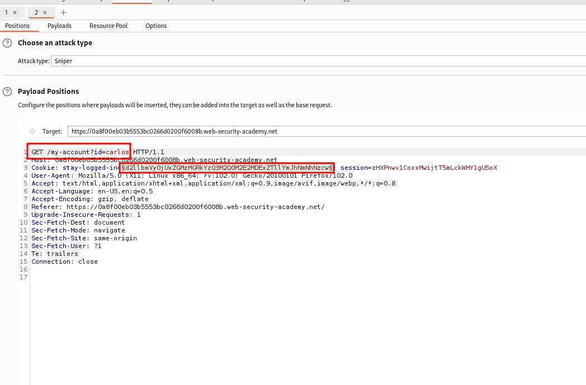
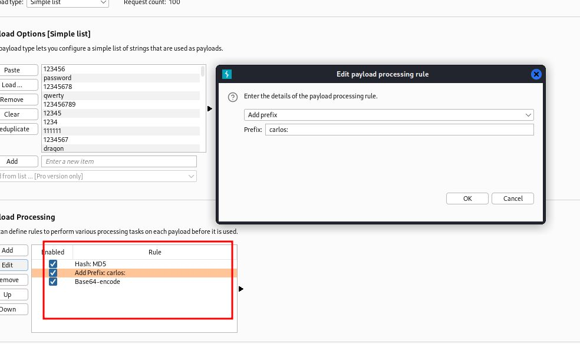
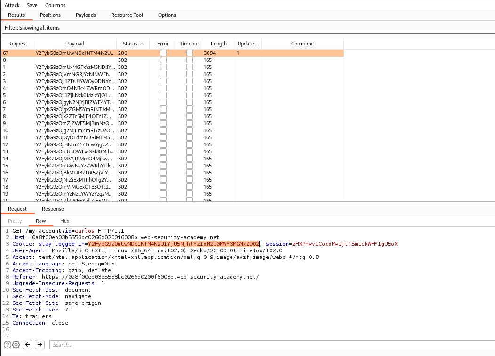
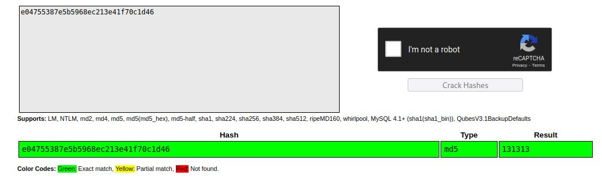

# Brute-forcing a stay-logged-in cookie

## This lab allows users to stay logged in even after they close their browser session. The cookie used to provide this functionality is vulnerable to brute-forcing.

To solve the lab, brute-force Carlos's cookie to gain access to his "My account" page.

- Your credentials: `wiener:peter`
- Victim's username: `carlos`
- [Candidate passwords](https://portswigger.net/web-security/authentication/auth-lab-passwords)

____

1.  With Burp running, log in to your own account with the **Stay logged in** option selected. Notice that this sets a `stay-logged-in` cookie.
2.  Examine this cookie in the [Inspector](https://portswigger.net/burp/documentation/desktop/functions/message-editor/inspector) panel and notice that it is Base64-encoded. Its decoded value is `wiener:51dc30ddc473d43a6011e9ebba6ca770`. Study the length and character set of this string and notice that it could be an MD5 hash. Given that the plaintext is your username, you can make an educated guess that this may be a hash of your password. Hash your password using MD5 to confirm that this is the case. We now know that the cookie is constructed as follows:

    `base64(username+':'+md5HashOfPassword)`

3.  Log out of your account.
4.  Send the most recent `GET /my-account` request to Burp Intruder.
5.  In Burp Intruder, add a payload position to the `stay-logged-in` cookie and add your own password as a single payload.
6.  Under **Payload processing**, add the following rules in order. These rules will be applied sequentially to each payload before the request is submitted.
    - Hash: `MD5`
    - Add prefix: ` `carlos:`
    - Encode: `Base64-encode`
7.  As the **Update email** button is only displayed when you access the `/my-account` page in an authenticated state, we can use the presence or absence of this button to determine whether we've successfully brute-forced the cookie. On the **Options** tab, add a grep match rule to flag any responses containing the string `Update email`. Start the attack.

