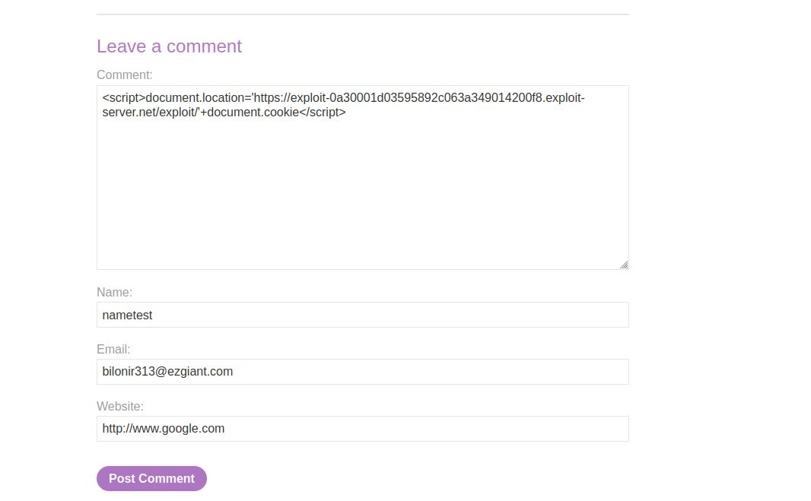
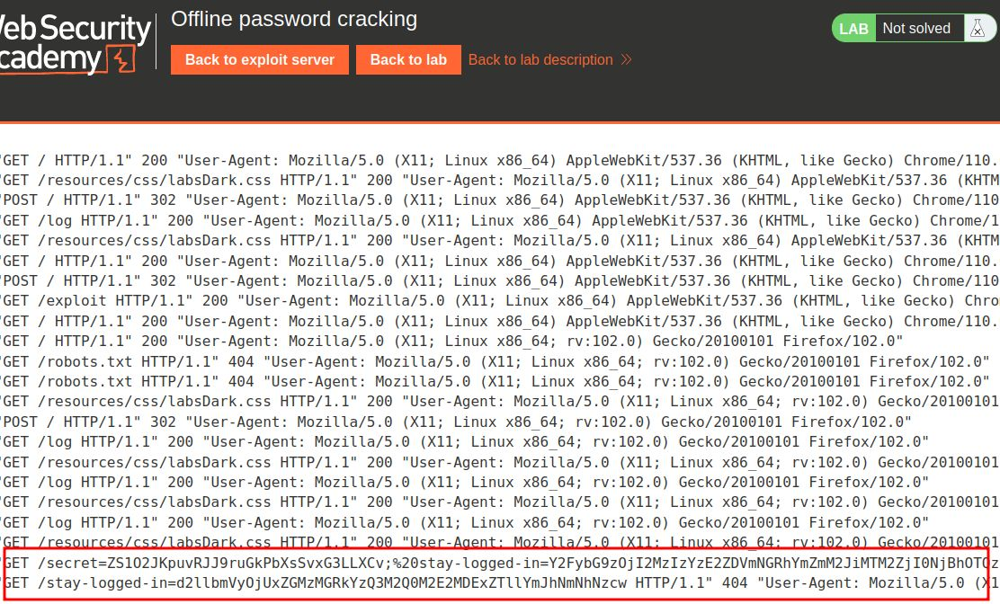

# Offline password cracking

## This lab stores the user's password hash in a cookie. The lab also contains an XSS vulnerability in the comment functionality. To solve the lab, obtain Carlos's `stay-logged-in` cookie and use it to crack his password. Then, log in as `carlos` and delete his account from the "My account" page.

- Your credentials: `wiener:peter`
- Victim's username: `carlos`

___

****

Y2FybG9zOjI2MzIzYzE2ZDVmNGRhYmZmM2JiMTM2ZjI0NjBhOTQz
after decode base64

carlos:26323c16d5f4dabff3bb136f2460a943

_26323c16d5f4dabff3bb136f2460a943_ is hash _onceuponatime_
