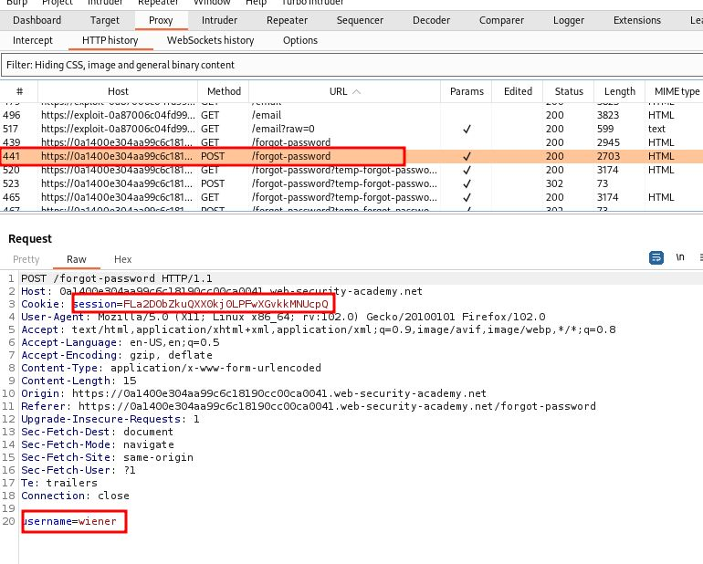
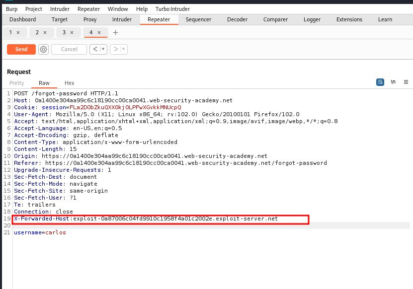
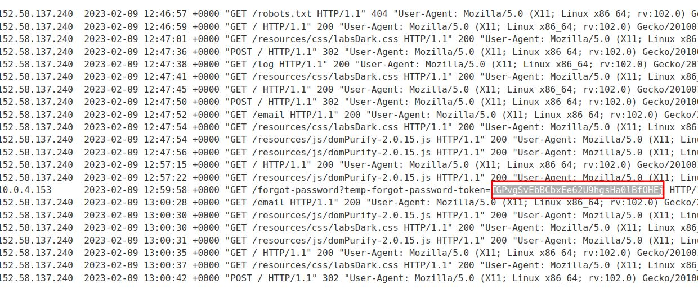
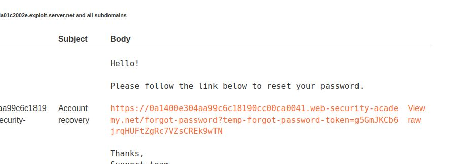

# Password reset poisoning via middleware

## This lab is vulnerable to password reset poisoning. The user `carlos` will carelessly click on any links in emails that he receives. To solve the lab, log in to Carlos's account. You can log in to your own account using the following credentials: `wiener:peter`. Any emails sent to this account can be read via the email client on the exploit server

___

send to repeter
add
`X-Forwarded-Host: YOUR-EXPLOIT-SERVER-ID.exploit-server.net`

ip is different from rest of other

change token and paste into url
