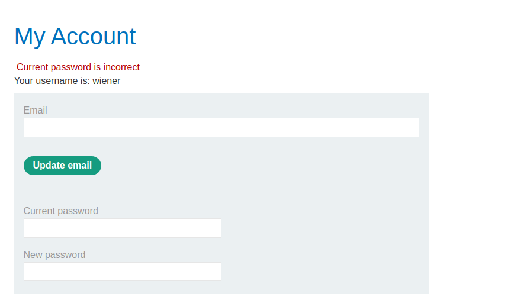
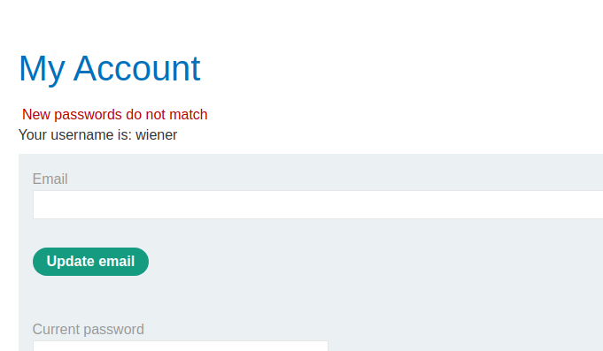
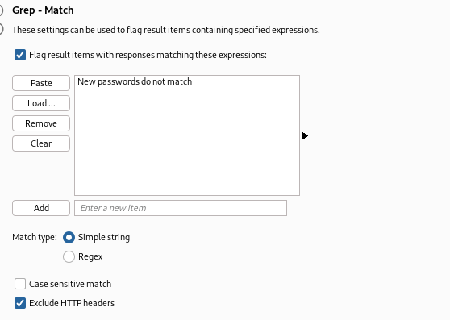
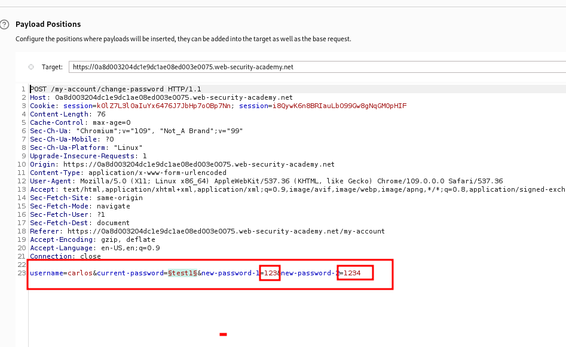
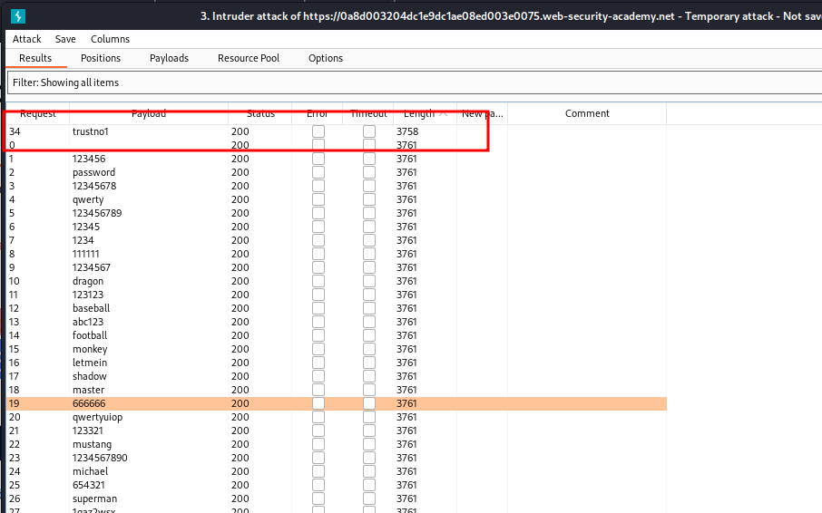

#  Password brute-force via password change

## This lab's password change functionality makes it vulnerable to brute-force attacks. To solve the lab, use the list of candidate passwords to brute-force Carlos's account and access his "My account" page.

when you enter wrong password with different password
like
currrent passwod = test1 => wrong password
new password = 123
confirm neew password = 1234
both new password and confirm new password must be wrong
if both new password and confirm password will be same you will redirect to login page again

### step2

enter correct password
but new passwod and confirm password must be diffeernet

note: important password and new password must be differnent

