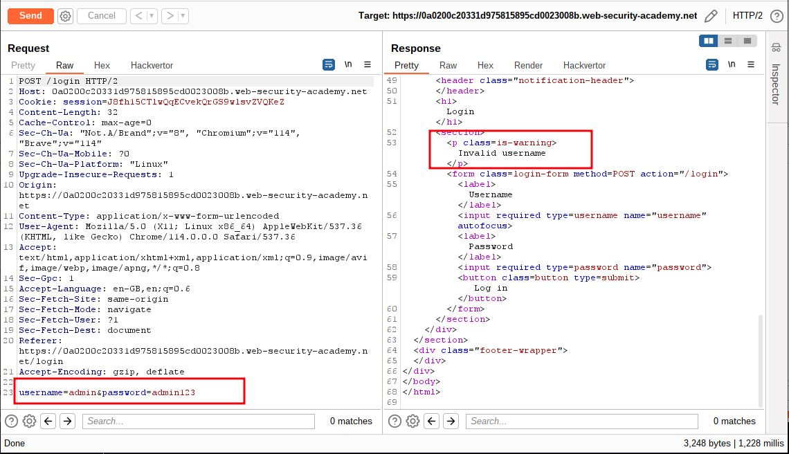
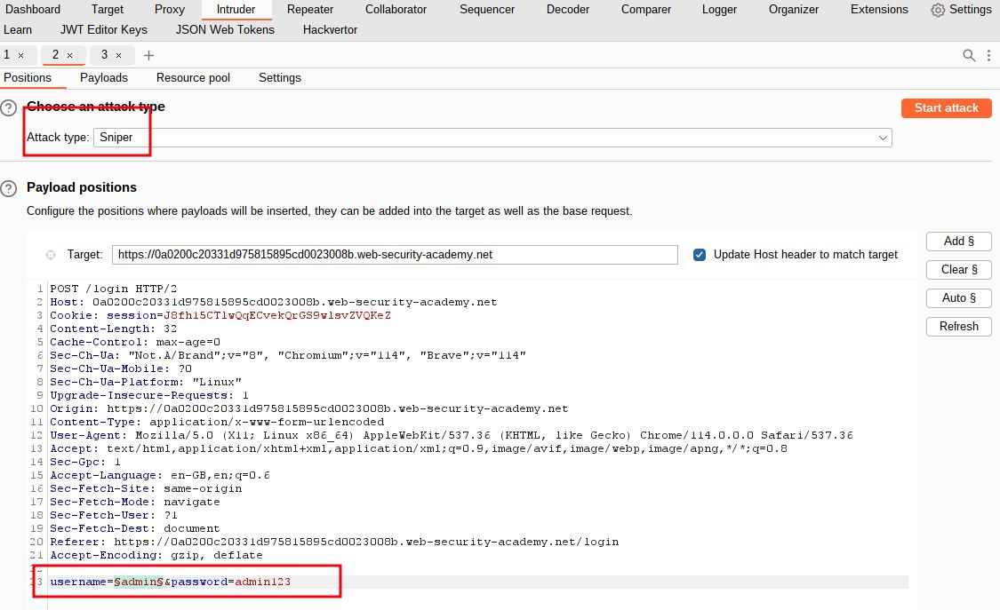
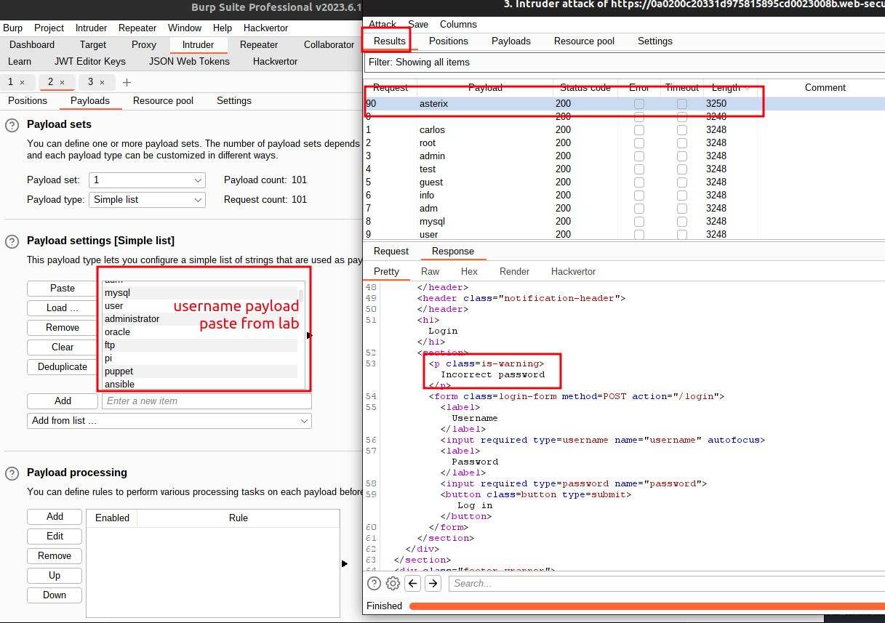
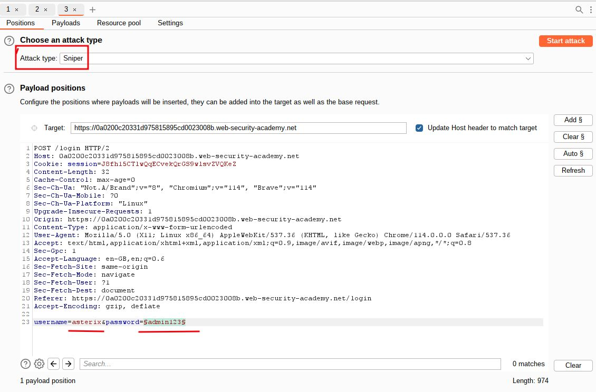

# Lab: Username enumeration via different responses

## This lab is vulnerable to username enumeration and password brute-force attacks. It has an account with a predictable username and password, which can be found in the following wordlists:

- [Candidate usernames](https://portswigger.net/web-security/authentication/auth-lab-usernames)
- [Candidate passwords](https://portswigger.net/web-security/authentication/auth-lab-passwords)

To solve the lab, enumerate a valid username, brute-force this user's password, then access their account page

___

1.  With Burp running, investigate the login page and submit an invalid username and password.
2.  In Burp, go to **Proxy > HTTP history** and find the `POST /login` request. Send this to Burp Intruder.
3.  In Burp Intruder, go to the **Positions** tab. Make sure that the **Sniper** attack type is selected.
4.  Click **Clear §** to remove any automatically assigned payload positions. Highlight the value of the `username` parameter and click **Add §** to set it as a payload position. This position will be indicated by two `§` symbols, for example: `username=§invalid-username§`. Leave the password as any static value for now.
5.  On the **Payloads** tab, make sure that the **Simple list** payload type is selected.
6.  Under **Payload options**, paste the list of candidate usernames. Finally, click **Start attack**. The attack will start in a new window.
7.  When the attack is finished, on the **Results** tab, examine the **Length** column. You can click on the column header to sort the results. Notice that one of the entries is longer than the others. Compare the response to this payload with the other responses. Notice that other responses contain the message `Invalid username`, but this response says `Incorrect password`. Make a note of the username in the **Payload** column.
8.  Close the attack and go back to the **Positions** tab. Click **Clear**, then change the `username` parameter to the username you just identified. Add a payload position to the `password` parameter. The result should look something like this:
    
    `username=identified-user&password=§invalid-password§`
9.  On the **Payloads** tab, clear the list of usernames and replace it with the list of candidate passwords. Click **Start attack**.
10.  When the attack is finished, look at the **Status** column. Notice that each request received a response with a `200` status code except for one, which got a `302` response. This suggests that the login attempt was successful - make a note of the password in the **Payload** column.
11.  Log in using the username and password that you identified and access the user account page to solve the lab.
---

step 1

step 2

step 3

step 4

step 5

username=`asterix` password=`123321`

