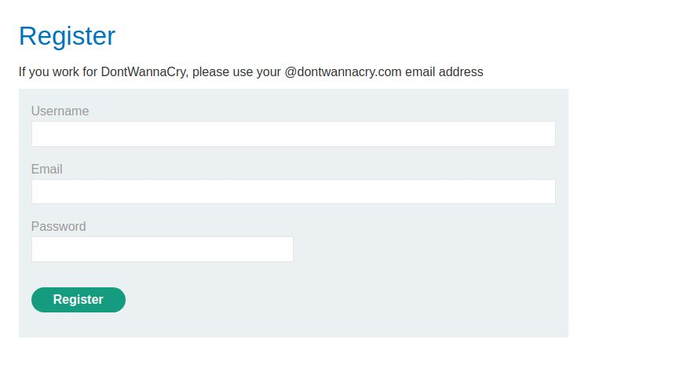
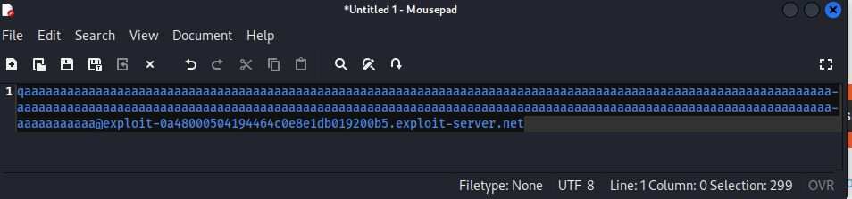
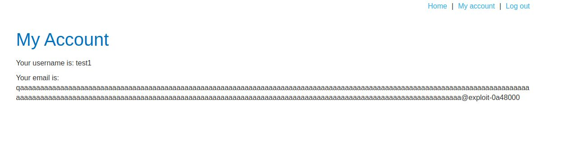
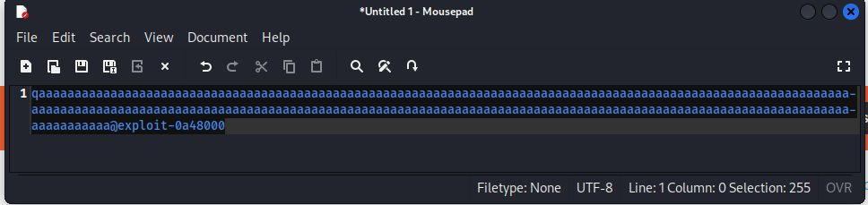
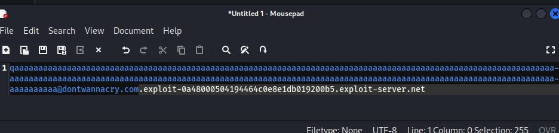
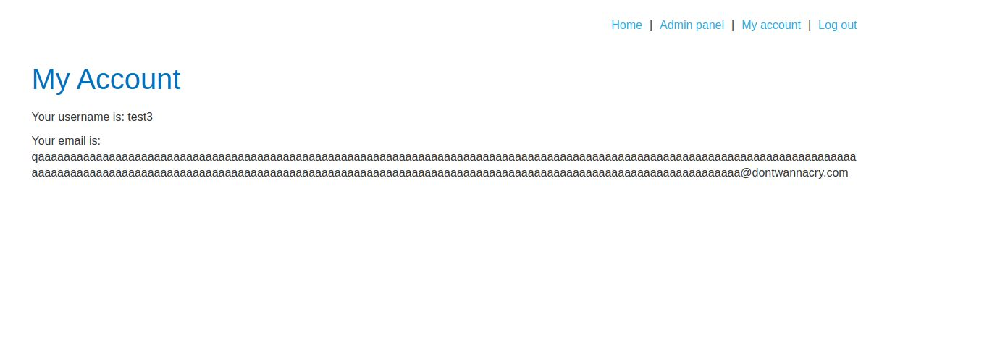

# Inconsistent handling of exceptional input

## This lab doesn't adequately validate user input. You can exploit a logic flaw in its account registration process to gain access to administrative functionality. To solve the lab, access the admin panel and delete Carlos

---

### step 1 registration page

### step2

make a string with more than 255 with email address
here 299 words

After registration successfull

total number of charcter is 255

### step3

make sure @dontwannacry.com comes under 255 then attacker email

then regester open /admin page if admin pannel not visiilbe and delete carlos account solve the problem

