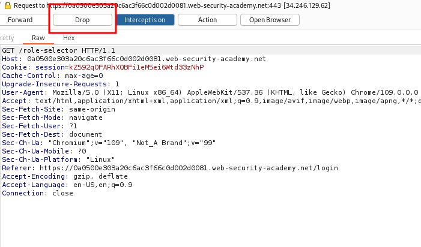

# Authentication bypass via flawed state machine

## This lab makes flawed assumptions about the sequence of events in the login process. To solve the lab, exploit this flaw to bypass the lab's authentication, access the admin interface, and delete Carlos.

## You can log in to your own account using the following credentials: `wiener:peter`

---

### step 1

enter user name and password and intercept then forword then _drop the role selctor place_

### step2

https://0a0500e303a20c6ac3f66c0d002d0081.web-security-academy.net/role-selector

remove role selector from url

https://0a0500e303a20c6ac3f66c0d002d0081.web-security-academy.net/

forword request in burpsuit

your admin panel at your home page
delete carlos solve the lab
