# Authentication bypass via encryption oracle

## This lab contains a logic flaw that exposes an encryption oracle to users. To solve the lab, exploit this flaw to gain access to the admin panel and delete Carlos.

## You can log in to your own account using the following credentials: `wiener:peter`

---

### step 1

copy stay logged in string

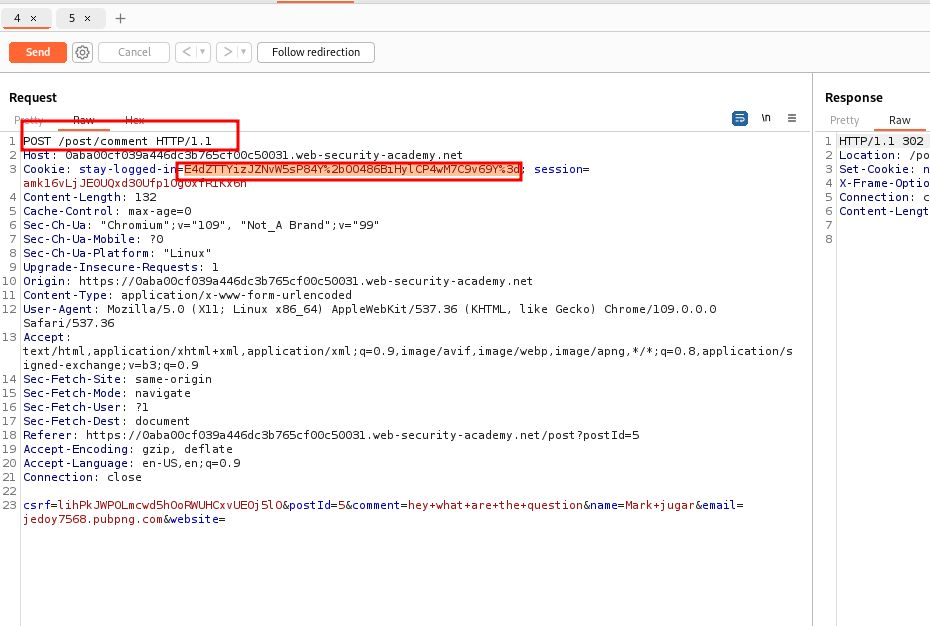

### step2

paste post comment stay logged in into
get post/postid into cookies notification

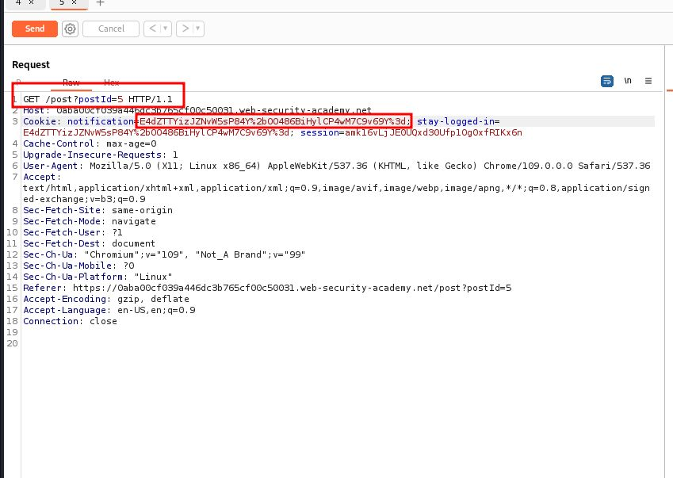

### step3

send you will get
wiener:1677300649109 (this number can be different when test again)

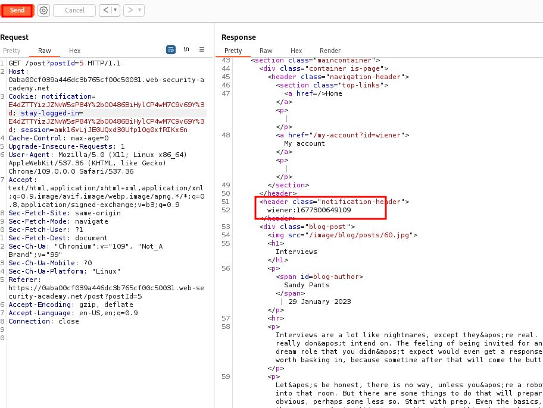

### step4

1.  change email to administrator:1677300649109
2.  send request
3.  copy set cookies notification string

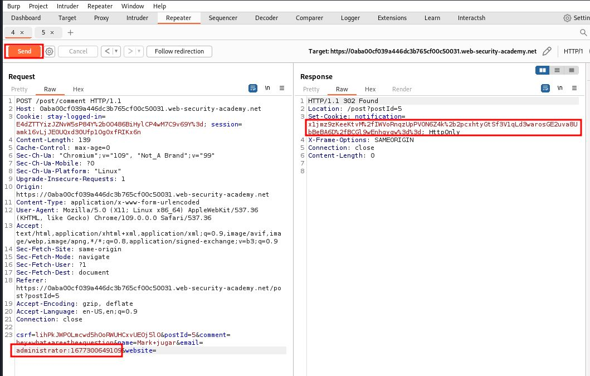

### step5

1. copy set notification from post comment and paste into get post id cookie notification
2. note down the invalid email address length = 23

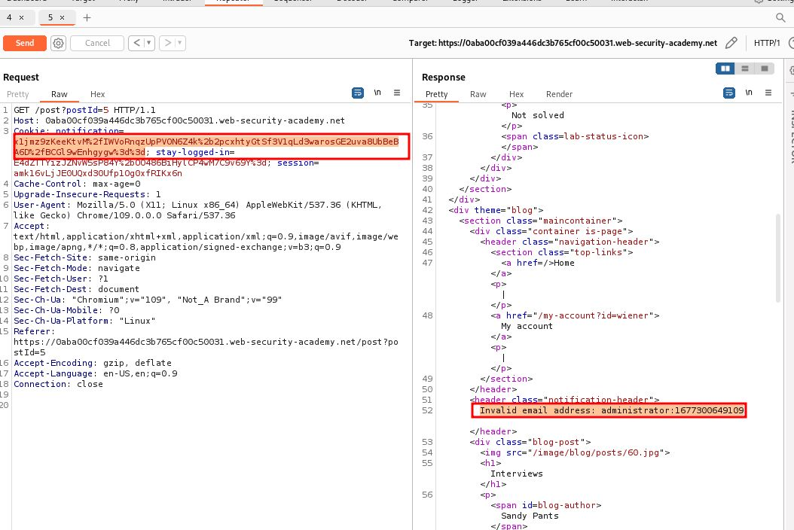

### step6

1. go to post comment in the response section copy cookies notification and send to decoder
2. decode as url
3. decode as base64
4. select 32 bits and delete
   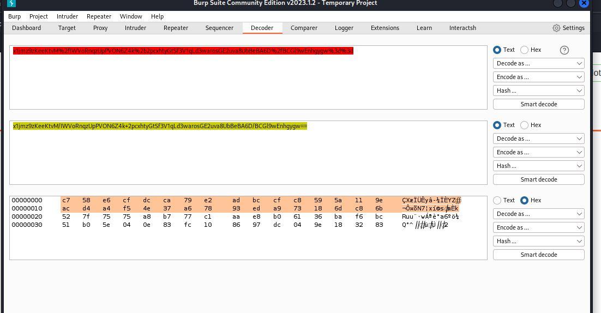

5. encode as base64
6. encode as url

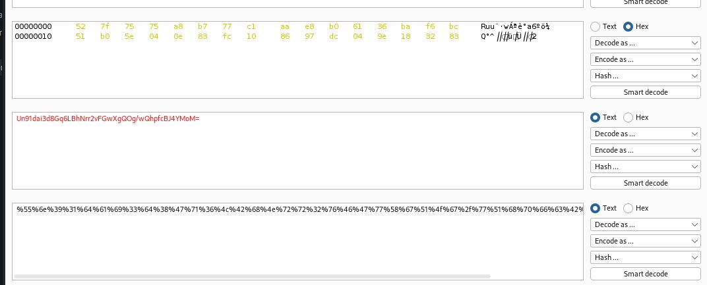

### step7

1. paste encrypt url from ### step6(last step)
2. send request ator:1677300649109
3. actual email administrator:1677300649109
   ator:1677300649109
   administrator:1677300649109

to fix this we need to add 9 character to make administrator work
123456789ator:1677300649109
administrator:1677300649109
like this
xxxxxxxxxadministrator:1677300649109
total x is 9
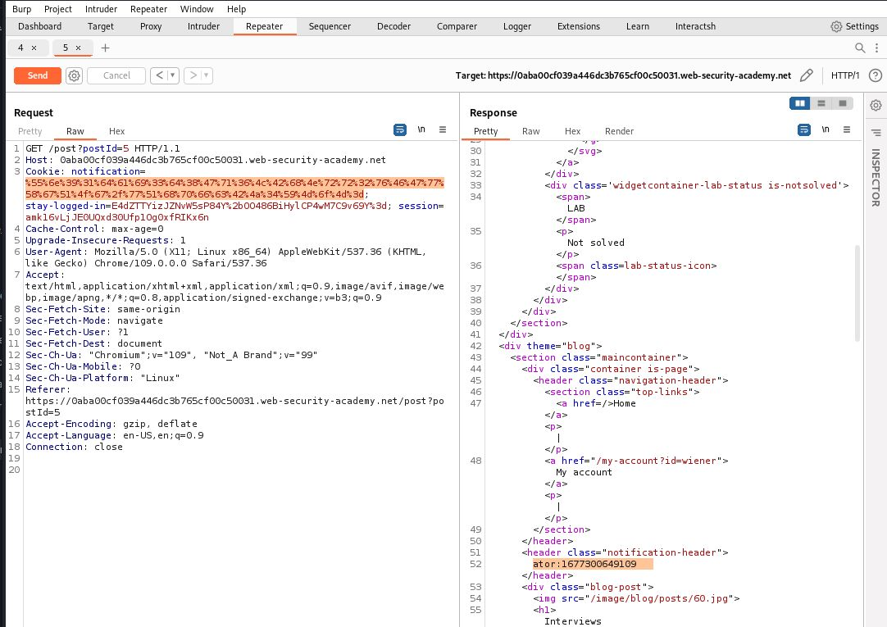

### step8

modify administrator and send request copy cookies notfication from response seconde and decode

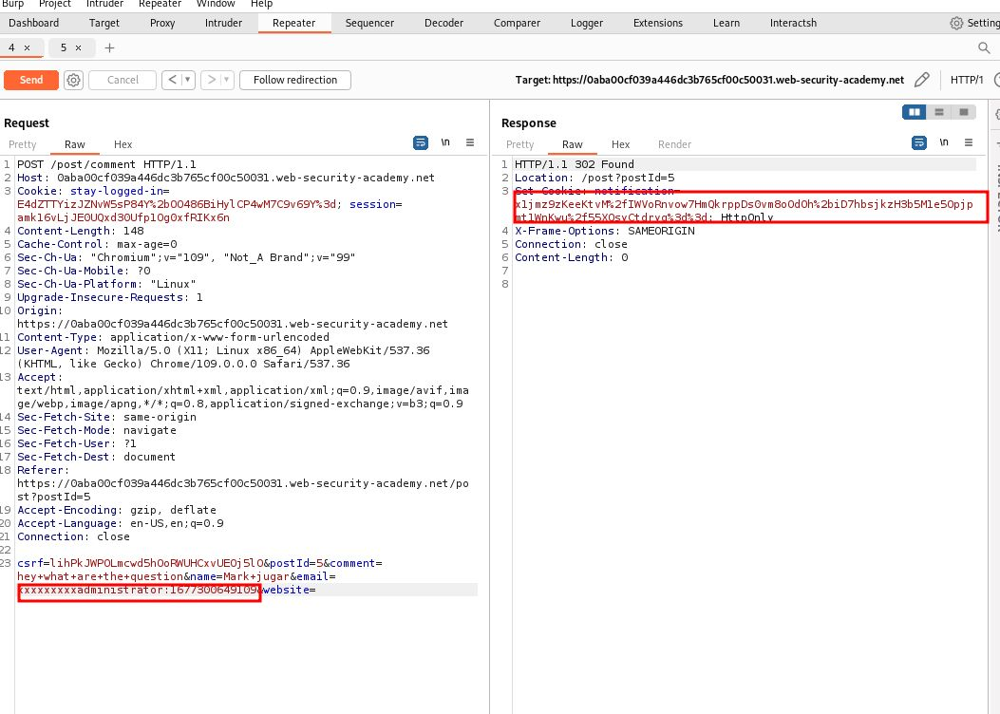

### step9

decode and encode

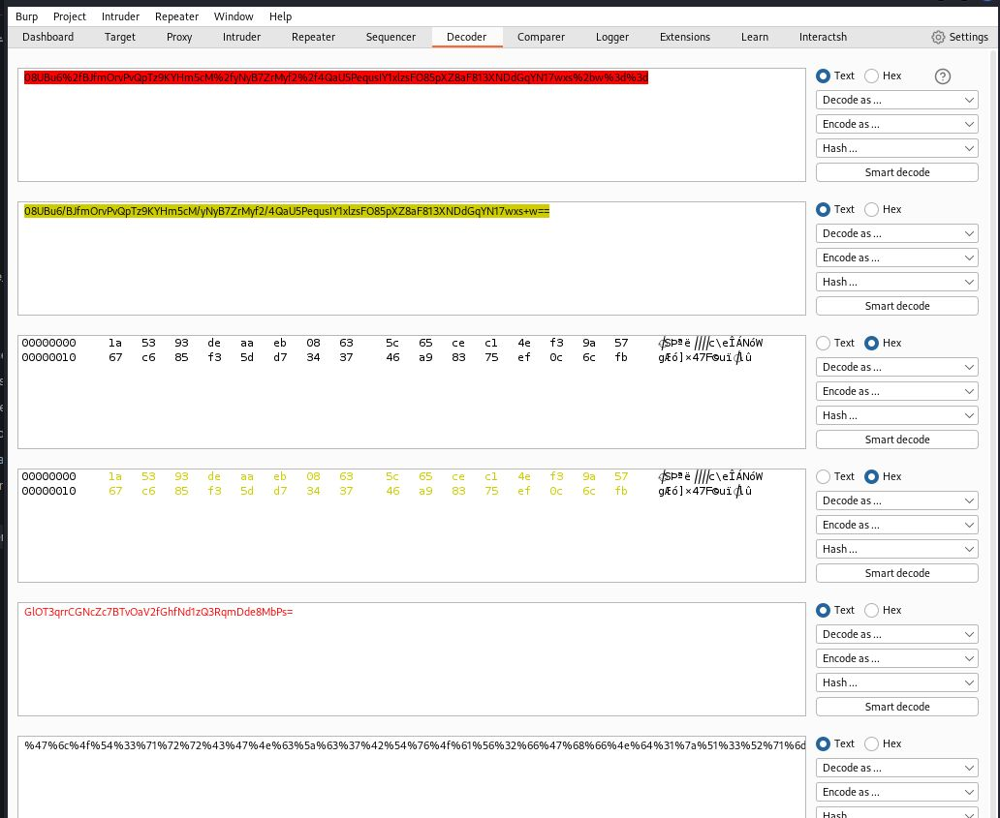

---

### step 10

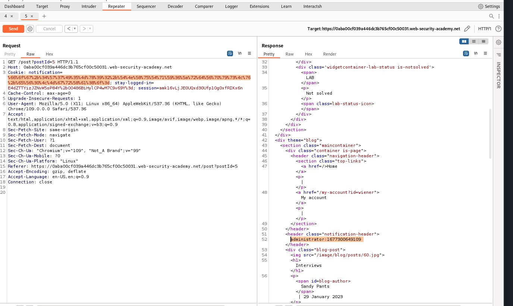

---

### step 11

ntercept on
click on my account

1. remove old session
2. change stay logged in and paste the decoded url
3. forword request intercept off
   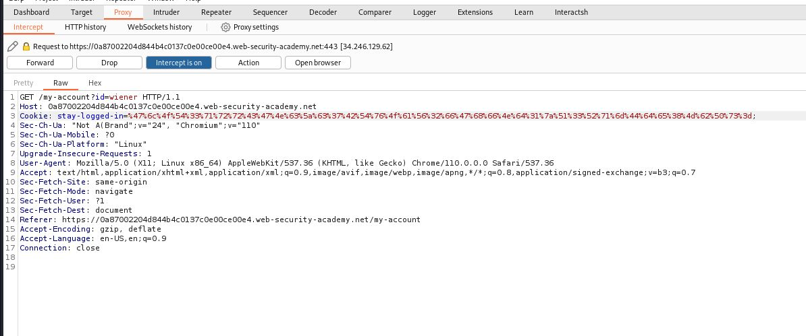

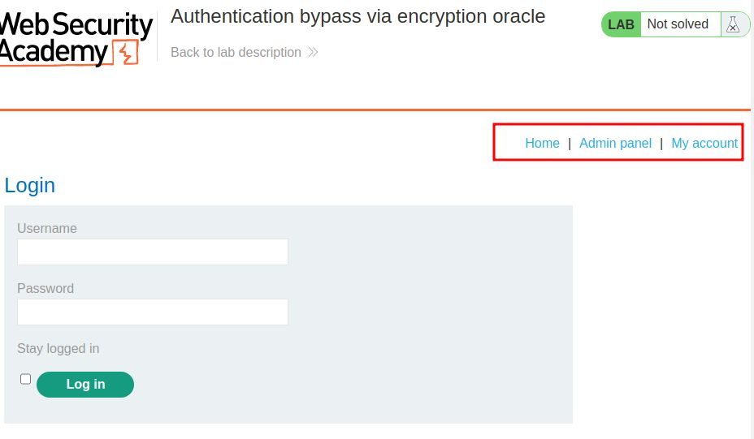
