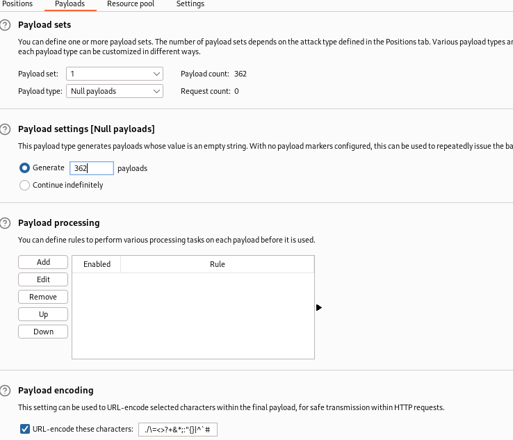

# Low-level logic flaw

## This lab doesn't adequately validate user input. You can exploit a logic flaw in its purchasing workflow to buy items for an unintended price. To solve the lab, buy a "Lightweight l33t leather jacket".

## You can log in to your own account using the following credentials: `wiener:peter`

max integer value = 2147483647 = 2^31 - 1

we can add only 99 item in cart at once
productId=1&redir=PRODUCT&quantity=99
send this request to intrudder and clear
then go to payload option

payload option

362 or 323 depends on which value the negative number so less
now add different item to make it positive value

once value is postive and less than $100 checkout you solve the problem
