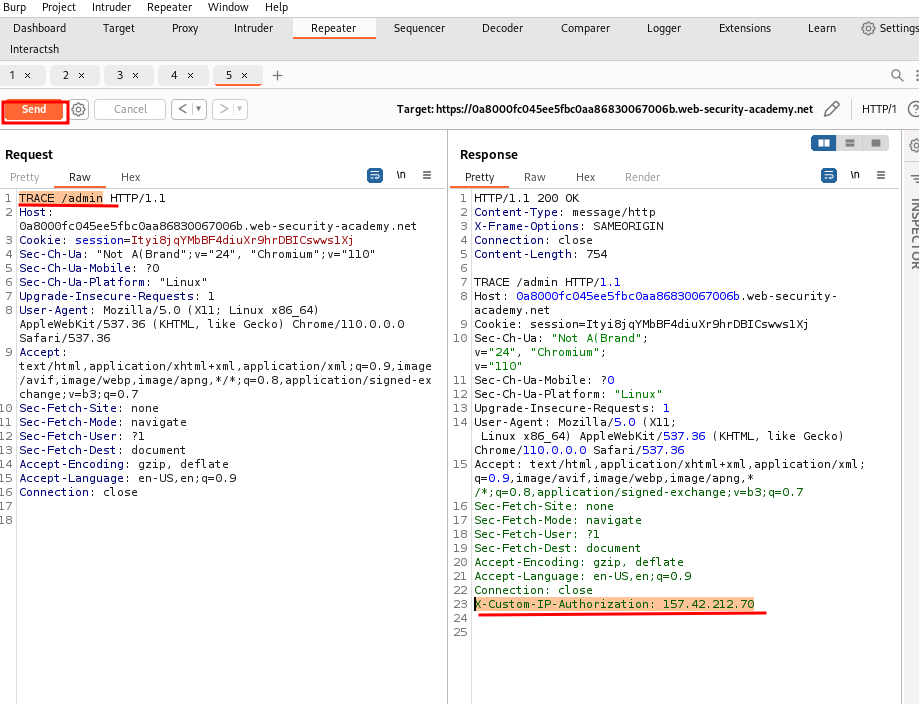
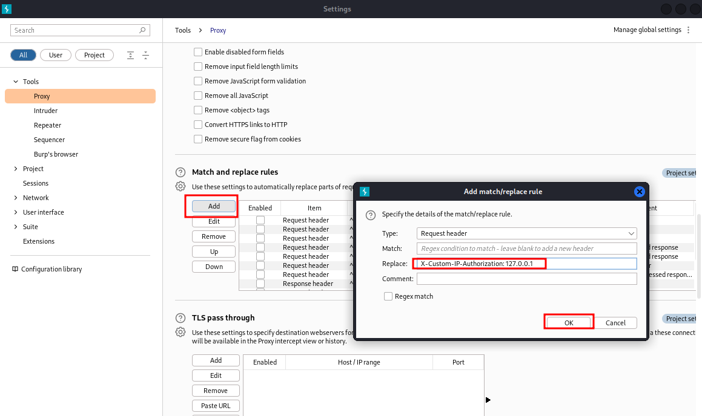
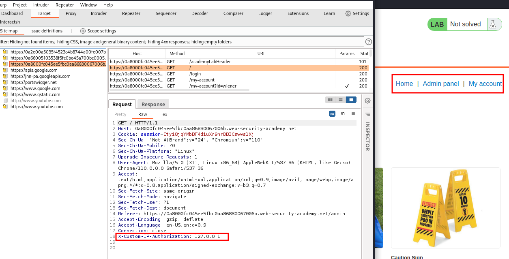

# Authentication bypass via information disclosure

## This lab's administration interface has an authentication bypass vulnerability, but it is impractical to exploit without knowledge of a custom HTTP header used by the front-end.

## To solve the lab, obtain the header name then use it to bypass the lab's authentication. Access the admin interface and delete Carlos's account.

## You can log in to your own account using the following credentials: `wiener:peter`

step1
log in into website
add /admin
send to burp Repeater
send request
now change _GET_ to _TRACE_
TRACE /admin

copy _X-Custom-IP-Authorization:_
paste into proxy option match and replace section

click on home page

delete carlos account from admin panel

### Note: _the HTTP `TRACE` method is designed for diagnostic purposes. If enabled, the web server will respond to requests that use the `TRACE` method by echoing in the response the exact request that was received_
