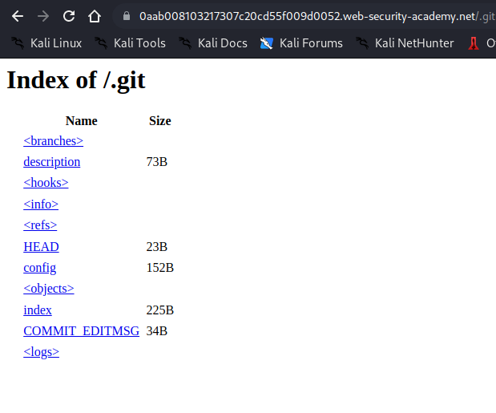
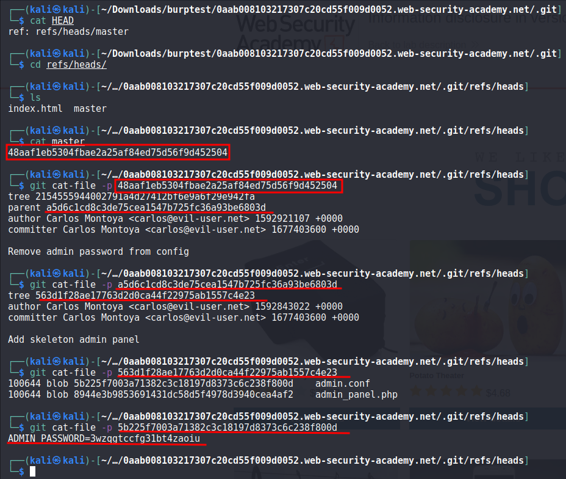

# Information disclosure in version control history

## This lab discloses sensitive information via its version control history. To solve the lab, obtain the password for the `administrator` user then log in and delete Carlos's account.

---

### step 1

https://0aab008103217307c20cd55f009d0052.web-security-academy.net/
add /.git to see git file
https://0aab008103217307c20cd55f009d0052.web-security-academy.net/.git

### step2

download .git file from website

wget -r https://0aab008103217307c20cd55f009d0052.web-security-academy.net/.git/

ADMIN_PASSWORD=3wzqgtccfg31bt4zaoiu

try admin or administrator as user name
and password: 3wzqgtccfg31bt4zaoiu
