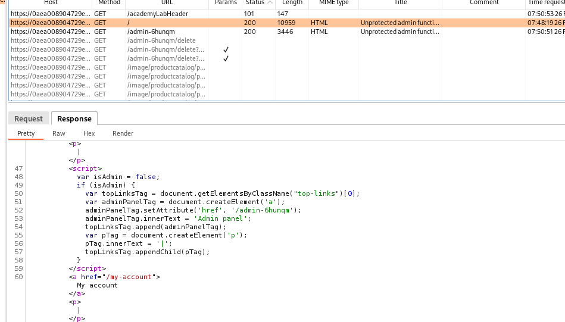

# Unprotected admin functionality with unpredictable URL

## This lab has an unprotected admin panel. It's located at an unpredictable location, but the location is disclosed somewhere in the application.

## Solve the lab by accessing the admin panel, and using it to delete the user `carlos`.

### step1

open url
see the response of home page

### step2

add to url _/admin-6hunqm_
https://0aea008904729ebdc40d6514000300e2.web-security-academy.net/admin-6hunqm
delete carlos solve lab
