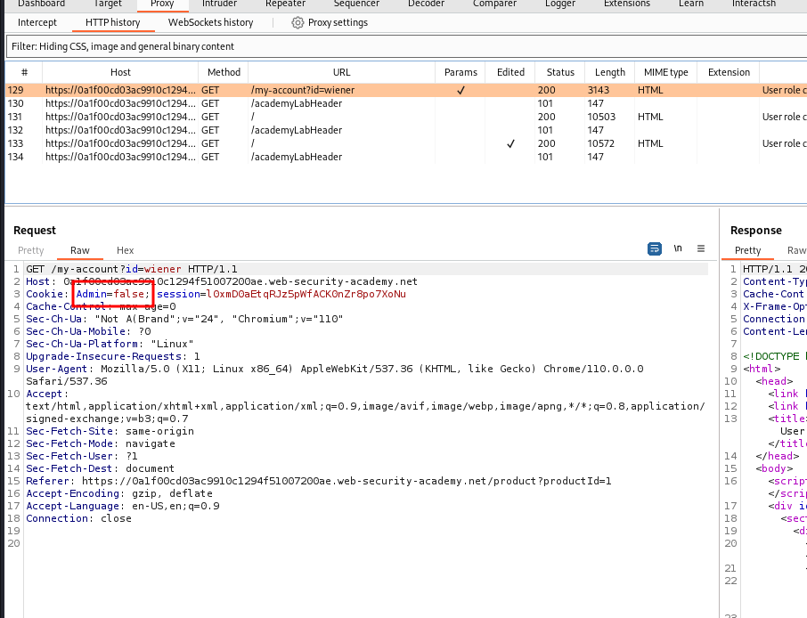
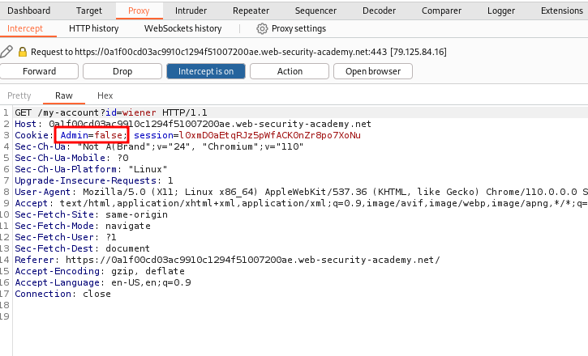
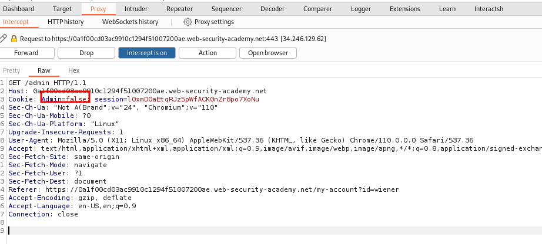
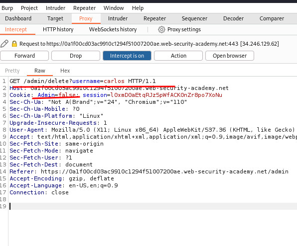

# User role controlled by request parameter

## This lab has an admin panel at `/admin`, which identifies administrators using a forgeable cookie.

## Solve the lab by accessing the admin panel and using it to delete the user `carlos`.

## You can log in to your own account using the following credentials: `wiener:peter`

### step1

login in using user and password  `wiener:peter`

https://0a1f00cd03ac9910c1294f51007200ae.web-security-academy.net/my-account?id=wiener

intercept my account

change Admin=true

send forword

Admin=true
and forword

intercept on carlos delete selection

Admin=true
forword request
