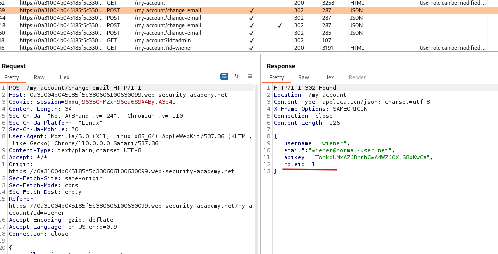

# User role can be modified in user profile

## This lab has an admin panel at `/admin`. It's only accessible to logged-in users with a `roleid` of 2.

## Solve the lab by accessing the admin panel and using it to delete the user `carlos`.

## You can log in to your own account using the following credentials: `wiener:peter`

### step1

login in to account using userid and password

### step2

update email id with same email or different email id

intercept the update email id
cahnge role 1 to role 2
and forword
you will get an admin panel
delete carlos
