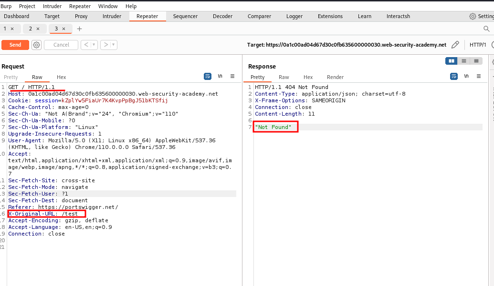
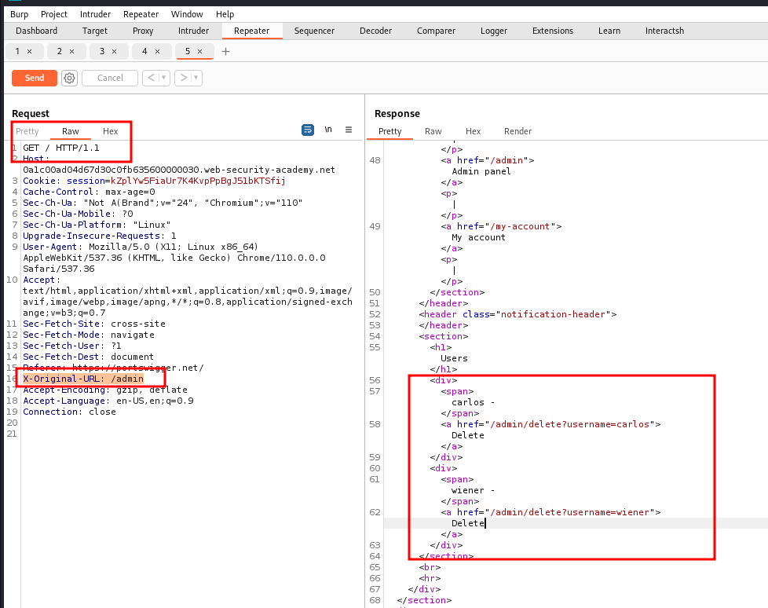
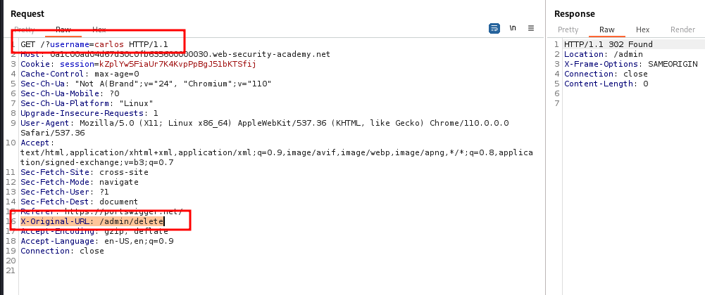

# URL-based access control can be circumvented

## This website has an unauthenticated admin panel at `/admin`, but a front-end system has been configured to block external access to that path. However, the back-end application is built on a framework that supports the `X-Original-URL` header.

## To solve the lab, access the admin panel and delete the user `carlos`.

note:
`X-Original-URL` is used to replace the url path

all ### stepdo in repeater with homepage

### step1

in the above example / is replace with /test
which is invalid address so not found

same thing we have to try with admin

### step2

add
X-Original-URL: /admin
and send request you will access admin panel
delete carlos it will say access denied so intercept again add X-Original-URL: /admin

`<a href="/admin/delete?username=carlos">`

now
add /?username=carlos into get request and X-Original-URL: /admin/delete

