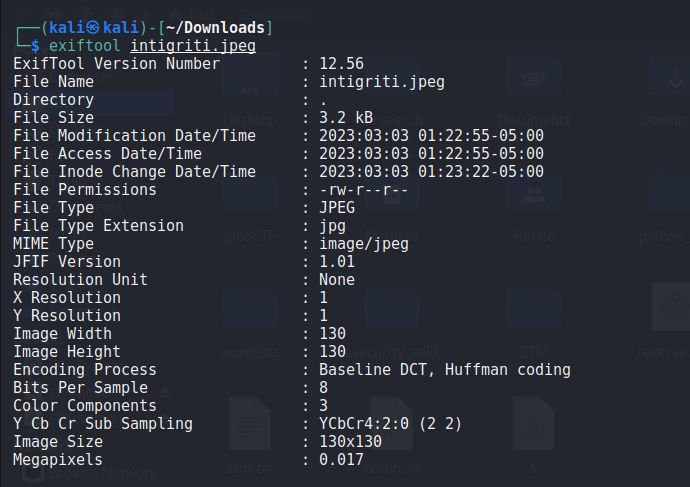
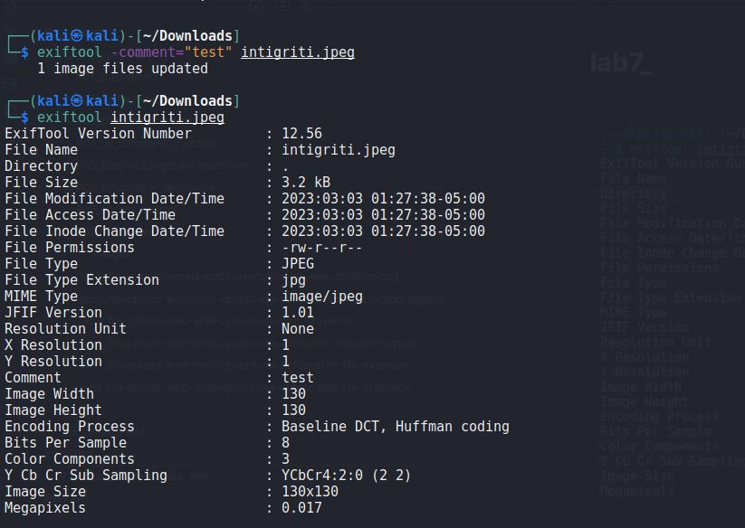
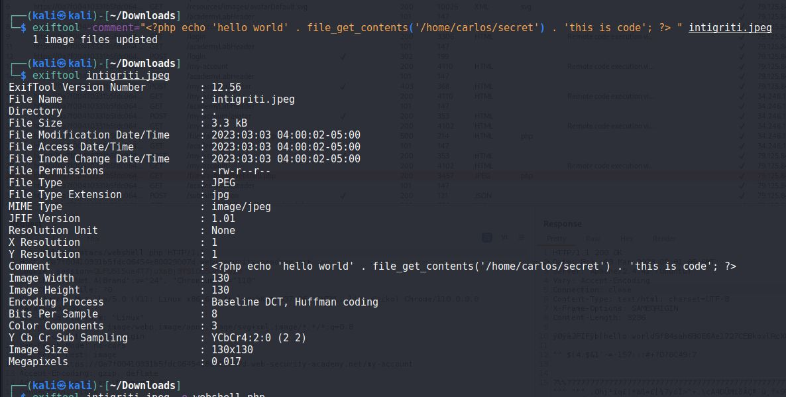
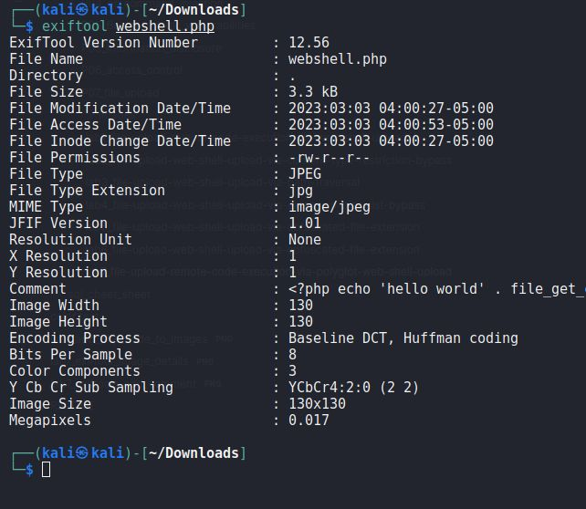
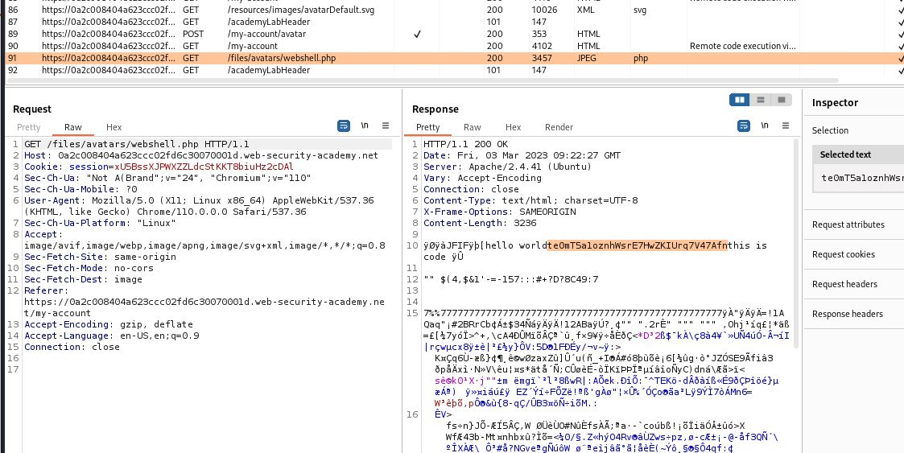

# Remote code execution via polyglot web shell upload

## This lab contains a vulnerable image upload function. Although it checks the contents of the file to verify that it is a genuine image, it is still possible to upload and execute server-side code.

## To solve the lab, upload a basic PHP web shell, then use it to exfiltrate the contents of the file `/home/carlos/secret`. Submit this secret using the button provided in the lab banner.

## You can log in to your own account using the following credentials: `wiener:peter`

---

### step 1

login and upload image
it will upload successfully
now upload php file
it will give error
Error: file is not a valid image Sorry, there was an error uploading your file.
now using exiftool to convert image to php

convert intigriti.jpeg to webshell.php

## exiftool intigriti.jpeg -o webshell.php

### step2

upload webshell.php
it will uploaded successfully
The file avatars/webshell.php has been uploaded.

### step3

GET /files/avatars/webshell.php

submit the secret code and lab solved
