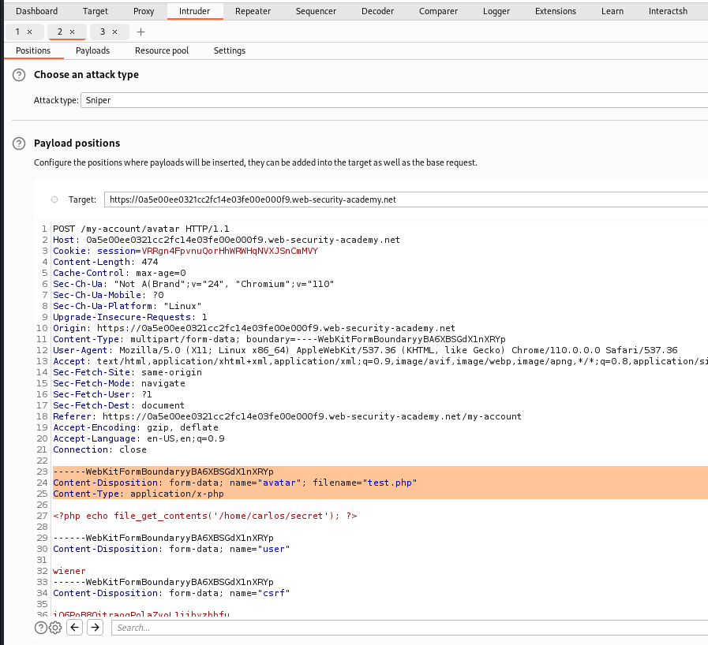
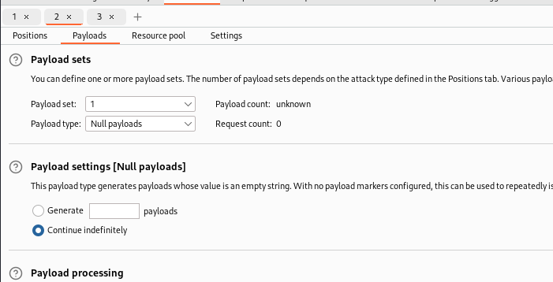
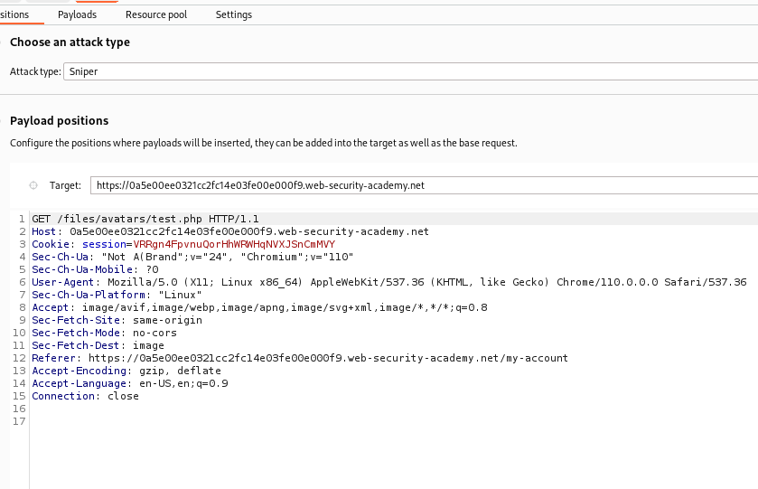
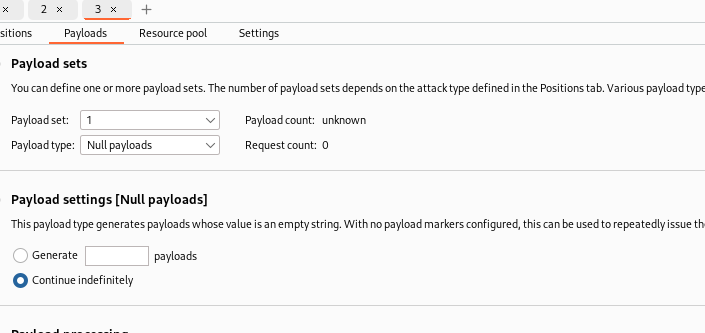
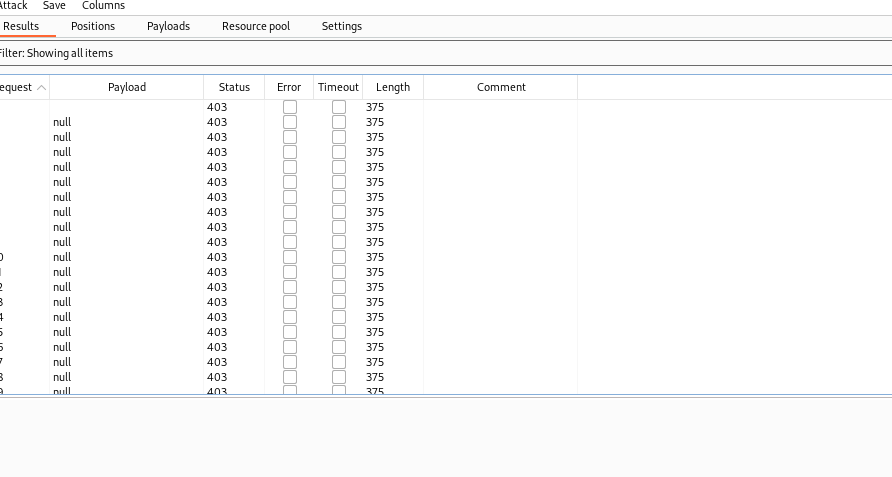
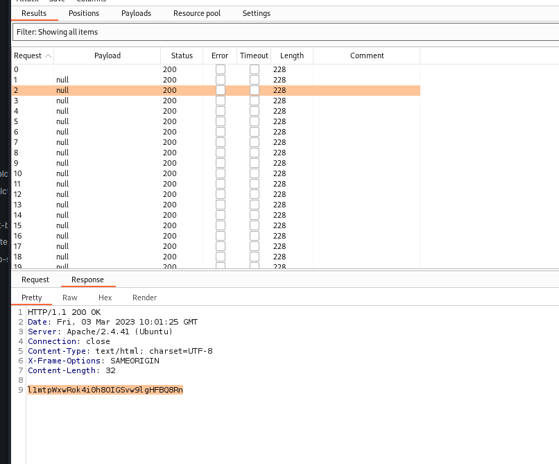

# Web shell upload via race condition

## This lab contains a vulnerable image upload function. Although it performs robust validation on any files that are uploaded, it is possible to bypass this validation entirely by exploiting a race condition in the way it processes them.

## To solve the lab, upload a basic PHP web shell, then use it to exfiltrate the contents of the file `/home/carlos/secret`. Submit this secret using the button provided in the lab banner.

## You can log in to your own account using the following credentials: `wiener:peter`

### step1

login
upload image then upload
php file
then intercept php file while uploading
include a URL encoded null byte _%00_

Content-Disposition: form-data; name="avatar"; filename="test.php%00.jpg"
then
upload
it will successfully upload

### step2

send to intruder both url
get and post
and payload option Null payload
first attack post request then attack get request
one get 200 other get 404
now remove null _%00_ from filename="test.php%00.jpg"
to
filename="test.php"
then do same atttack

post attack type

post attack payload ooption

get attack type

get payload option

post attack result result

get attack result

---
