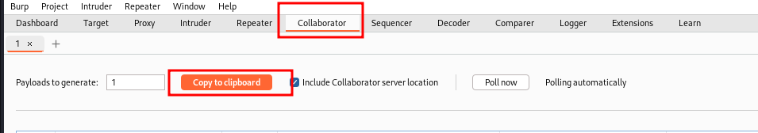
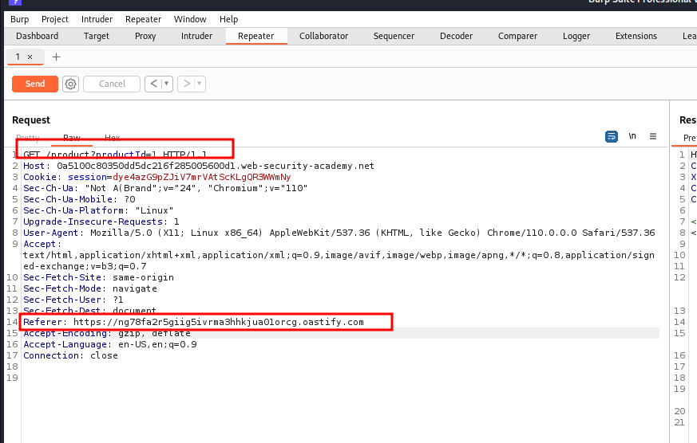
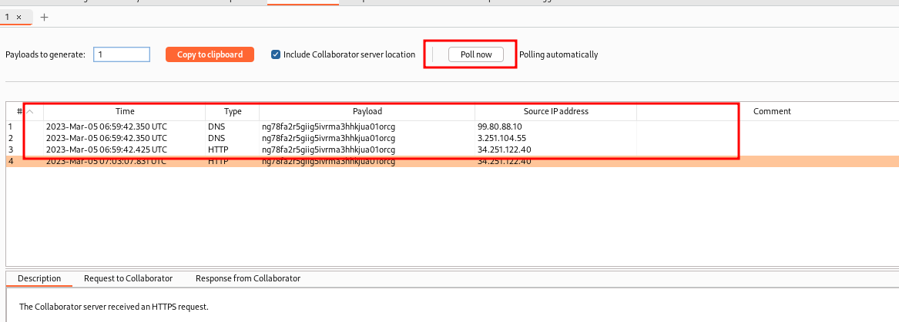

# Blind SSRF with out-of-band detection

## This site uses analytics software which fetches the URL specified in the Referer header when a product page is loaded.

## To solve the lab, use this functionality to cause an HTTP request to the public Burp Collaborator server.

---

### step 1

copy to clipborar => ng78fa2r5giig5ivrma3hhkjua01orcg.oastify.com

add https:// => https://ng78fa2r5giig5ivrma3hhkjua01orcg.oastify.com

send request

go to burp collaborator

click on pull lab solved
