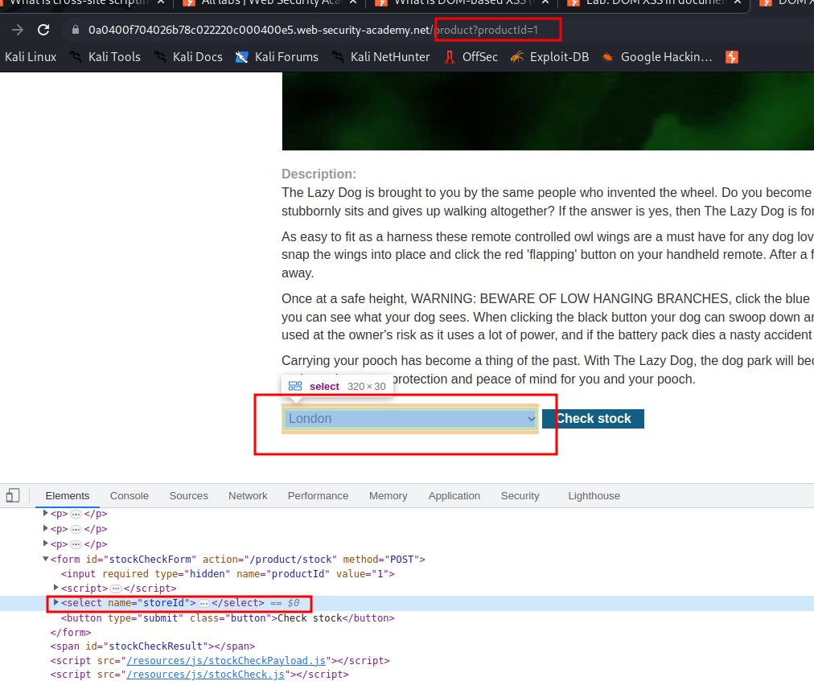
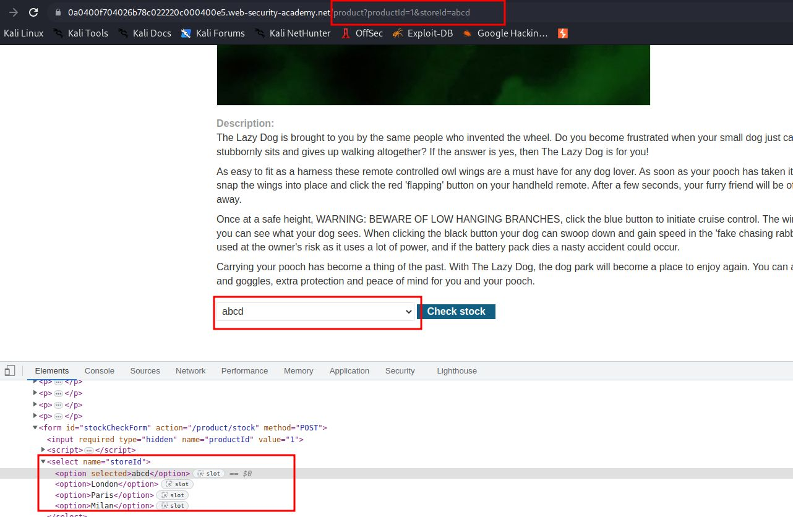
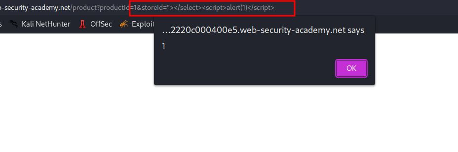
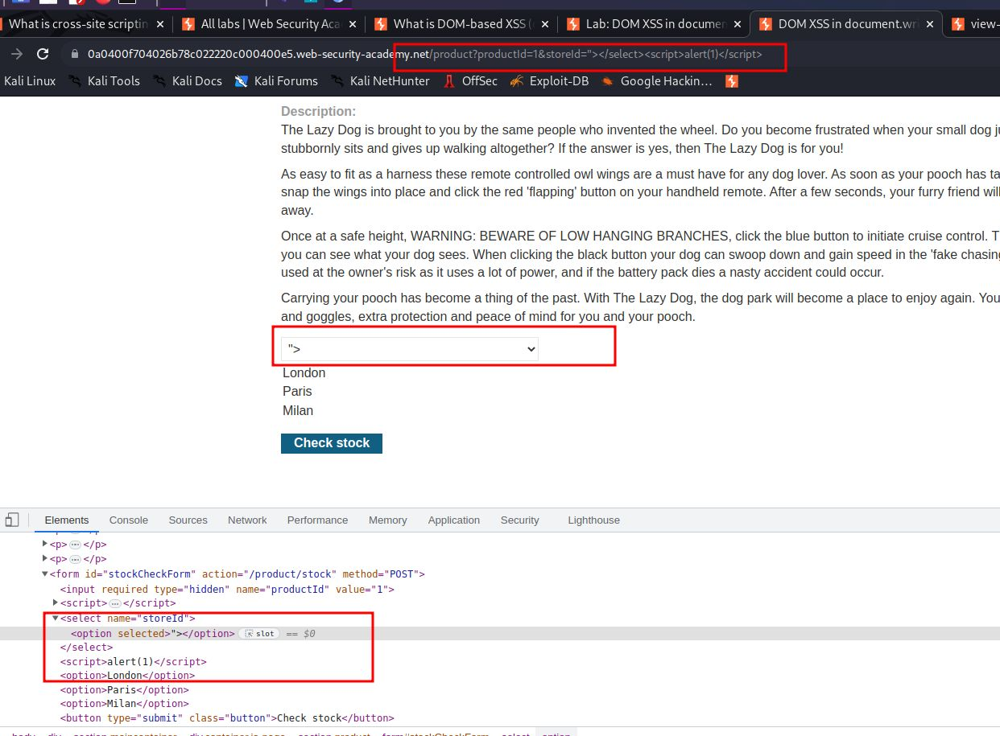

# DOM XSS in `document.write` sink using source `location.search` inside a select element

## This lab contains a [DOM-based cross-site scripting](https://portswigger.net/web-security/cross-site-scripting/dom-based) vulnerability in the stock checker functionality. It uses the JavaScript `document.write` function, which writes data out to the page. The `document.write` function is called with data from `location.search` which you can control using the website URL. The data is enclosed within a select element.

## To solve this lab, perform a [cross-site scripting](https://portswigger.net/web-security/cross-site-scripting) attack that breaks out of the select element and calls the `alert` function.

Pyaload are

`"></select>`
or
`"></select>`

`&storeId="></select>`

step1

add &storeId=abcd into url

use payload

