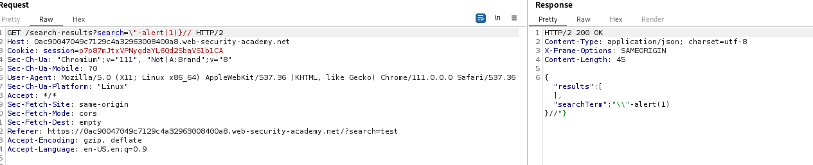

# Reflected DOM XSS

## This lab demonstrates a reflected DOM vulnerability. Reflected DOM vulnerabilities occur when the server-side application processes data from a request and echoes the data in the response. A script on the page then processes the reflected data in an unsafe way, ultimately writing it to a dangerous sink.

## To solve this lab, create an injection that calls the `alert()` function.

to solve this lab test various operation

